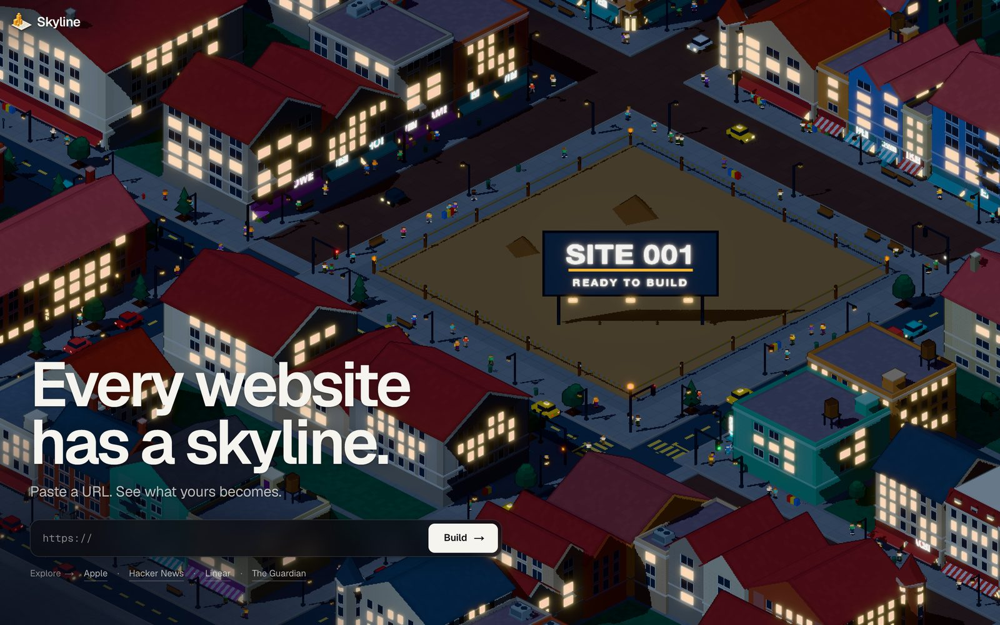
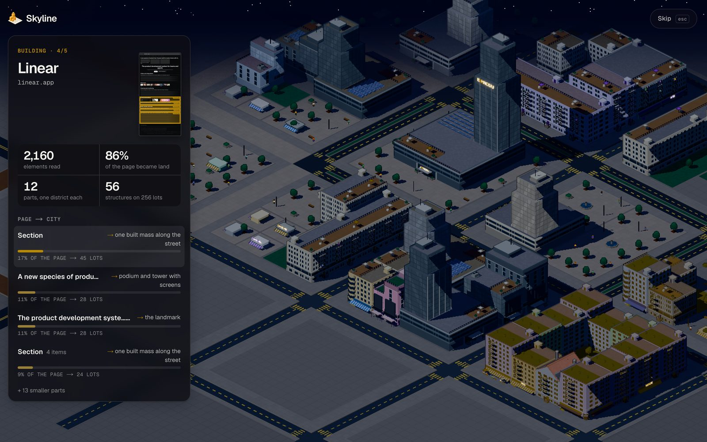
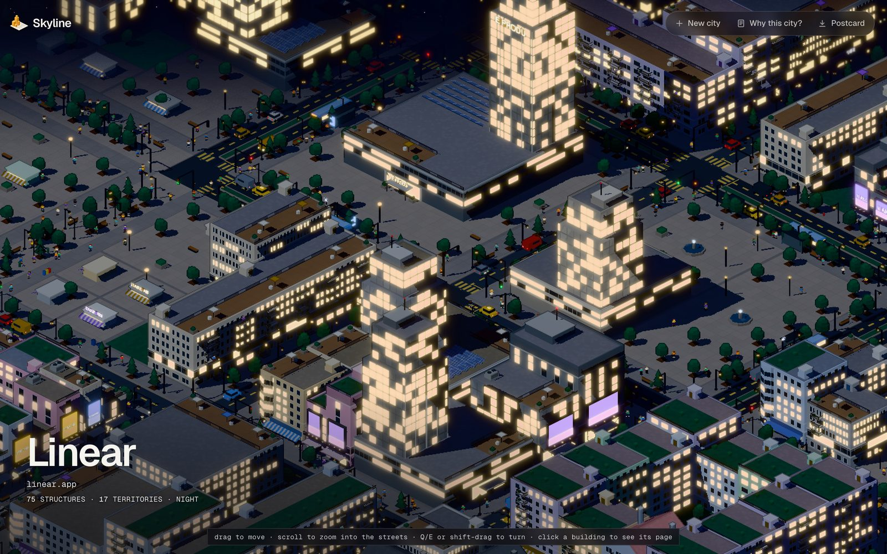
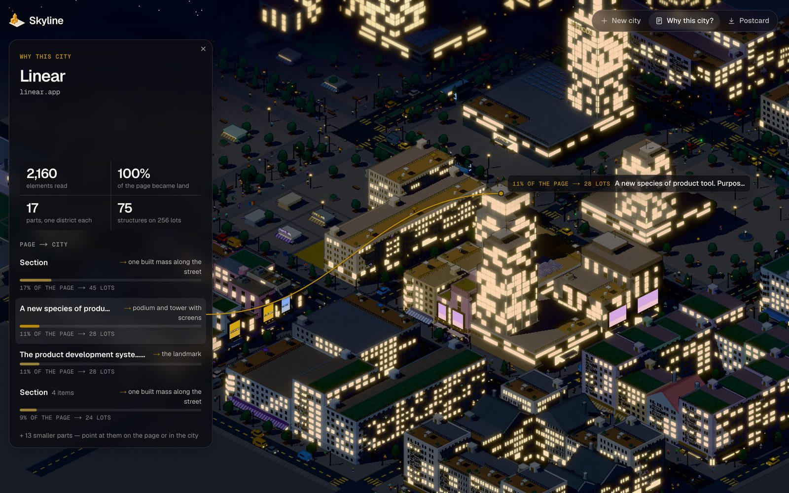

# Skyline

> Every website has a skyline.

Skyline lê a estrutura real de uma página pública e a reconstrói como uma cidade em pixel art
isométrica. Cada parte da página vira um bairro: o terreno é proporcional ao peso daquela parte, e
o tipo de conteúdo decide a organização urbana (uma lista vira lojas geminadas, um índice vira
pilhas baixas, uma vitrine de mídia vira torre com telões, o hero vira o landmark).



| construção | a cidade | por que esta cidade |
|---|---|---|
|  |  |  |

## Rodando

```bash
npm install
npm run dev
```

Abra `http://localhost:3000` (redireciona para `/pixel`), cole uma URL e clique em **Build**.
Link direto: `http://localhost:3000/pixel?url=https://news.ycombinator.com`.

## Como usar

- **Construção:** a página aparece num painel; enquanto a cidade sobe, as partes da página acendem e
  os números crescem. **Skip** (ou Esc, Espaço, Enter) pula para o fim.
- **A cidade:** arrastar move, scroll aproxima até o nível da rua, Q/E ou Shift+arrastar giram.
  Clicar num prédio mostra de que parte da página ele veio.
- **Why this city?** mostra a página, quanto dela virou terreno e o que cada parte virou; apontar
  uma parte (no painel ou na cidade) liga as duas com uma linha.
- **New city** volta para a home; **Postcard** salva uma imagem; H esconde a interface.
- `?at=references` (ou outro nome de parte) abre a cidade já no bairro correspondente.

## Como funciona

```
URL ─▶ /api/capture ─▶ captura estática ─▶ DomSnapshot ─▶ normalize() ─▶ NormalizedDocument
                                                                              │ (cliente)
   analyzeSemantics ─▶ computeFingerprint ─▶ planFromPage ─▶ generateKitDistrict ─▶ PixelScene
   (regiões)           (identidade visual)   (territórios)   (cidade do kit)        (three.js)
```

- **Semântica:** regiões da página (hero, navegação, feed, índice, referências, rodapé…) inferidas
  por tag, posição, tamanho, conteúdo e nomes de classe — nunca por hostname.
- **Alocação:** os territórios ocupam 256 lotes em ordem de leitura, do centro para fora, com
  terreno proporcional ao peso de cada um.
- **Cidade:** composição, volumetria, programa, fachadas, ruas, vida de rua e atmosfera vêm do kit
  (`src/lib/pixelcity/kit`). As camadas de base e de direção de arte estão congeladas e são
  checadas por testes.
- **Page map:** a página redesenhada a partir do que o pipeline já sabe (ordem de leitura,
  títulos, links, imagens reais, cores e tipo), sem inventar conteúdo.

Segurança da captura:

- **O cliente nunca recebe HTML**, só estrutura e métricas.
- **SSRF fechado no nível do socket:** o DNS é validado, a conexão vai para o IP validado e cada
  redirect é revalidado ([`net-guard.ts`](src/lib/acquisition/net-guard.ts),
  [`safe-fetch.ts`](src/lib/acquisition/safe-fetch.ts)).
- **Imagens reais via proxy assinado** (HMAC), para não virar um proxy aberto.

## Rotas

| rota | o que é |
|---|---|
| `/pixel` | o produto |
| `/pixel/kit?page=<id>&v=<n>` | a cidade de um snapshot congelado (`docs/real-pages/snapshots`), em qualquer versão congelada do kit |
| `/pixel/compare` | várias cidades com a mesma câmera |
| `/maquette` | a maquete 3D da primeira versão |

## Scripts

| comando | |
|---|---|
| `npm run dev` · `build` · `typecheck` · `lint` | |
| `npm run test:foundation` · `test:art-direction` · `test:polish` | as camadas congeladas, comparadas byte a byte com os kits gravados |
| `npm run test:allocation` · `hygiene` · `surface` · `openings` · `composition` · `program` · `streets` · `life` · `atmosphere` | cada etapa do pipeline sobre o corpus de páginas reais |
| `npm run probe -- <url>` | roda captura → normalização no terminal e imprime um resumo |

## Documentação

| documento | |
|---|---|
| [PIXEL_FOUNDATION_V1.md](docs/PIXEL_FOUNDATION_V1.md) | base semântica e arquitetural (congelada) |
| [PIXEL_ART_DIRECTION_V1.md](docs/PIXEL_ART_DIRECTION_V1.md) | ruas, vida de rua e atmosfera (congelada) |
| [PIXEL_VISUAL_POLISH_V1.md](docs/PIXEL_VISUAL_POLISH_V1.md) | névoa e assets |
| [PIXEL_PRODUCT_COMMUNICATION.md](docs/PIXEL_PRODUCT_COMMUNICATION.md) | página → cidade na interface |
| [ARCHITECTURE.md](docs/ARCHITECTURE.md) | captura, segurança e a maquete original |

## Limites conhecidos

- **SPAs:** a captura estática vê só o HTML que o servidor envia; `captureRenderedPage` está pronta
  para um worker com navegador (`SKYLINE_RENDERER_URL`).
- **Bloqueios:** sites com bot challenge (Cloudflare etc.) ou login são recusados com explicação;
  não tentamos burlar.
- **Estado em memória:** rate limit, cache e o segredo de assinatura vivem por processo. Com mais de
  uma instância, defina `SKYLINE_ASSET_SECRET` e use um store compartilhado.
