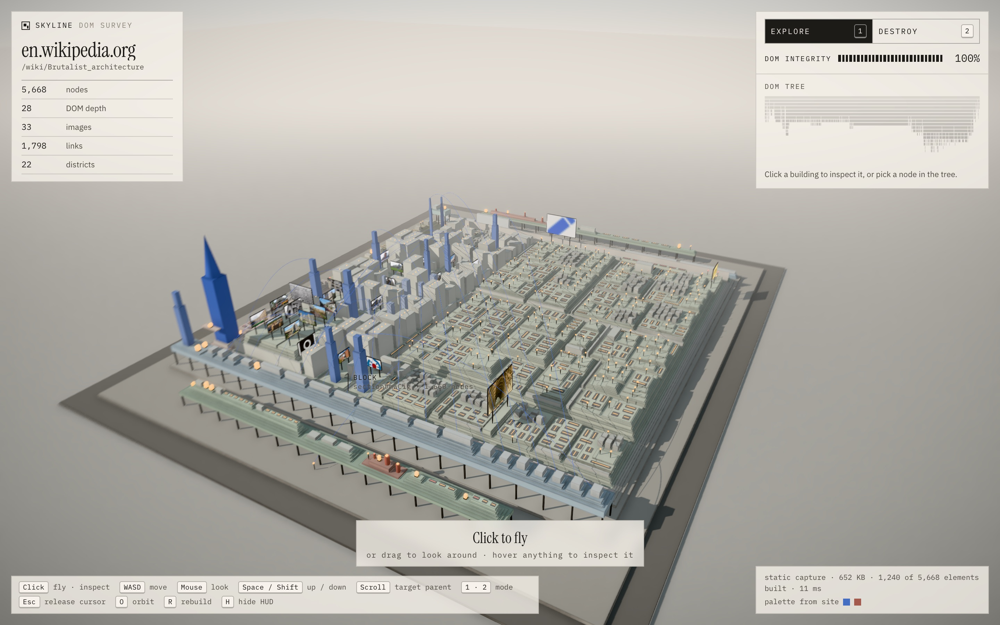

# Skyline

> Turn any website into a city.

Skyline captura uma página pública por HTTPS, lê a estrutura real do DOM e a reconstrói
como uma maquete urbana 3D, que dá para explorar e demolir nó a nó. Seções viram quarteirões,
headings viram torres, imagens viram outdoors com a imagem real, links viram ruas e postes,
e a profundidade de aninhamento vira relevo.



> **Exploração em andamento:** uma nova direção em pixel art, guiada por um `SiteFingerprint`,
> vive isolada em `/pixel` e `/pixel/compare`. Veja **[docs/PIXEL_CITY.md](docs/PIXEL_CITY.md)**
> e a rodada semântica (City View, Explore, inspector, teste de identidade) em
> **[docs/PIXEL_CITY_SEMANTIC.md](docs/PIXEL_CITY_SEMANTIC.md)**. A versão anterior está em `/pixel/v1`.
> Enquadramento “a cidade é a tela” (A/B com a ilha via `&frame=island`):
> **[docs/PIXEL_CITY_FRAMING.md](docs/PIXEL_CITY_FRAMING.md)**.

## Rodando

```bash
npm install
npm run dev
```

Abra `http://localhost:3000` (vai para a cidade em pixel art, `/pixel`), cole uma URL HTTPS
e clique em **Build**. Link direto: `http://localhost:3000/pixel?url=https://news.ycombinator.com`.

A maquete 3D bege da primeira rodada (voo, inspeção, demolição) continua em
`http://localhost:3000/maquette?url=…`; o que está abaixo sobre controles e DOM INTEGRITY se refere a ela.
O exemplo `sample:lumen` (o HTML do protótipo original) funciona sem rede.

## Controles

| | |
|---|---|
| **Clique** | entra em voo (pointer lock); voando: inspecionar / demolir o que está na mira |
| **Mouse** | olhar (ou arrastar, sem pointer lock) |
| **WASD** / setas | mover |
| **Space / E** · **Shift / Q** | subir · descer |
| **Scroll** | mirar o pai (↑) ou voltar ao filho (↓) — é assim que se demole um container inteiro |
| **1 · 2** / Tab | modo Explore · Destroy |
| **F** | voar até o nó selecionado |
| **Esc** | liberar o cursor |
| **O** · **R** · **H** · **M** | órbita · reconstruir · esconder HUD (para prints) · som |

Sem pointer lock, o cursor livre continua inspecionando: passe o mouse sobre qualquer prédio.

## Como funciona

```
URL ─▶ /api/capture ─▶ acquire() ─▶ DomSnapshot ─▶ normalize() ─▶ NormalizedDocument
                         │                                               │
                         ├ fetchStaticPage   (implementado)              ▼ (cliente)
                         └ captureRenderedPage (interface, Playwright)   generateCity() ─▶ CityModel
                                                                         buildRenderModel() ─▶ RenderModel
                                                                         <CityScene/>  (~6 draw calls)
```

Arquitetura, gramática visual, algoritmo de layout, redução de DOMs grandes e a estratégia
de aquisição e segurança estão em **[docs/ARCHITECTURE.md](docs/ARCHITECTURE.md)**.

Pontos-chave:

- **O cliente nunca recebe HTML.** O servidor envia só estrutura e métricas, então não há o que
  executar nem o que injetar.
- **SSRF fechado no nível do socket.** O DNS é validado, a conexão vai para o IP já validado e cada
  redirect é revalidado. Ver [`net-guard.ts`](src/lib/acquisition/net-guard.ts) e
  [`safe-fetch.ts`](src/lib/acquisition/safe-fetch.ts).
- **Imagens reais via proxy assinado** (HMAC), para não virar um proxy aberto. Todas ficam
  num único atlas 2048² e cada outdoor é uma instância.
- **Ids em pré-ordem.** A subárvore de um nó é um intervalo contíguo, então destruir um `section`
  inteiro é atualizar um intervalo de instâncias. Crescimento e colapso rodam no vertex shader.
- **DOM INTEGRITY** é calculada por peso estrutural, não por contagem de meshes.

## Scripts

| | |
|---|---|
| `npm run probe -- <url…>` | roda o pipeline do servidor no terminal (captura → normalização → cidade) e imprime um resumo; `TREE=3` mostra a árvore |
| `npm run shoot -- <url> <prefixo> [cenas…]` | screenshots 1440×900@2x com o Chrome instalado (`puppeteer-core`, sem baixar browser). Cenas: `landing intro entrance aerial street inspect destroy orbit`. Env: `BASE`, `CHROME_PATH`, `OUT`, `Q` |
| `npm run typecheck` · `npm run lint` · `npm run build` | |

Na página, `window.__skyline` expõe ganchos de teste: `setView`, `select`, `destroy`,
`project`, `bench` (tempo de frame síncrono) e `state`.

## Páginas testadas

| Página | Estrutura | Cidade |
|---|---|---|
| en.wikipedia.org/wiki/Brutalist_architecture | 5.668 elementos, profundidade 28, 1.798 links | metrópole densa: galeria de fotos reais, torres azuis, sidebars viram ruas |
| news.ycombinator.com | 808 elementos, layout em `<table>` | grade regular de plintos com a faixa laranja do `bgcolor` |
| gov.uk | 374 elementos, HTML semântico | floresta de torres (37 headings), outdoor com o logo GOV.UK |
| stripe.com | 1.356 elementos, marketing | torres magenta/violeta, dezenas de outdoors com screenshots do produto |
| bbc.com/news | 1.187 elementos | 57 manchetes em torres vermelhas |

Screenshots em [`docs/screenshots/`](docs/screenshots).

## Limites conhecidos

- **SPAs**: a captura estática vê só o "esqueleto" que o servidor envia. A UI avisa, e
  `captureRenderedPage` está pronta para receber um worker Playwright (`SKYLINE_RENDERER_URL`).
- Sites com bot challenge (Cloudflare etc.) ou login são recusados com explicação. Não tentamos
  burlar esses bloqueios.
- Rate limit, cache e o segredo de assinatura vivem em memória por processo. Em produção com
  várias instâncias, defina `SKYLINE_ASSET_SECRET` e use um store compartilhado.
