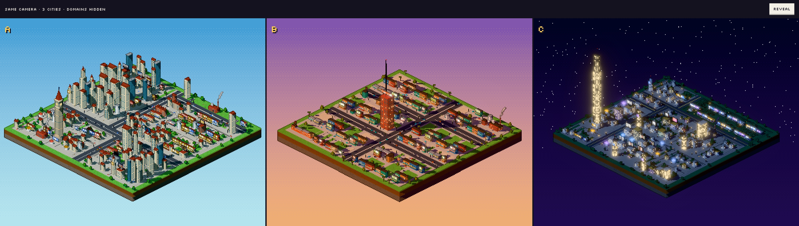
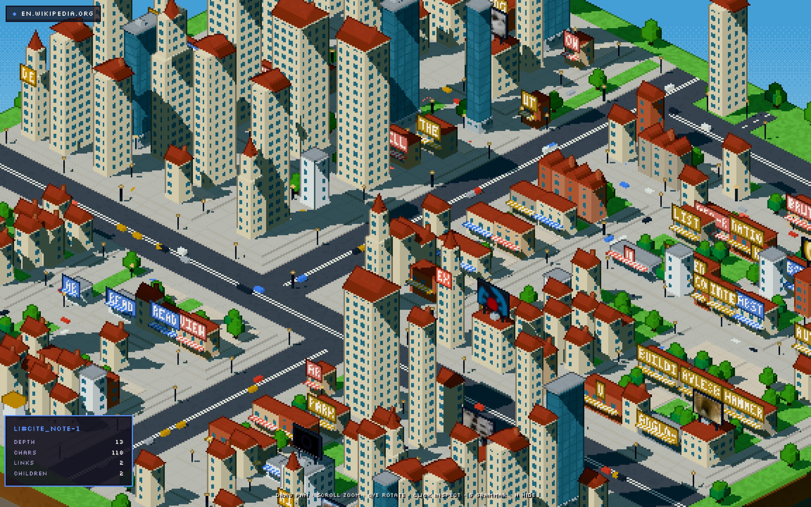
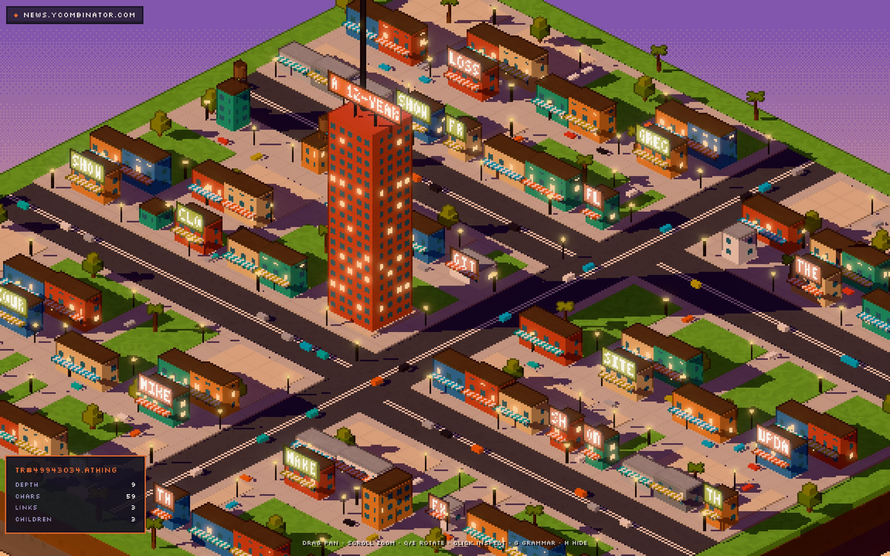
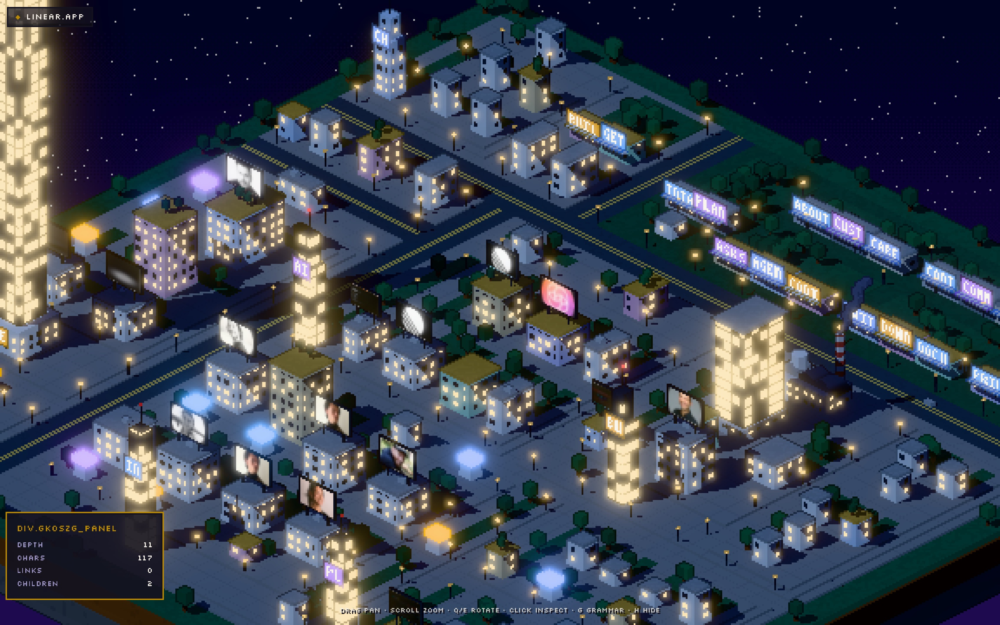
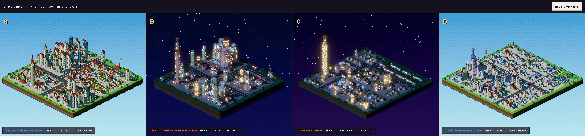

# Pixel city — rodada de exploração

> Pergunta da rodada: *se eu esconder o domínio, essas URLs parecem cidades diferentes?*
> E: *eu teria vontade de tirar um screenshot e mostrar para alguém?*



*A, B e C são, nesta ordem, en.wikipedia.org/wiki/Brutalist_architecture, news.ycombinator.com
e linear.app. A versão com os domínios revelados está em
[`three-compare-revealed.jpg`](screenshots/pixel/three-compare-revealed.jpg).*

## O que mudou e o que ficou

| | |
|---|---|
| **Preservado sem mudança** | `/api/capture`, aquisição, SSRF, parsing, `normalize()`. A maquete continua disponível (hoje em `/maquette`; `/` abre a cidade pixel). |
| **Adicionado ao pipeline (não quebra nada)** | `StyleSignals` no snapshot: border-radius, espaçamento, sombras, gradientes, animações, tipografia, fundo da página, HTML legado e classes utilitárias. Resolve `var(--x)` e lê Tailwind (`py-24`, `rounded-xl`, `font-serif`). |
| **Novo e isolado** | `src/lib/fingerprint/` · `src/lib/pixelcity/` · `src/components/pixel/` · rotas `/pixel` e `/pixel/compare` |

```
DOM + CSS + conteúdo ──▶ SiteFingerprint ──▶ CityGrammar ──▶ PixelCity ──▶ cena pixel art
   (já existia)          (~20 números 0..1)   (regras)         (partes, ruas,     (resolução baixa,
                                                                placas, imagens)   nearest-neighbour)
```

O DOM continua sendo a fonte estrutural: cada prédio é rastreável ao elemento que o originou
(clique em qualquer prédio em `/pixel`). Mas prédio agora é um **grupo** do DOM (um card, uma nav,
uma sequência de parágrafos), não um elemento.

## `SiteFingerprint`

[`fingerprint.ts`](../src/lib/fingerprint/fingerprint.ts). Todos os campos são 0..1, calculados
só a partir do que foi capturado.

| Grupo | Campo | De onde vem |
|---|---|---|
| estrutura | `size` | log do nº de elementos (30 → 0, 6000 → 1) |
| | `depth` | profundidade máxima do DOM |
| | `breadth` | média de filhos por container |
| | `regularity` | parcela de nós em sequências repetidas (feeds, listas, tabelas) |
| | `sections` | nº de `section`/`article` |
| conteúdo | `textDensity` | caracteres por elemento (log) |
| | `imagery` | imagens ÷ blocos de texto |
| | `linkDensity` | links por elemento |
| | `headings` | headings por 100 elementos |
| | `interactivity` | densidade de botões, controles e links tipo CTA |
| | `forms` | presença de formulários |
| estilo | `roundness` | mediana do border-radius + pílulas |
| | `airiness` | mediana de padding/margin/gap + parcela de espaçamentos ≥ 48px |
| | `ornament` | gradientes + sombras + animações |
| | `darkness` | luminância do fundo real da página |
| | `legacy` | `bgcolor`, `<font>`, `<center>`, tabelas de layout |
| | `type` | votos serif/sans/mono, com peso para regras de `body` e headings, pela família genérica da pilha |
| | `hues`, `colorfulness` | cores cromáticas do site em OKLCH |

Fingerprints das três páginas escolhidas:

| | Wikipedia | Hacker News | Linear |
|---|---|---|---|
| size | **0.99** | 0.62 | 0.81 |
| depth | **0.92** | 0.33 | 0.71 |
| regularity | **1.00** | 0.62 | 0.46 |
| textDensity | **0.81** | 0.38 | 0.35 |
| imagery | 0.29 | 0.09 | **1.00** |
| linkDensity | **0.91** | 0.81 | 0.10 |
| interactivity | 0.29 | 0.03 | **1.00** |
| airiness | 0.12 | **0.00** | **0.51** |
| ornament | 0.34 | 0.10 | **0.85** |
| darkness | 0 | 0 | **1.00** |
| legacy | 0 | **1.00** | 0 |
| type | 50% serif | sans + legado | sans |
| hue primária | 262° (azul dos links) | **43° (laranja)** | 83° |

Elas foram escolhidas por serem extremos em eixos diferentes. A Wikipedia é enorme, profunda,
densa em texto e em links, com serif. O HN é pequeno, raso, legado, um feed de links sem imagens.
A Linear é escura, arejada, cheia de imagens, CTAs e gradientes.

## `CityGrammar`

[`grammar.ts`](../src/lib/pixelcity/grammar.ts) recebe só o fingerprint.
[`generate.ts`](../src/lib/pixelcity/generate.ts) usa o DOM para decidir o *quê* e *onde*,
e a gramática para decidir o *como*.

### O que faz duas páginas virarem cidades diferentes

| Característica da página | Vira na cidade | Wikipedia → | HN → | Linear → |
|---|---|---|---|---|
| fundo escuro / hue quente | **hora do dia**: noite / golden hour / dia; o céu noturno é tingido pela cor do fundo | dia | golden hour (laranja 43°) | noite |
| tipografia + raio + legado | **arquitetura**: `classic` (serif: tijolo, telhados de duas águas, chaminés, torre de relógio), `retro` (HTML legado: tijolo, caixas d'água, palmeiras, letreiros), `modern` (vidro, pódios, antenas), `soft` (raio alto: cilindros, cúpulas, jardins no telhado, pastel), `tech` (mono: concreto escuro, luzes piscando) | classic + modern | retro | modern + soft |
| tamanho × densidade de texto | **nº de prédios** e área da cidade | 123 | 55 | 73 |
| densidade de texto − espaço em branco | **ocupação dos lotes** (o resto vira jardim/praça) | 78% | 64% | 42% |
| profundidade + tamanho − espaço | **verticalidade** (andares, sobrados altos em cidades densas) | 0.95 | 0.56 | 0.63 |
| espaço em branco + largura da árvore | **rede de ruas**: quantos níveis da hierarquia ganham rua, largura das avenidas | 2 níveis, avenida 3 | 1 nível | 2 níveis |
| headings | **orçamento de torres** (sem paliteiro) | médio | — | baixo |
| `h1` | **marco** único, no estilo dominante (torre de relógio, arranha-céu, cúpula, mastro de rádio, monólito) | torre de relógio | torre de tijolo com letreiro | arranha-céu de vidro |
| links | **lojas** com a palavra do link na placa, e **tráfego** de carros | muito | muito | pouco |
| imagens | **outdoors com a imagem real** | 9 | 0 | 16 |
| botões / CTAs | **quiosques de neon** | poucos | — | 11 |
| formulários | **fábrica** com chaminé e fumaça | 2 | 1 | 1 |
| repetição de irmãos | **casas geminadas** idênticas, distritos do mesmo tipo com o mesmo "papel cartão" | sim | sim (feed) | — |
| cor de fundo de um elemento | aquele prédio é **tingido** com a cor dele | — | o laranja da barra do HN | — |
| cores do site | telhados, toldos, placas, neon e carros, normalizados em OKLCH numa paleta de jogo | azul | laranja | violeta/amarelo |

O efeito é combinatório. Duas páginas escuras (a Linear e um portfólio) continuam diferentes
porque diferem em airiness, imagens, headings e no matiz do fundo. Ver o teste com 4 páginas abaixo.

## Direção visual

Não é textura pixelada sobre os meshes antigos. A cena inteira foi refeita:

- **Resolução interna baixa** (~360 linhas) com upscale nearest-neighbour e número inteiro de
  pixels físicos por pixel de arte, para não haver pixels desiguais.
- **Câmera ortográfica dimétrica 2:1** (30°), com posição travada na grade de pixels para não
  tremer ao arrastar.
- **Cel shading** em 3 faixas, sombras duras (`BasicShadowMap`), céu em faixas com
  **dithering Bayer** e estrelas de 1 texel à noite.
- **Contorno por profundidade** no pós-processamento: silhuetas escurecidas na cor de "tinta",
  como sprites feitos à mão.
- Todos os padrões são desenhados no shader em escala de texel: janelas que acendem à noite,
  faixas de rua, grama pontilhada, juntas de calçada, tijolo, toldos listrados e estratos de
  terra nas laterais do diorama.
- **Mundo vivo**: carros circulando nas ruas (faróis à noite), nuvens de blocos fazendo sombra,
  fumaça das fábricas, luzes de aviação piscando e prédios surgindo do chão com um leve overshoot.
- **Placas com conteúdo real**, numa fonte bitmap 3×5 desenhada em texel exato (sem
  antialiasing): palavras dos links nas lojas, títulos nos letreiros. O HN, por exemplo, mostra
  "SHOW", "GIT", "SITE", "LOSS".
- **HUD mínimo**: só um chip com o domínio. Detalhes técnicos aparecem só ao clicar num
  prédio. `G` mostra fingerprint e gramática, `H` esconde tudo.

| | |
|---|---|
|  |  |
| Wikipedia, de perto | Hacker News, de perto |
|  |  |
| Linear, de perto | Teste com 4: Wikipedia, portfólio, Linear, Guardian |

## Resposta honesta às duas perguntas

**1. Parecem cidades diferentes com o domínio oculto?** Sim, nas três e também no teste com quatro.
O que separa mais forte é a hora do dia, a arquitetura e a densidade e verticalidade. Mas o
teste com quatro mostra que, mesmo com a hora igual (duas noturnas, duas diurnas), a morfologia
sozinha já distingue: o portfólio é compacto e cheio de torres, a Linear é esparsa com um farol,
a Wikipedia é um centro denso de telhados vermelhos e o Guardian é extenso, baixo e pastel.

**2. Dá vontade de tirar screenshot?** Os closes, sim. Os do HN e da Wikipedia são os mais fortes.
A vista geral funciona como "diorama", mas ainda é o ponto mais fraco:

- No quadro inteiro, os detalhes (placas, carros) ficam pequenos demais para aparecer.
- As cidades noturnas ainda são escuras no geral. As formas leem pelas janelas, não pelos volumes.
- A Linear, mesmo arejada, ainda parece um bairro genérico; poderia ser mais "vitrine": praças
  grandes, telões e poucos edifícios-ícone.

## Próximos passos sugeridos (antes de novas features)

1. **Composição da vista geral**: um zoom inicial mais próximo, com o marco no terço da tela,
   e um intro que desce do céu até o diorama.
2. **Diferenciar mais as noturnas**: luz de rim e neon nas arestas dos telhados no estilo
   `tech`/`modern`; telões grandes para sites com muitas imagens.
3. **Destruição na nova linguagem**: prédios quebrando em voxels, debris em cascata pela
   subárvore, shake proporcional ao peso (um `section` derruba um quarteirão, o `body` derruba a
   cidade). O motor de colapso por intervalo pré-ordem da maquete se reaproveita direto.
4. Gerar a cidade num Web Worker quando os DOMs forem muito grandes (hoje leva 2 a 25 ms).

## Como reproduzir

```bash
npm run dev
# http://localhost:3000/pixel?url=https://news.ycombinator.com
# http://localhost:3000/pixel/compare?u=https://en.wikipedia.org/wiki/Brutalist_architecture&u=https://news.ycombinator.com&u=https://linear.app
npm run fingerprint -- https://linear.app https://news.ycombinator.com   # tabela de fingerprints
BASE=http://localhost:3000 node scripts/compare.mjs three <url> <url> <url> [--reveal]
```
