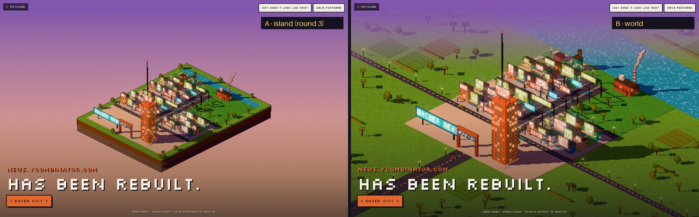
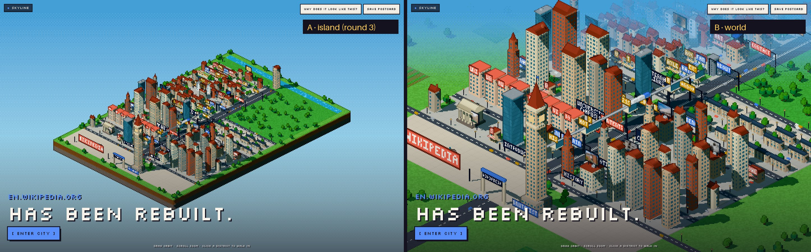
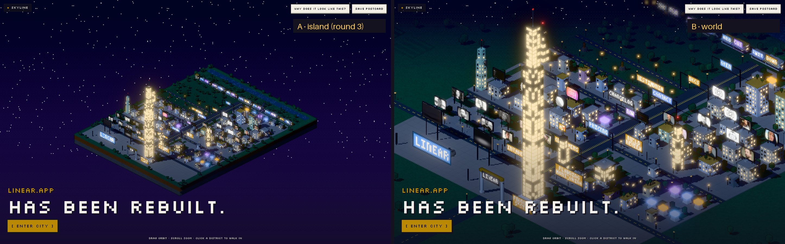
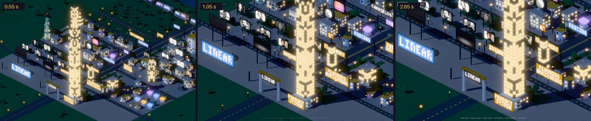

# Pixel city: enquadramento

> Problema: a cidade parecia uma maquete flutuando no meio de uma página.
> Objetivo: **a cidade é a tela**. A viewport é uma câmera olhando para um mundo.

Mudaram só composição, câmera e escala. A cidade gerada é a mesma. Verificado nas três páginas:
as partes vindas do DOM, os prédios, as zonas, as placas, as influências, a gramática e a paleta
saem **idênticas** (mesmo hash) nos dois enquadramentos. O modo mundo só remove o pedestal (3
caixas de solo/pedra) e as árvores da borda, e acrescenta a terra em volta.

## A/B, 1440×900, mesma câmera

A = enquadramento da rodada 3, com a ilha inteira. B = o novo, em que a cidade continua além do quadro.





Arquivos individuais: `docs/screenshots/framing/{hn,wikipedia,linear}-{A-island,B-world}.jpg`.

## Entrar na cidade é um único movimento de câmera



*Linear, depois de clicar em ENTER CITY: 0,55 s, 1,05 s e 2,65 s. Não há corte nem tela de
carregamento. A câmera desliza e desce, o título some com ela, e o HUD do Explore aparece quando
ela chega.*

## O que mudou

**1. Sem ilha.** No modo mundo não há pedestal nem espessura. A cidade fica sobre um terreno que
passa de qualquer borda da tela:

- o rio do footer atravessa a terra inteira;
- a avenida sai pelo portal da frente e a rua atrás da entrada sai pelos dois lados, com postes
  que acendem à noite e algum tráfego;
- em volta há campo: bosques, prados e algumas lavouras discretas.

O campo **nunca tem prédios e nunca vem do DOM**, então continua valendo que todo prédio na tela
é um elemento da página. Ele usa só botões que a gramática já tinha (densidade de árvores,
estilo, paleta), então não cria diferença entre sites. A terra também não é inspecionável:
o hover e o clique passam direto por ela.

**2. Escala fixa, não “caber na tela”.** A rodada 3 ajustava o zoom para a ilha caber. Agora a
escala é constante: 50 unidades do mundo na diagonal da tela. Por isso cada página ocupa o espaço
que tem, e esse é o ponto 5 do pedido:

| Página | Lote (tiles) | Largura projetada ÷ largura da tela | Leitura |
|---|---|---|---|
| Hacker News | 26×34 | **1,0×** | uma cidade pequena, inteira, cercada de campo e rio |
| Linear | 44×57 | **1,7×** | a cidade ocupa a tela; a torre de 28 tiles domina |
| Wikipedia | 44×65 | **1,8×** | vemos só a entrada e os primeiros distritos; o resto continua fora do quadro |

Na rodada 3 as três mediam 0,97× por construção.

**3. Alvo da câmera.** Quando a cidade cabe, ela fica centrada. Quando transborda, o alvo desliza
em direção à entrada, na proporção do excesso, até 42%. Assim o marco e os primeiros distritos
ficam com o quadro, e as ruas do fundo saem pela borda.

**4. Horizonte.** Uma câmera ortográfica não tem horizonte: o chão infinito cobriria a tela toda,
e o céu (com a luz e a hora do dia) sumiria. Isso foi o que aconteceu na primeira tentativa. Por
isso há uma névoa presa ao quadro: a faixa de cima da terra se dissolve no céu em 4 passos
pontilhados, e a terra totalmente envolta na névoa *é* o céu, com estrelas à noite. Prédios altos
estão mais perto da câmera, então ficam nítidos contra ela: o skyline aparece contra o céu. A névoa
some enquanto a câmera desce para o Explore.

**5. Descida contínua.** Mudar de modo agora é uma interpolação com início e fim suaves de zoom
(em escala logarítmica), alvo e ângulo, de 1,9 s. O zoom vai um pouco atrás do alvo: primeiro voa
na direção do ponto, depois desce. Ao abrir, a câmera chega de mais alto e girada 18° e assenta
na vista da cidade em 2,8 s, ou seja, chegamos sobrevoando. Qualquer gesto (arrastar, scroll, Q/E,
WASD) assume a câmera no meio do movimento.

**6. Interface.** O título fica sobre a cidade, não sobre céu vazio. Para isso há uma sombra baixa
no rodapé, e o overlay some e aparece em vez de ser montado e desmontado. A tipografia continua a
da rodada anterior.

## Como comparar

```bash
npm run dev
# B (padrão):  http://localhost:3000/?url=https://linear.app
# A:           http://localhost:3000/?url=https://linear.app&frame=island
BASE=http://localhost:3000 node scripts/framing.mjs   # refaz todas as capturas desta página
```

`/pixel/compare` continua com a ilha. Ali o objetivo é reconhecer três cidades lado a lado, e um
recorte esconderia a morfologia.

## Avaliação honesta

- **O critério.** Linear e Wikipedia em B não parecem mais maquete. Parecem uma vista aérea de
  uma cidade maior que a tela, com profundidade, e dá vontade de entrar. O HN em B ainda se lê
  como “uma cidade inteira”, porque ela é pequena. Mas agora é uma cidade num lugar, com rio,
  estrada e campo, e não um objeto sobre fundo liso. Isso é intencional (ponto 5); só não espere
  dele o impacto da Linear.
- **A névoa esconde o fundo da Wikipedia** na City View. Os distritos de trás aparecem ao girar,
  dar zoom ou entrar. É o preço do horizonte.
- **O campo é genérico.** As mesmas regras valem para todo site, de propósito, para não inventar
  diferença. Em sessões longas pode ficar repetitivo.
- **No dev, o primeiro quadro leva 2–5 s** (compilação de shaders e atlas). Nesse intervalo o
  título aparece antes da cidade. No build de produção é mais rápido, mas ainda não medi.
- **O Explore ficou um pouco mais aberto** (1,75× a escala da City View). Antes era 2,6× do
  enquadramento da ilha, e ficava próximo demais com a escala nova.

## Arquivos

| | |
|---|---|
| `src/lib/pixelcity/scenery.ts` | `plantTree` (compartilhada) e `addWorld`: chão, rio, estradas, campo |
| `src/lib/pixelcity/generate.ts` | `generatePixelCity(doc, { frame })`; pedestal e árvores da borda só no modo ilha; corrigido o rio do footer, que ficava escondido sob o pedestal |
| `src/lib/pixelcity/hash.ts` | `h01` (só decoração) |
| `src/components/pixel/PixelScene.tsx` | terra em malhas separadas (fora do raycast), escala fixa, alvo, limites de pan, névoa, descida contínua |
| `src/components/pixel/PixelPost.ts` | névoa por profundidade, pontilhada, no mesmo gradiente do céu |
| `src/components/pixel/PixelApp.tsx`, `src/app/pixel/pixel.css` | `?frame=island`, overlays com fade, sombra do título |
| `scripts/framing.mjs` | as capturas desta página |
