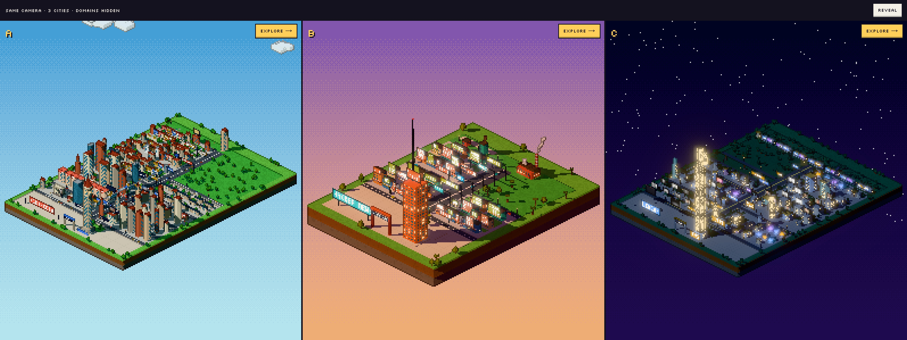
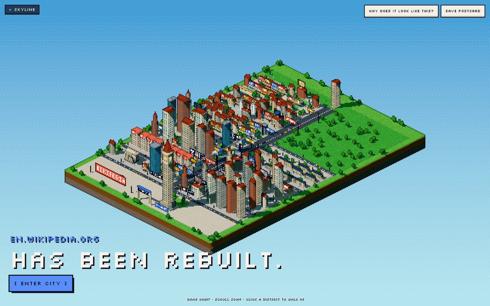
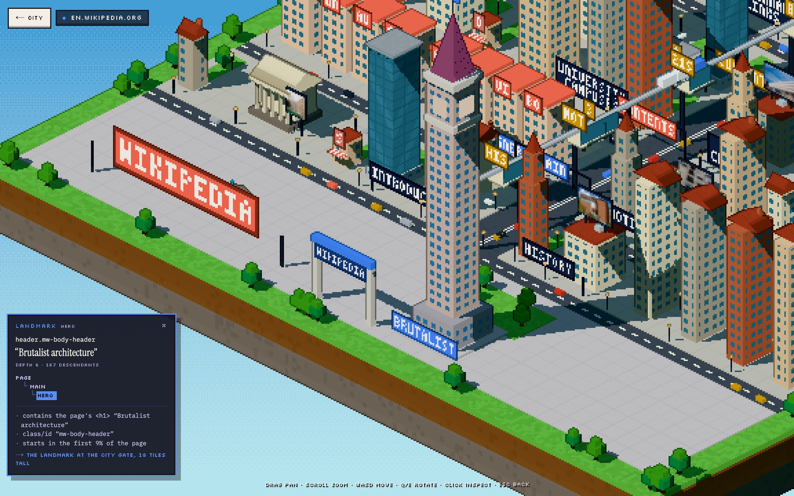
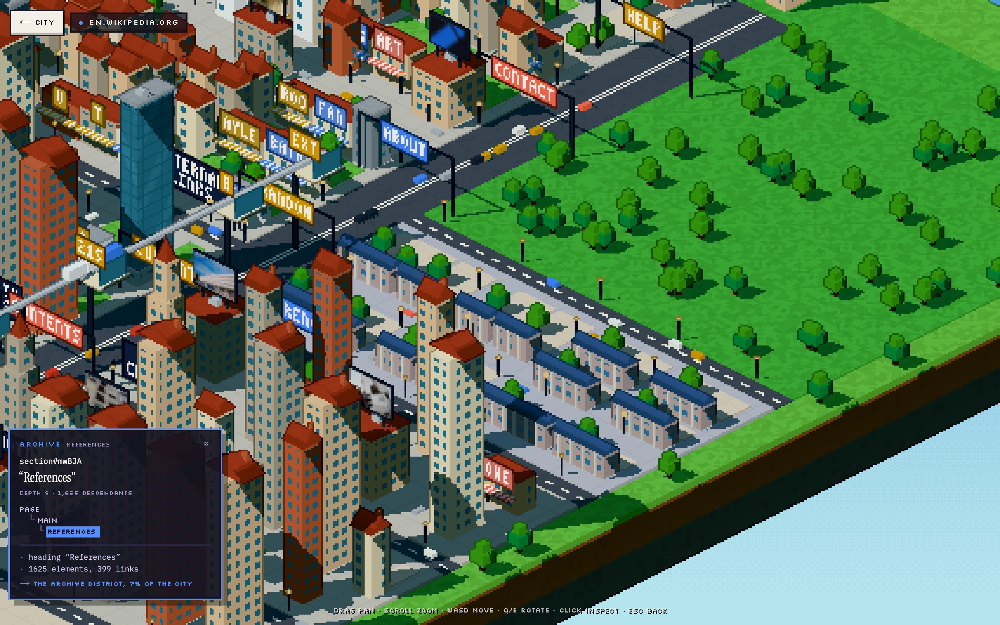
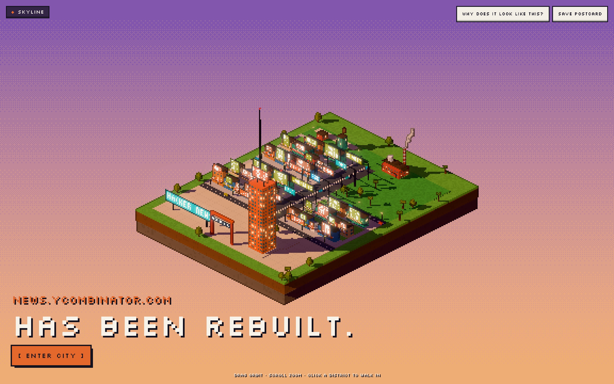
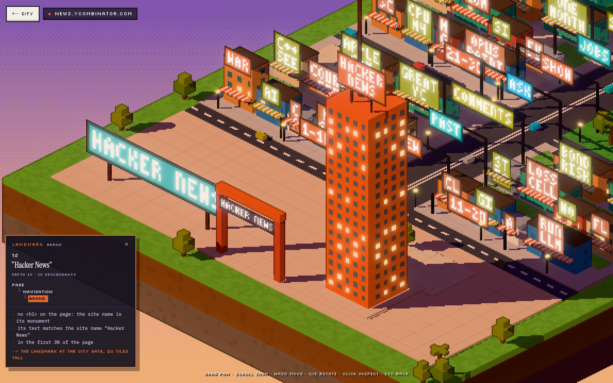
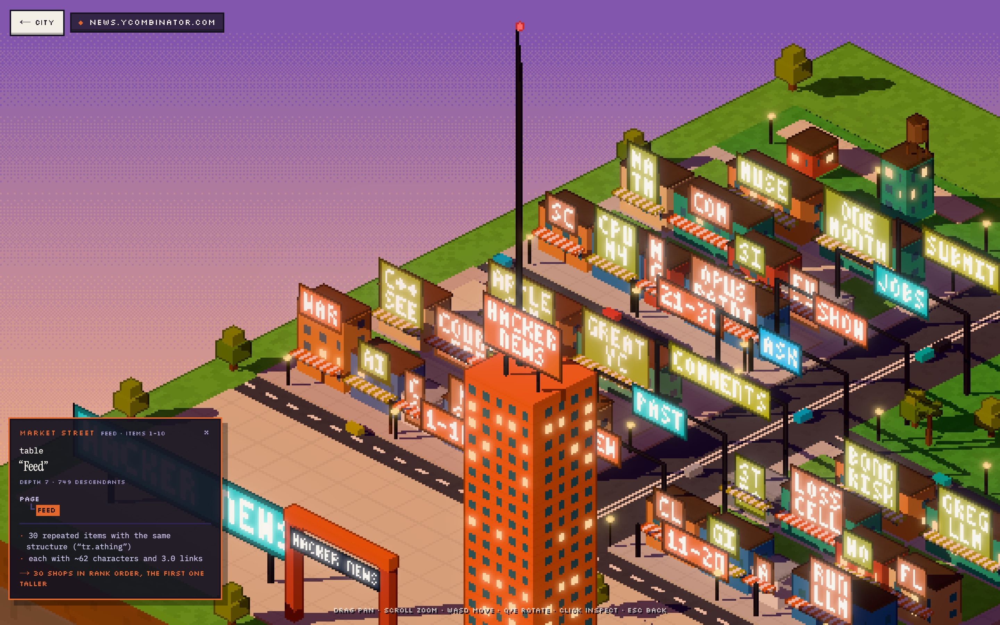
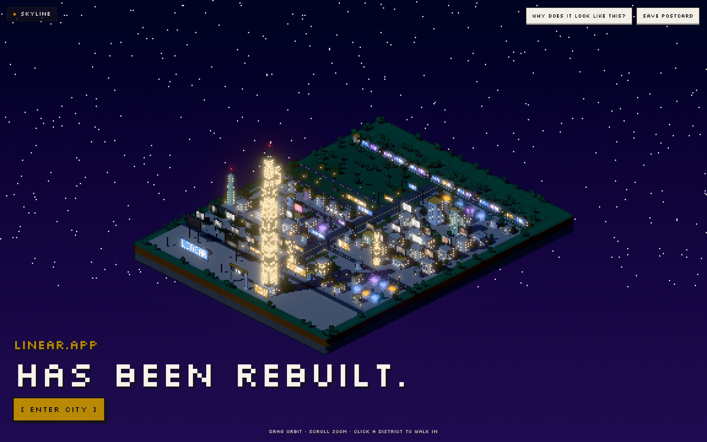
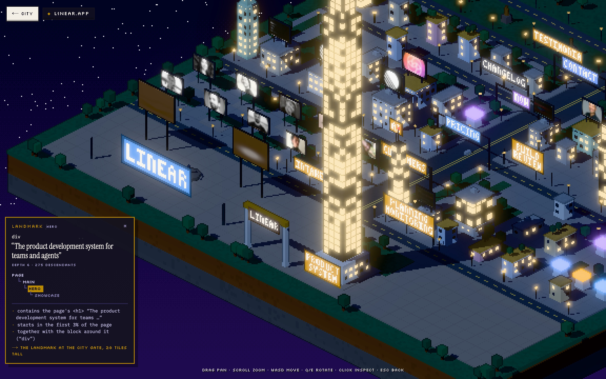
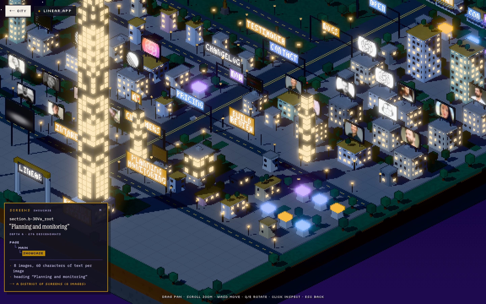

# Pixel city: rodada semântica

> Objetivo: **reconhecer o site dentro da cidade.** Cada marco grande tem que se explicar a partir
> da página. A diferença entre cidades não pode vir de seed aleatória.



*A = en.wikipedia.org/wiki/Brutalist_architecture · B = news.ycombinator.com · C = linear.app.
Com domínios e top-5 revelados: [`compare-revealed.jpg`](screenshots/semantic/compare-revealed.jpg).*

## Como rodar

```bash
npm run dev
```

| Rota | O que é |
|---|---|
| `/pixel?url=…` | **City View**: o diorama inteiro, `linear.app / HAS BEEN REBUILT. / [ ENTER CITY ]` |
| `/pixel?url=…&at=hero` | entra direto no **Explore View** naquele distrito, com o inspector aberto (`at` = tipo de região, papel da zona ou palavra do título: `hero`, `feed`, `pricing`, `references`, `entrance`, `avenue`…) |
| `/pixel/compare?u=…&u=…&reveal=1` | mesma câmera lado a lado, com o top-5 de cada cidade |
| `/pixel/v1`, `/pixel/v1/compare` | **a versão da rodada anterior, congelada** para comparação |

```bash
npx tsx scripts/identity.ts            # top-5 e o texto exato do inspector, para as 3 páginas
BASE=http://localhost:3000 node scripts/identity.mjs   # screenshots desta página
```

## O que mudou

```
DOM ─▶ normalize ─▶ analyzeSemantics ─▶ regiões com evidência ─▶ generatePixelCity ─▶ zonas, influências
                      (novo)               hero, nav, feed, toc…     (reescrito)          (cada zona sabe
                                                                                         de que nós veio)
```

**`src/lib/semantics/analyze.ts`** lê a página como um leitor leria. Não usa regra de tag fixa:
combina tag, posição, tamanho, conteúdo, headings, descendentes repetidos, classes e ARIA. Cada
região guarda as frases que justificam a inferência (`evidence`). O inspector mostra essas frases,
e são as mesmas que decidiram a forma.

| Região inferida | Vira | Exemplo de evidência |
|---|---|---|
| hero (ou a marca, se não há `<h1>`) | monumento na entrada da cidade | “contains the page's `<h1>`”, “starts in the first 3% of the page” |
| nav | avenida principal com faixas (rótulos reais dos links) | `navigation (“Customers”, “Pricing”, “Now”…)` |
| CTA | portal sobre a avenida | “a button/link reading ‘Get started’” |
| seções | distritos, em ordem de leitura, dos dois lados da avenida | “heading ‘History’”, “12% of the page” |
| features | conjunto de prédios iguais | cards de tamanho parecido |
| pricing | torres que sobem com o preço | preços detectados nos tiers |
| gallery / logos | praça de outdoors com as **imagens reais** | “10 images, 24 characters of text per image” |
| showcase | distrito de telas | “49 images, 40 characters of text per image” |
| feed | rua de comércio, uma loja por item, em ordem de ranking | “30 repeated items with the same structure (‘tr.athing’)” |
| toc | monotrilho com uma estação em cada seção que ele linka | “19 links” |
| references | arquivo (galpões longos) | “1625 elements, 399 links” |
| infobox | templo | classe `infobox` |
| testimonials | parque de estátuas | blockquotes |
| footer | orla, na borda de trás, com água | “a `<footer>` element” |

**Conteúdo real como easter egg**, sem poluir a cidade: imagens reais nos outdoors, palavras curtas
reais nas placas (fonte bitmap 3×5, uma palavra-chave por placa), o nome do site em letras grandes
na entrada, headings nas placas de distrito, cores da página na paleta.

**Inspector** (pequeno, sem o painel gigante da rodada 1):

```
LANDMARK  HERO
header.mw-body-header
“Brutalist architecture”
DEPTH 6 · 187 DESCENDANTS
PAGE
└ MAIN
  └ HERO
· contains the page's <h1> “Brutalist architecture”
· class/id “mw-body-header”
· starts in the first 9% of the page
→ THE LANDMARK AT THE CITY GATE, 18 TILES TALL
```

Clicar num prédio comum mostra o elemento dele e o porquê da forma: `404 characters of text → an
office block`, `part of the showcase “Build, review, and ship”`.

**City View → Explore View.** Na City View a câmera orbita (arrastar) e dá zoom curto. Passar o
mouse num distrito acende só os prédios dele (os nós daquela região) e escurece o resto.
Clicar desliza a câmera até lá, sem corte, e abre o inspector. “Why does it look like this?” lista o
top-5; passar o mouse num item acende o pedaço da cidade correspondente. “Save postcard” exporta
um PNG do quadro atual com o título na mesma fonte das placas. No Explore: arrastar move,
WASD anda, Q/E gira, `Esc` fecha o inspector e depois volta para a cidade.

## Teste de identidade

### A: Wikipedia, *Brutalist architecture* (dia · clássica · 44×65 · 138 prédios · 28 imagens reais)



| # | Elemento da página | Efeito na cidade |
|---|---|---|
| 1 | Hero “Brutalist architecture” (`header.mw-body-header`, `<h1>`) | torre-relógio de 18 tiles na entrada |
| 2 | navegação (“Main page”, “Contents”, “Current events”, “Random article”…) | avenida principal com 7 faixas |
| 3 | headings serifados (49% das regras de tipo) | arquitetura clássica: telhados de duas águas, chaminés, torre-relógio |
| 4 | o índice (19 links) | monotrilho com 7 estações nas seções que ele linka |
| 5 | seção “External links” | um distrito com 19% da cidade (os navboxes do fim do artigo pesam muito) |




### B: Hacker News (golden hour · retrô · 26×34 · 34 prédios · 0 imagens)



| # | Elemento da página | Efeito na cidade |
|---|---|---|
| 1 | 30 itens repetidos (`tr.athing`) | 30 lojas em ordem de ranking, em blocos “1-10 / 11-20 / 21-30”, o primeiro mais alto |
| 2 | a marca “Hacker News” (não há `<h1>`) | o monumento da entrada: 20 tiles |
| 3 | navegação (“new”, “past”, “comments”, “ask”…) | avenida com 7 faixas |
| 4 | layout em `<table>` e atributos `bgcolor` | arquitetura retrô: tijolo, caixas d'água, palmeiras |
| 5 | cor da marca, matiz 43° (o laranja `#ff6600`) | luz de fim de tarde |




### C: Linear (noite · moderna · 44×57 · 83 prédios · 38 imagens reais)



| # | Elemento da página | Efeito na cidade |
|---|---|---|
| 1 | Hero “The product development system for teams and agents” | torre de 28 tiles na entrada |
| 2 | fundo da página `#08090a` | noite: janelas acesas, estrelas, neon |
| 3 | showcase “Build, review, and ship” | distrito de telas (49 imagens) |
| 4 | navegação (“Customers”, “Pricing”, “Now”, “Contact”…) | avenida com 6 faixas |
| 5 | logo wall “Intake and integrations” | praça de outdoors com 10 imagens reais |




## Respostas

**Essas três cidades parecem diferentes?** Sim, com os domínios escondidos. Elas diferem em
três níveis ao mesmo tempo:

- **Luz:** dia, fim de tarde, noite.
- **Forma:** um centro denso e alto cortado por um monotrilho e cercado por parque (A); uma única
  rua de comércio curta com uma torre de tijolo e uma fábrica (B); uma cidade noturna de telas e
  outdoors com fotos de verdade (C).
- **Tamanho:** 138, 34 e 83 prédios em lotes de 44×65, 26×34 e 44×57.

Isso já valia na rodada 2. O que mudou é que agora a **disposição** também é da página: a ordem
dos distritos é a ordem de leitura, e cada distrito tem o nome da seção na placa.

**Consigo explicar por que cada uma tem essa aparência?** Sim, e a explicação vem do próprio
produto. O top-5 de cada cidade aponta para elementos concretos da página, e todo marco grande
abre um inspector com o seletor, o texto, a posição na árvore e a evidência que levou àquela
forma. Os cinco itens de cada lista foram conferidos olhando a cidade:

- A torre da Wikipedia é o `<h1>`.
- As 30 lojas do HN são as 30 histórias, na ordem.
- As telas da Linear são as 49 imagens do showcase.
- O monotrilho tem uma estação por seção do índice.

**A diferença vem de seed aleatória?** Não.

- Não há `Math.random` em `semantics/`, `fingerprint/`, `pixelcity/` nem `model/`. Gerar a Linear
  três vezes dá o mesmo hash de partes, zonas, placas e influências (`67aea3eb03e5`).
- Todas as decisões estruturais são funções da página: quais regiões existem, o que viram, o
  tamanho dos lotes, a ordem e o lado da avenida, as alturas, o estilo, a hora do dia e o que
  aparece nas placas. Empates na partição do terreno caem sempre no eixo x.
- Existe um único hash, `h01(nó)`, e ele é derivado do id do nó, não de uma seed. Ele só decora:
  posição e quantidade de árvores, detalhes de telhado (chaminé, caixa d'água), atraso da
  animação de montagem, tom da folhagem e até ~1,4 andar de variação sobre a altura que vem do
  texto. Ele também escolhe quais prédios recebem o estilo secundário, mas a **proporção** desse
  estilo vem do fingerprint.
- Trocar esse hash por uma constante deixaria as cidades menos orgânicas, mas não menos
  reconhecíveis.

## Limites honestos

- **Classes com hash** (Linear: `div`, `section.b-30Va_root`) deixam o seletor do inspector pouco
  legível. O título e a evidência carregam a explicação; o seletor é o que a página tem.
- **O 5º lugar da Wikipedia** (“External links”, 19% da cidade) é correto pela estrutura, por causa
  dos navboxes, mas surpreende quem olha o artigo renderizado. Peso estrutural ≠ peso visual.
- **Feed sem heading** (HN) aparece como “Feed” no inspector. Os blocos “1-10 / 11-20 / 21-30”
  ficam na linha de tipo.
- **Placas cortam palavras longas** em lojas estreitas (“COUR”, “C++ SEE”). A palavra-chave já é
  escolhida para caber, mas loja de 3 tiles não comporta tudo.
- **Monumentos altos tapam distritos** no Explore perto da entrada (Linear: 28 tiles). Dá para
  girar com Q/E. Limitar a altura enfraqueceria o marco mais importante.
- O `?at=` e o hover usam faixas de nós contíguas (pré-ordem). Uma região cujos filhos estão em
  outro lugar da cidade (por exemplo, um CTA desenhado no portal) acende junto, o que é coerente
  com o DOM, mas pode surpreender.

## Arquivos

| | |
|---|---|
| `src/lib/semantics/analyze.ts` | regiões, evidência, árvore de regiões, `regionOf` |
| `src/lib/pixelcity/generate.ts` | gerador v2 (zonas com faixa de nós, influências, monotrilho, placas por palavra-chave) |
| `src/lib/pixelcity/explain.ts` | texto do inspector (`explainNode`, `explainZone`), `zoneAt`, `zoneOfNode` |
| `src/components/pixel/PixelApp.tsx` | City View, Explore View, inspector, top-5, postcard, deep link |
| `src/components/pixel/PixelScene.tsx` | câmeras City/Explore com transição suave, destaque em faixa de nós, spotlight, trem |
| `src/components/pixel/postcard.ts` | PNG do quadro com o título na fonte bitmap |
| `src/lib/snapshot/parse-html.ts` | `unrepeat()`: headings animados que trazem o texto duas vezes |
| `src/lib/v1/**`, `src/components/pixel-v1/**` | rodada 2 congelada (`/pixel/v1`) |
| `scripts/identity.ts`, `scripts/identity.mjs` | o teste desta página |
