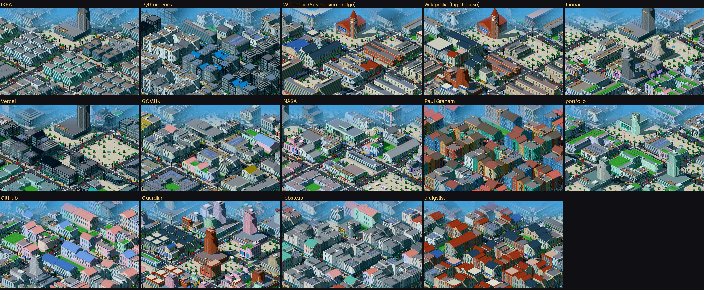
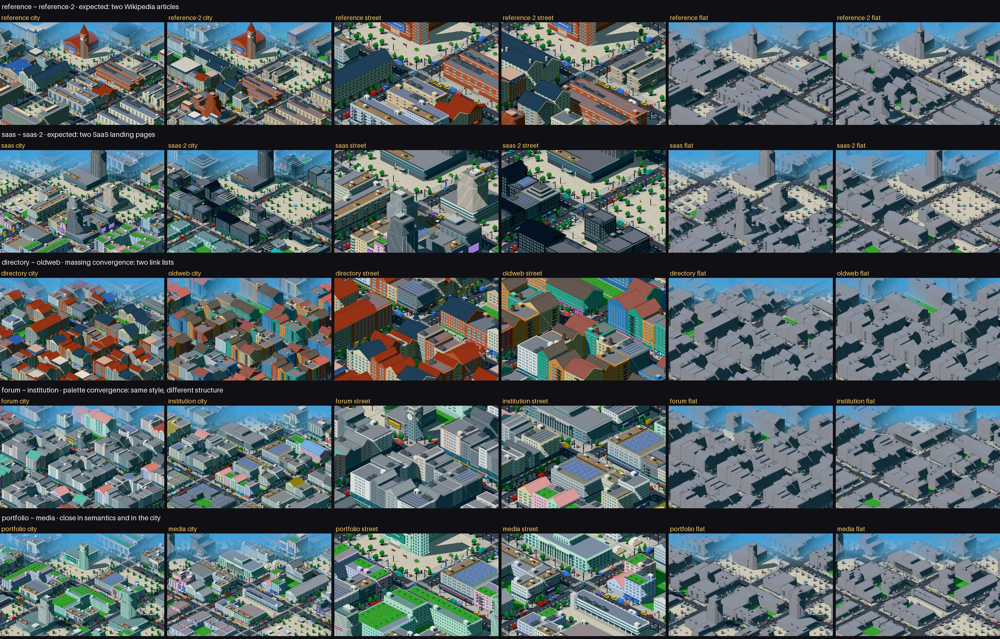

# Pixel city: end-to-end differentiation

> Rodada diagnóstica. Nenhuma camada de produção foi alterada: o kit atual é byte a byte o kit-v6
> congelado ([`e2e/corpus-baseline.txt`](e2e/corpus-baseline.txt), 42/42 cidades idênticas). A única
> instrumentação nova é um *harness* que força o estilo de uma página (`src/lib/pixelcity/diagnostics.ts`,
> `?style=` em `/pixel/kit`), usado só para medir ruído de estilo.

## Conclusão

**MOSTLY.** Nas escalas **CITY** e **STREET**, a cidade final preserva as diferenças da página de
forma proporcional e explicável: páginas diferentes variam 2,6× (city) e 2,2× (street) mais que uma
troca de seed; só 1 de 91 pares fica dentro do ruído de seed em City, e é o par dos dois artigos da
Wikipedia, que deve mesmo convergir; os dois pares semanticamente próximos (Wikipedia × Wikipedia,
Linear × Vercel) ficam entre os mais parecidos em todas as camadas; o `flat` concorda com a semântica
(ρ = 0,63) e com o massing (ρ = 0,68). Não é YES por três razões, todas documentadas e **não
corrigidas**:

1. **Funil das páginas de lista de links** (composition → massing): GitHub, lobste.rs, Paul Graham e
   craigslist viram quase o mesmo tecido de *rows* + esquinas, 89–100% comercial. Parte é convergência
   esperada (as quatro são >79% links), mas a organização interna (craigslist: 6 listas agrupadas com
   títulos; Paul Graham: uma lista única) não chega ao massing — `flat` craigslist × Paul Graham fica
   no 1º percentil de distância, contra o 56º na semântica.
2. **Funil comercial** (massing → surface): *parcelled*, *grid* e *navigation* viram todos "commercial"
   (57% dos volumes). A Surface Grammar não acrescenta distinção entre uma grade de produtos e uma
   lista de links; quem os separa na imagem é o massing (módulos idênticos × fileiras).
3. **CLOSE não diferencia páginas por quadro**: num único enquadramento, 25 de 91 pares ficam dentro
   do ruído de seed (cor de parede, forma de telhado e estilo secundário são sorteados por prédio). As
   métricas de programa (uso, térreo, corpo) continuam 9,6× acima do ruído de seed — a identidade de
   programa existe, mas um quadro Close mostra 1–3 prédios e não é uma amostra estável da página.

## 1. Pergunta

Quando duas páginas reais são estrutural e semanticamente diferentes, essa diferença sobrevive à
cadeia PAGE → SEMANTICS → TERRITORY → COMPOSITION → MASSING → SURFACE → OPENINGS → PIXELS? E páginas
próximas continuam próximas?

## 2. Método

- **Fingerprint por camada** ([`scripts/e2e/analyze.ts`](../scripts/e2e/analyze.ts)): o que o sistema
  de fato guarda em cada etapa, como distribuições (mistura de tipos de região, composições,
  famílias, alturas, usos, térreos, estilos…) e escalares (densidade de links, dominância, centralidade
  do território dominante, cobertura…). Distância entre páginas = média das distâncias de cada
  componente (variação total nas distribuições; diferença normalizada pela amplitude do corpus nos
  escalares), sempre em [0, 1]. As camadas **não** compartilham unidade: o que se compara é a
  **relação** — postos (Spearman entre camadas), razões contra ruído de seed e de estilo.
- **Pixels** ([`scripts/e2e/visual.py`](../scripts/e2e/visual.py)): capturas 1440×900 @2x, mesma
  câmera, dia, seed 7 (CITY, STREET em `focus=0,0`, CLOSE em `focus=9.4,0`, FLAT). Distância de imagem
  = média de quatro componentes (histograma de cor, mapa de luminância 32×20, histograma de gradiente,
  orientação de bordas), cada um normalizado pela mediana entre páginas daquela vista.
- **Ruído de seed**: a mesma página com seeds 8–11 (métricas) e 8 (pixels).
- **Ruído de estilo**: a mesma página forçada nos 5 estilos (métricas) e em clássico/moderno
  (pixels); só os campos do fingerprint que votam no estilo mudam (tipografia, legado, arredondamento,
  ornamento) — mesmo número de prédios e mesma alocação (verificado).
- **Controle `flat=1`** (massing puro) e **ablações**: kit-v4 (sem Surface Grammar), kit-v5 (sem
  aberturas), todas as páginas num estilo só, e ablações de componentes nas métricas
  ([`e2e/ablations.txt`](e2e/ablations.txt)).
- **Teste cego**: folhas sem nome, ordem embaralhada; julgamento escrito **antes** de abrir a chave
  ([`e2e/blind-judgement.md`](e2e/blind-judgement.md), [`e2e/blind-key.json`](e2e/blind-key.json)).

Tabelas completas: [`e2e/tables.md`](e2e/tables.md) · dados: [`e2e/metrics.json`](e2e/metrics.json),
[`e2e/visual.json`](e2e/visual.json).

## 3. Corpus

Os 14 snapshots congelados (nenhum site foi recapturado): IKEA (`shop`), Python Docs (`docs`),
Wikipedia — Suspension bridge (`reference`) e Lighthouse (`reference-2`), Linear (`saas`), Vercel
(`saas-2`), GOV.UK (`institution`), NASA (`media`), Paul Graham (`oldweb`), portfolio, GitHub (`app`),
Guardian (`news`), lobste.rs (`forum`), craigslist (`directory`).

Pares semanticamente próximos por construção do corpus: **reference ~ reference-2** (dois artigos da
Wikipedia) e **saas ~ saas-2** (duas landing pages de SaaS).

## 4. Fingerprints por camada

| camada | o que o fingerprint guarda |
|---|---|
| **semantics** | mistura de tipos de região por peso (texto, lista, mídia, produto, chrome, hero); composição do conteúdo (texto / links / mídia de conteúdo / controles); escalares do fingerprint da página (tamanho, profundidade, regularidade, densidade de texto, imagens, links, títulos, interatividade, formulários); nº de regiões, dominância, entropia dos pesos, peso do hero |
| **territory** | lotes por composição; distribuição dos lotes por posto; nº de territórios, dominância, entropia, fragmentação (segmentos por território), densidade de fronteiras, centralidade do território dominante |
| **composition** | peças por composição; tipos de peça (full/half/quad/lot) por lote; prédios por lote, esquinas, interiores, lotes abertos (praças, pátios), quarteirões repetidos |
| **massing** | famílias; formas de cobertura; andares (faixas); área de footprint (faixas); família do marco; alturas mediana / p90 / máxima; cobertura do solo; andares do marco |
| **surface** | uso; térreo; base; corpo (superfície/padrão); coroamento; serviço da cobertura; cobertura ocupada; esquina |
| **expression** | estilo; abertura (vidro/profundidade); moldura + peitoril + caixilho; toldo |

## 5. Matrizes por camada

Matrizes 14×14 completas (métricas e pixels) em [`e2e/tables.md`](e2e/tables.md) §3. Resumo:

| camada | média página↔página | mín. | ruído de seed (máx.) | ruído de estilo | página / seed | página / estilo | ρ com a semântica |
|---|---|---|---|---|---|---|---|
| semantics | 0,388 | 0,093 | 0 | 0 | ∞ | ∞ | 1,00 |
| territory | 0,389 | 0,027 | 0 | 0 | ∞ | ∞ | 0,60 (0,87 contra a estrutura que o plano lê) |
| composition | 0,381 | 0,101 | 0 | 0 | ∞ | ∞ | 0,63 |
| massing | 0,435 | 0,081 | 0,020 (0,054) | 0,058 | 22,2 | 7,4 | 0,50 (0,64 sem o marco) |
| surface | 0,450 | 0,120 | 0,047 (0,148) | 0,174 | 9,6 | 2,6 | 0,47 |
| expression | 0,545 | 0,086 | 0,065 (0,255) | 0,403 | 8,4 | 1,4 | 0,34 |
| **pixels CITY** | 1,12 | 0,51 | 0,42 (0,61) | 0,76 | **2,6** | **1,5** | 0,49 (estrutura do plano 0,56; com estilo fixo 0,70) |
| **pixels STREET** | 1,04 | 0,51 | 0,48 (0,68) | 0,66 | **2,2** | **1,6** | 0,28 (estrutura do plano 0,27; com estilo fixo 0,48) |
| **pixels CLOSE** | 1,01 | 0,61 | 0,52 (0,89) | 0,56 | **1,9** | **1,8** | 0,21 |
| pixels FLAT | 1,11 | 0,55 | – | – | – | – | 0,63 (estrutura do plano 0,60; massing 0,68) |

Concordância de postos entre camadas consecutivas (Spearman, 91 pares):
semantics —0,60→ territory —0,86→ composition —0,48→ massing —0,48→ surface —0,53→ expression.

**Retenção de diferenciação** (medida simples): ρ entre a distância semântica e a distância na
camada. Ela cai de 1 para ~0,6 na alocação, **para de cair** entre territory e surface (0,63 → 0,47),
e cai na expressão (0,34), onde o estilo entra. Robustez: refazendo tudo só com os componentes-chave
de cada camada, a ordem dos pontos de perda é a mesma ([`e2e/ablations.txt`](e2e/ablations.txt)).

## 6. Page vs seed

- **Métricas**: semantics, territory e composition **não dependem da seed** (ruído 0). Massing 22×,
  surface 9,6×, expression 8,4× acima do ruído de seed; nenhum par de páginas abaixo do ruído máximo
  em massing; 2/91 em surface (Wikipedia × Wikipedia, Linear × portfolio) e 5/91 em expression.
- **Pixels**: City 2,6×, Street 2,2×, Close 1,9×. Pares dentro do ruído máximo: City **1/91**
  (Wikipedia × Wikipedia), Street **4/91** (Wikipedia × Wikipedia, Guardian × Wikipedia Lighthouse,
  portfolio × NASA, Wikipedia Lighthouse × Vercel), Close **25/91**.
- O que a seed muda (folha E): cores de parede, forma de telhado e quais prédios recebem o estilo
  secundário. Em Python Docs a rua muda bastante (telhados azuis ↔ fachadas brancas) porque o estilo
  secundário (tech) cai em outros prédios. A estrutura (alocação, peças, alturas) não muda.

## 7. Page vs style

- O estilo forçado só muda o estilo (mesmos prédios, mesma alocação — verificado).
- **Estrutura imune**: territory e composition não mudam com o estilo; massing muda pouco (7,4×
  abaixo da diferença entre páginas — só a forma do telhado, que o estilo escolhe).
- **Superfície**: estilo vale ~1/2,6 de uma troca de página; com todas as páginas no mesmo estilo,
  a distância de superfície entre páginas cai de 0,450 para 0,355 — **o programa continua lá**.
- **Pixels**: trocar só o estilo muda a imagem em 2/3 do que muda trocar de página (página / estilo
  ≈ 1,5). Mas pôr todas as páginas no mesmo estilo reduz a distância entre páginas só 5% (city 1,12
  → 1,06) e **aumenta** a concordância com a semântica (0,56 → 0,70). Leitura: o estilo é um eixo
  visual forte e **independente** da estrutura; ele não apaga a estrutura, mas acrescenta diferença
  que não vem da organização da página (vem da tipografia/legado/arredondamento — também da página).
- Exceção: nas páginas de lista de links o estilo é quase toda a identidade (folha F: Paul Graham em
  clássico/moderno vira outra cidade; IKEA continua IKEA porque a grade de módulos é estrutura).

## 8. Signal survival

Spearman entre o sinal na página e cada efeito a jusante (14 páginas). Tabela completa em
[`e2e/tables.md`](e2e/tables.md) §5.

| sinal | caminho | ρ | classificação |
|---|---|---|---|
| hero | landmark lots 1,00 → andares do marco 0,96 → prédio mais alto 0,73 | alto | **survives strongly** |
| mídia de conteúdo | lotes *media* 0,92 → torres/pódios 0,91 → uso office 0,80 | alto | **survives strongly** |
| interatividade | lotes *interactive* 0,79 → quiosques 0,75 → transparência das vitrines 0,82 | alto | **survives strongly** |
| chrome / rodapé | lotes support+navigation 1,00 → uso service 0,72 | alto | **survives strongly** |
| grade de produtos repetida | lotes *grid* 1,00 → módulos idênticos 1,00 → uso commercial 0,23 | alto até o massing | **survives strongly** (gasto na composição; a superfície não o distingue) |
| lista / documento | lotes *archive* 0,73 → uso institutional 0,73 | médio | **survives** |
| escuridão da página | → paleta noturna (hora própria) 0,89 | alto | **survives strongly** (neutralizado nas capturas deste estudo, que usam dia) |
| densidade de links | lotes parcelled+archive+nav 0,74 → *rows* 0,54 → unidades de loja 0,57 | médio | **survives weakly** |
| texto longo | lotes *continuous* 0,64 → pátios/L 0,76 → uso residencial 0,54 | médio | **survives weakly** |
| hierarquia de títulos | → base dupla / ático 0,70 | médio | **survives weakly** (só superfície, sutil na imagem) |
| regularidade | → vãos de ponta articulados (inv.) 0,62 | médio | **survives weakly** (só abaixo de 0,45) |
| tamanho / profundidade do DOM (verticalidade) | → altura mediana −0,16 | nulo | **accidentally lost** (mascarado): `vf` só varia 0,97–1,20 e é arredondado; a mistura de composições decide as alturas |
| imagens brutas (`fp.imagery`) | → voto *modern* no estilo, outdoors | – | **upstream leak**: o fingerprint de página ainda conta os 471 GIFs espaçadores do Paul Graham (imagery 1,0); a higiene corrigiu o plano, não o fingerprint de identidade |
| rótulos de região errados (craigslist "features", lobste.rs "faq") | ignorados: a composição usa as métricas | – | **irrelevant downstream** (correto) |

## 9. Signal budget

Onde cada sinal é gasto hoje (e para):

```
pesos de conteúdo das regiões ───────────► TERRITORY (lotes) ─────────────── STOP
tipo de conteúdo (métricas da região) ───► COMPOSITION (mix) ─► MASSING (família, andares) ─► SURFACE (uso)
hero ────────────────────────────────────► LANDMARK (lotes, família, andares) ──────────────── STOP
mídia de conteúdo ───────────────────────► COMPOSITION media ─► torres/pódios ─► uso office
interatividade ──────────────────────────► COMPOSITION interactive ─► quiosques ─► transparência do térreo
densidade de links (página) ─────────────► SURFACE: largura das lojas  (já gasto por região na composição)
títulos ─────────────────────────────────► SURFACE: base dupla / ático
regularidade ────────────────────────────► SURFACE: vãos de ponta
tipografia, legado, arredondamento, ornamento ► STYLE ─► expressão (moldura, telhado, cor) ──── STOP
cores ───────────────────────────────────► PALETA ──────────────────────────────────────────── STOP
escuridão ───────────────────────────────► HORA DO DIA ─────────────────────────────────────── STOP
tamanho / profundidade / densidade de texto ► VERTICALIDADE (±10% nos andares) ── (quase não chega)
```

Distinção perda × consumo: a queda semântica → território (ρ 0,60) **não é perda**: o território
segue a estrutura que o plano lê com ρ = 0,87; os escalares de página (tamanho, profundidade,
regularidade…) têm ρ ≈ 0,15 com qualquer camada estrutural porque **são consumidos** pelo estilo e
por parâmetros finos da superfície, de propósito. A única perda real nesse grupo é a verticalidade.

## 10. Flat vs normal

- `flat` (só massing) concorda com a semântica (ρ 0,63) e com o massing (0,68) — **as diferenças
  estruturais aparecem no flat**.
- Normal City tem a mesma magnitude (1,12 × 1,11) mas concorda menos com a semântica (0,49): a cor e
  o estilo acrescentam diferença não estrutural. Com o estilo fixo, o normal concorda **mais** que o
  flat (0,70 × 0,60, ambos contra a estrutura do plano): a Surface Grammar, descontado o estilo, **acrescenta identidade causal**.
- Resposta à pergunta 13: **A (acrescenta identidade)**, com uma ressalva de B: na rua, o kit-v4 →
  kit-v6 reduz a distância bruta entre páginas 5% (o ruído sorteado das coberturas saiu) e aumenta a
  concordância com a semântica (0,18 → 0,27). Não é C: o massing é idêntico por construção (teste).

## 11. Ablations

| ablação | efeito |
|---|---|
| sem Surface Grammar (kit-v4), STREET | distância entre páginas 1,10 (vs 1,04); ρ com a estrutura 0,18 (vs 0,27) — mais variação, menos causal |
| sem aberturas (kit-v5), STREET/CLOSE | 1,07 / 1,05 (vs 1,04 / 1,01); ρ igual — as aberturas não mudam a diferenciação (como esperado: são material) |
| estilo fixo (todas clássicas), CITY | 1,06 (vs 1,12); ρ 0,70 (vs 0,56) — o estilo não carrega a identidade estrutural |
| sem o marco (métrica de massing) | média 0,393 (vs 0,435); ρ com a semântica 0,64 (vs 0,50) — o marco é uma diferença categórica forte e pouco correlacionada |
| sem estilo/moldura/toldo (métrica de expressão) | ρ com a semântica cai para 0,16 — o resto da expressão (abertura) é quase só função do uso |
| seed fixa | já é o caso de todas as comparações (seed 7); seeds 8–11 dão o ruído |

Quem carrega a diferenciação final: **massing + marco** na City, **massing + paleta/estilo** na
Street, **paleta/estilo + 1–3 prédios** no Close. A Surface Grammar e as aberturas tornam a leitura
mais causal, mas não são as maiores fontes de distância.

## 12. Pares mais parecidos (pixels CITY, e onde convergem)

| par | city | street | flat | semântica | onde convergem | classificação |
|---|---|---|---|---|---|---|
| Wikipedia × Wikipedia (Lighthouse) | 0,51 (p0) | 0,51 (p1) | 0,55 (p0) | p0 | em tudo | **EXPECTED CONVERGENCE** |
| portfolio × GOV.UK | 0,62 (p1) | 0,91 (p29) | 0,98 (p53) | p2 | semântica próxima; paleta moderna parecida | **EXPECTED** |
| lobste.rs × GOV.UK | 0,62 (p2) | 0,95 (p36) | 1,20 (p62) | p57 | surface p12, expressão p4: mesmo estilo (moderno), maioria comercial | **SURFACE / expression convergence** (estrutura diferente no flat; o teste cego **não** os confundiu) |

Também muito próximos: portfolio × NASA (p4; semântica p27, território p5), Linear × Vercel (p15;
semântica p4 — **EXPECTED**), craigslist × Paul Graham (flat p1, massing p2; semântica p56 —
**COMPOSITION/MASSING LOSS** parcial, ver §14).

## 13. Pares mais diferentes

| par | city | semântica | leitura |
|---|---|---|---|
| IKEA × craigslist | 2,08 (p99) | p99 | grade de módulos idênticos × fileiras de lista; proporcional |
| IKEA × Paul Graham | 2,06 (p98) | p74 | idem + estilo (moderno × retro); amplificado pelo massing (p99) |
| Python Docs × IKEA | 1,74 (p97) | p87 | texto contínuo (pátios) × grade de produtos; proporcional |

Os pares semanticamente mais distantes são todos claramente diferentes em CITY e STREET (folha I).

## 14. Pontos de compressão

| onde | entra | sai | por que se perde | classe |
|---|---|---|---|---|
| composition → massing (links) | 4 páginas de lista com organização diferente (craigslist: 6 listas tituladas por país; Paul Graham: 1 lista de 215 títulos; lobste.rs: 1 lista com metadados; GitHub: listas + readme) | o mesmo tecido de *rows* + esquinas, 3–5 andares | *parcelled* produz a mesma peça para qualquer lista; territórios adjacentes da mesma composição não se distinguem (o programa varia por peça, não por território), então a partição em 6 listas some | **COMPOSITION / MASSING LOSS** (parcial; a semelhança de conteúdo — >79% links — é esperada) |
| massing → surface | grade de produtos (IKEA), lista de links (lobste.rs), navegação | "commercial" em 57% dos volumes; IKEA × lobste.rs converge 69 pontos percentuais de posto na superfície | o mapeamento composição → uso é muitos-para-um (*parcelled*, *grid*, *navigation* → commercial) | **SURFACE LOSS** (compensada na imagem pelo massing) |
| composition → massing (marco) | presença e tipo de hero | família do marco (torre do relógio, pódio, cívico, nenhum) | a família do marco é categórica e pesa muito; diferença real, mas pouco correlacionada com o resto da semântica | não é perda: **ganho de diferença não proporcional** |
| page-wide → massing | tamanho/profundidade do DOM | ±10% de andares, arredondado | mascarado pela mistura de composições | **ALLOCATION/MASSING LOSS** (pequena) |
| upstream | imagens incidentais | `fp.imagery` alto no Paul Graham e lobste.rs | a higiene limpou o plano, não o fingerprint de identidade (vota no estilo moderno e em outdoors) | **UPSTREAM leak** (não é perda, é ruído) |
| pixels CLOSE | identidade de programa (9,6× seed nas métricas) | 25/91 pares dentro do ruído de seed | um quadro Close mostra 1–3 prédios; cor/telhado/estilo secundário sorteados dominam o histograma | **RENDERING / sampling** (o programa está lá; o quadro único não é amostra) |

Não há compressão relevante entre territory e composition (ρ 0,86) nem perda de massing pela
superfície (o flat é idêntico e a superfície concorda com o massing).

## 15. Convergência esperada

- **Wikipedia × Wikipedia (Lighthouse)**: o par mais próximo em **todas** as camadas e nas 4 vistas;
  o teste cego chamou C ≈ N de "a mesma cidade". Família reconhecível, com o marco e o conteúdo
  (referências, infobox) proporcionais.
- **Linear × Vercel**: semântica p4, pixels p3–p15, mesmo tipo de marco (torre em pódio); o teste cego
  agrupou D ≈ L. Família reconhecível; diferem no estilo (moderno × tech) e na fração de mídia.
- **Páginas de lista de links** (lobste.rs × Paul Graham: semântica p11, território p0): convergência
  esperada; craigslist entra no grupo com mais força do que a semântica justifica (§14).

## 16. Folhas

| folha | o quê |
|---|---|
| [A-city-matrix](screenshots/e2e/sheets/A-city-matrix.jpg) | todas as páginas, CITY |
| [B-street-matrix](screenshots/e2e/sheets/B-street-matrix.jpg) | STREET |
| [C-close-matrix](screenshots/e2e/sheets/C-close-matrix.jpg) | CLOSE |
| [D-flat-matrix](screenshots/e2e/sheets/D-flat-matrix.jpg) | FLAT |
| [E-page-vs-seed](screenshots/e2e/sheets/E-page-vs-seed.jpg) | mesma página, seeds 7/8 |
| [F-page-vs-style](screenshots/e2e/sheets/F-page-vs-style.jpg) | mesma página, estilo próprio / clássico / moderno |
| [G-ablations](screenshots/e2e/sheets/G-ablations.jpg) | sem Surface Grammar / sem aberturas / completo |
| [H-most-similar](screenshots/e2e/sheets/H-most-similar.jpg) | pares mais parecidos |
| [I-most-different](screenshots/e2e/sheets/I-most-different.jpg) | pares mais diferentes |
| blind-[city](screenshots/e2e/sheets/blind-city.jpg) · [street](screenshots/e2e/sheets/blind-street.jpg) · [close](screenshots/e2e/sheets/blind-close.jpg) · [flat](screenshots/e2e/sheets/blind-flat.jpg) | teste cego (letras; chave em `e2e/blind-key.json`) |




### Teste cego

Julgamento escrito antes da chave ([`e2e/blind-judgement.md`](e2e/blind-judgement.md)):

| agrupamento cego | páginas | veredito |
|---|---|---|
| C ≈ N "a mesma cidade" | Wikipedia × Wikipedia | correto (convergência esperada) |
| D ≈ L (torre escura em praça) | Linear × Vercel | correto (convergência esperada) |
| F ≈ M (tecido denso de telhados inclinados) | craigslist × Paul Graham | convergência real de massing (§14) |
| A ≈ G (cidade cinza/clara com salão baixo) | NASA × GOV.UK | semântica p22, cidade p11: proporcional |
| G ≈ I (só no Close) | GOV.UK × lobste.rs | convergência de superfície/estilo; na City o cego os separou |
| singulares: H, K, B, J | IKEA, Guardian, Python Docs, GitHub | cada um com identidade própria |

Nenhum par semanticamente distante foi agrupado às cegas.

## 17. Conclusão

**MOSTLY.** A cidade final preserva as diferenças da página de forma proporcional e explicável em
City e Street, e as convergências que existem são, na maioria, causais (páginas realmente parecidas)
ou localizáveis (funil das listas de links na composição/massing; funil comercial na superfície;
quadro Close pequeno demais para amostrar uma página).

Critérios do pedido:

| # | critério | resultado |
|---|---|---|
| 1 | distantes > ruído de seed | ✅ City 2,6×, 1/91 pares (o par irmão) dentro do ruído |
| 2 | próximas com semelhança de família | ✅ Wikipedia × Wikipedia p0; Linear × Vercel p3–p15 |
| 3 | diferenças estruturais no flat | ✅ ρ 0,63 com a semântica |
| 4 | Surface acrescenta identidade sem apagar massing | ✅ com ressalva: acrescenta concordância causal, mas colapsa programas em "commercial" |
| 5 | estilo não domina a identidade estrutural | ✅ estrutura imune; ⚠️ nas páginas de lista o estilo é quase toda a identidade |
| 6 | Close preserva diferenças de programa | ⚠️ nas métricas sim (9,6× seed); por quadro, não (25/91 dentro do ruído) |
| 7 | nenhum conjunto de sinais morre em silêncio | ⚠️ verticalidade mascarada; imagens brutas vazam para o estilo |
| 8 | similaridade final causalmente explicável | ✅ os vizinhos mais próximos têm explicação na cadeia |

Thresholds propostos **a partir das medidas** (não usados para aprovar esta rodada): pixels City e
Street ≥ 2× o ruído de seed; ≤ 5% dos pares dentro do ruído máximo, fora pares irmãos; pares irmãos
no decil inferior em todas as camadas; ρ(flat, estrutura do plano) ≥ 0,5; massing ≥ 5× o ruído de
estilo.

Limites do método: as distâncias são construções (pesos iguais entre componentes); o fingerprint
semântico é uma proxy; a métrica de pixels é sensível à paleta (lobste.rs × GOV.UK parecem mais
próximos para a métrica do que para o olho); Street e Close são um enquadramento por página.

