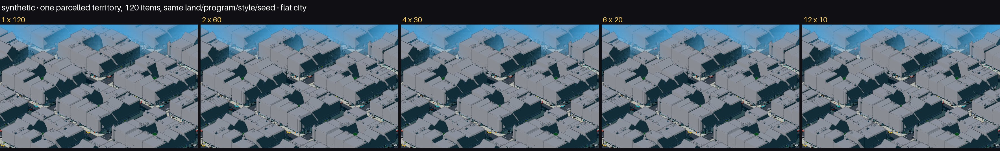
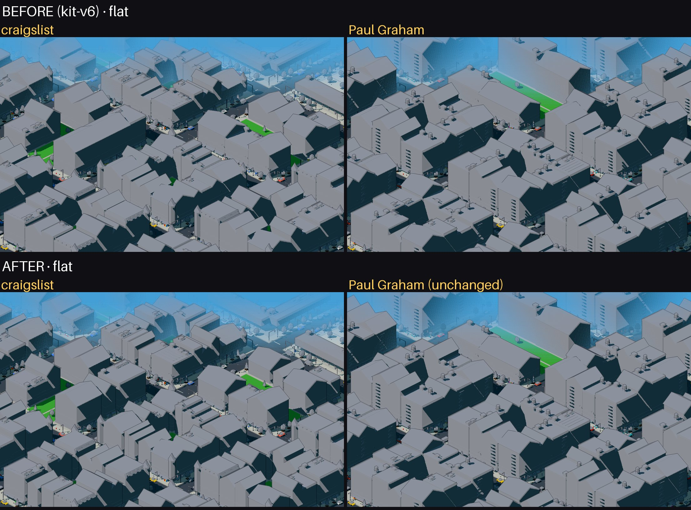
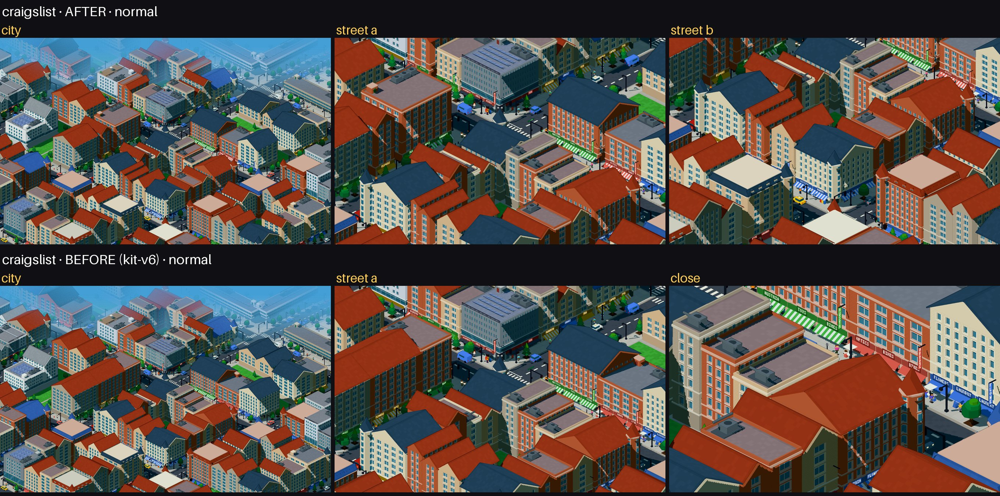
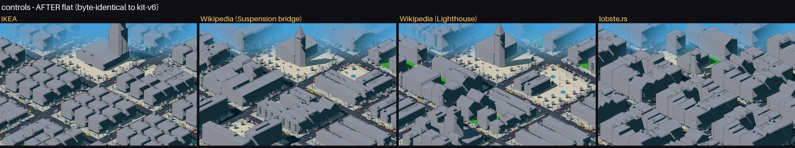

# Pixel city: intra-territory composition

> Corrige um gargalo achado pela validação ponta a ponta
> ([PIXEL_END_TO_END_DIFFERENTIATION.md](PIXEL_END_TO_END_DIFFERENTIATION.md)): a estrutura interna
> das listas morria antes da composição. Baseline: kit-v6 (`?v=6`). Tabelas:
> [`composition/tables.md`](composition/tables.md) · territórios *parcelled* do corpus:
> [`composition/generalization.md`](composition/generalization.md) · testes: `npm run test:composition`.

## 1. Falha encontrada pelo E2E

craigslist × Paul Graham: semântica no percentil 56 de distância, `flat` no percentil 1. As duas
páginas viravam o mesmo tecido de fileiras.

## 2. Onde a informação era perdida (auditoria)

| | estrutura real | o que chegava à composição |
|---|---|---|
| craigslist | 7 continentes (`h2`) × 140 sublistas tituladas (`h4` + `ul`) | 5 territórios de continente com `repeat = 4` cada (eram as **4 colunas** do layout, não as 7–27 sublistas) + o resto da página (EUA, 49 sublistas) com `repeat = 0` |
| Paul Graham | 1 sequência de 215 links | 1 bloco observado com `repeat = 0` |

1. Dentro do território, a estrutura sumia no **page model** (`plan.ts`): `Territory` só tinha
   `repeat` (itens da região) e métricas agregadas, sem títulos nem subgrupos.
2. Entre territórios, o `parcelled` recebia a partição (5 continentes) e a ignorava: cada peça era
   montada só com tipo de peça + `repeat`.

## 3. Modelo implementado

**A. Page model** — descritor aditivo `Territory.structure` ([`kit/structure.ts`](../src/lib/pixelcity/kit/structure.ts)),
anexado depois de peso, chave, ordem e mix. Fontes de evidência, da mais forte para a mais fraca:

| fonte | regra |
|---|---|
| `explicit` | títulos-**rótulo** particionam o conteúdo; grupos no nível mais profundo que ainda dá ≥ 2 grupos não vazios e cobre ≥ 60% do conteúdo; um nível mais raso dá as `sections`. Um título que **é um link** é título de item (história, produto), não rótulo de grupo |
| `inferred` | sem títulos-rótulo, uma série de ≥ 2 listas irmãs (`ul`/`ol`/`table`/`menu`, nunca `div` de coluna nem `dl`) sob o mesmo pai, cada uma com ≥ 3 itens e ≥ 10% dos itens |
| `none` | uma sequência — nenhum grupo inventado |

Tamanho de cada grupo: soma do `selfWeight` dos seus nós (o mesmo modelo de peso dos territórios)
e os links próprios. A evidência fica no trace (`structure.evidence`).

**B. Composition** — [`kit/frontage.ts`](../src/lib/pixelcity/kit/frontage.ts) + `groupedParcelled` em
`compose.ts`. Só para território *parcelled* com estrutura (≥ 2 grupos):

```
fileiras de rua das peças do território, em ordem do caminho → slots de ~2,7 (meia fileira)
grupos consecutivos → no máximo ⌈slots/2⌉ clusters (todos sozinhos se cabem; senão cortes em
                      partes iguais de peso, presos a fronteiras de grupo)
clusters → slots por arredondamento cumulativo (≥ 1 slot cada)
cada fileira vira runs; cada run continua a sequência de unidades da fileira do kit-v6 (mesma
seed, mesmos índices: as unidades — os itens — não mudam); toda troca de cluster abre uma
passagem de 0,7 (no meio da fileira ou entre a fileira e a esquina)
```

Limite e área do território, peças, lotes, esquinas e pátios ficam iguais. Sem estrutura, nada é
planejado: o layout é o do kit-v6 (byte a byte). O trace guarda, por território,
`grupos → clusters → slots → passagens` (`trace.frontage`).

## 4. Testes sintéticos (mesma terra, itens, programa, estilo e seed)

| grupos | clusters | passagens | planta alterada vs 1 grupo |
|---|---|---|---|
| 1 × 120 | – | 0 | 0 (layout kit-v6) |
| 2 × 60 | 2 | 1 | 0,26% |
| 4 × 30 | 4 | 3 | 0,61% |
| 6 × 20 | 6 | 5 | 0,77% |
| 12 × 10 | 12 | 11 | 1,55% |

Monotônico e limitado. Pesos: 50/50 → slots 64/64; 80/20 → 102/26; 50/25/15/10 → 64/32/19/13 (todas
dentro de ±3 pontos). Descritor: 1×120 → `none`; 2/4/6/12 grupos → `explicit` com os tamanhos
certos; títulos-link → `none`; colunas `div` → `none`; série de `dl` → `none`; listas minúsculas → `none`.



## 5. craigslist × Paul Graham

**A. Page model** — a estrutura agora chega a `Territory`: craigslist 12/27/21/19/7 sublistas nos
continentes e 41 sublistas em 2 seções no resto da página (278 de 278 links agrupados); Paul Graham
continua uma sequência de 215 itens.

**B. Composition**:

| | BEFORE | AFTER |
|---|---|---|
| semântica | p56 | p56 |
| massing (métrica E2E) | 0,180 (p2) | 0,226 (p4) |
| **pixels flat** | **0,55 (p1)** | **0,78 (p36)** |
| pixels City normal | 1,02 (p41) | 0,98 (p36) |

craigslist: 6 territórios planejados (12→5, 27→10, 21→8, 19→7, 7→2, 41→27 clusters), 13% da planta
alterada; Paul Graham inalterado.




## 6. Controles

IKEA, Wikipedia × Wikipedia, Python Docs, GOV.UK, lobste.rs e todas as outras 13 cidades:
**byte-idênticas ao kit-v6** (normal e flat). Nenhum território *parcelled* deles tem estrutura:
lobste.rs são 25 histórias com títulos-link (uma lista); GOV.UK "Benefits" são 16 títulos-link;
Paul Graham, GitHub, NASA, Wikipedia: uma sequência. 31 de 37 territórios *parcelled* do corpus não
mudaram, e não deveriam ([`generalization.md`](composition/generalization.md)); os 6 que mudaram são
os do craigslist. Nenhum mudou demais nem perdeu estabilidade.



## 7. Estabilidade (resto da página do craigslist, 26 cortes)

| perturbação | cortes que mudam | planta alterada |
|---|---|---|
| item +1 no maior grupo | 2 | 0,59% |
| item −1 | 0 | 0 |
| peso do maior grupo +5% | 2 | 0,59% |
| peso −10% | 2 | 0,54% |
| um grupo de 1 item some | 6 | 0,94% |
| um grupo de 1 item aparece | 0 | 0 |

## 8. Corpus BEFORE × AFTER

| | BEFORE | AFTER |
|---|---|---|
| ρ semântica ↔ composição (métrica) | 0,63 | 0,63 |
| ρ semântica ↔ massing (métrica) | 0,50 | 0,49 |
| ρ semântica ↔ pixels flat | 0,63 | 0,62 |
| ρ semântica ↔ pixels City | 0,49 | 0,48 |
| página ÷ ruído de seed (City) | 2,63 | 2,66 |

Corpus saudável e praticamente igual — esperado, porque só uma página tem terra *parcelled* com
estrutura. A retenção corpus-wide (estrutura interna → flat) é degenerada aqui (índice de estrutura
4,22 no craigslist, 0 nas outras); a curva de resposta é a dos sintéticos.

## 9. Limitações

1. **O sinal é fino.** A estrutura aparece como passagens e fileiras cortadas em prédios separados;
   na City distante isso é sutil. No sintético, 12 grupos numa cidade inteira mexem só 1,55% da planta.
2. **A sequência única ainda parece fragmentada.** Sem estrutura vale o kit-v6, cujas fileiras
   variam altura/telhado por unidade (item). Paul Graham não lê como "um terraço contínuo" — e não
   mudei isso (mudaria 31 territórios sem estrutura).
3. **City normal não ganhou**: craigslist × Paul Graham 1,02 → 0,98 (dentro do ruído de seed, 0,40):
   paleta e estilo (clássico × retro) dominam ali.
4. **Instrumento E2E**: a métrica de composição da validação lê peças, não runs; por isso não mudou.
   A mudança aparece no massing (p2 → p4) e no flat (p1 → p36).
5. **Generalidade pouco testada no corpus**: a regra dispara em uma página. Os sintéticos e o
   critério conservador (títulos-rótulo, listas irmãs) sustentam a generalidade; o corpus não.
6. Fora do escopo, como pedido: funil comercial, verticalidade, marco, Surface Grammar, aberturas,
   fingerprint do Paul Graham.
