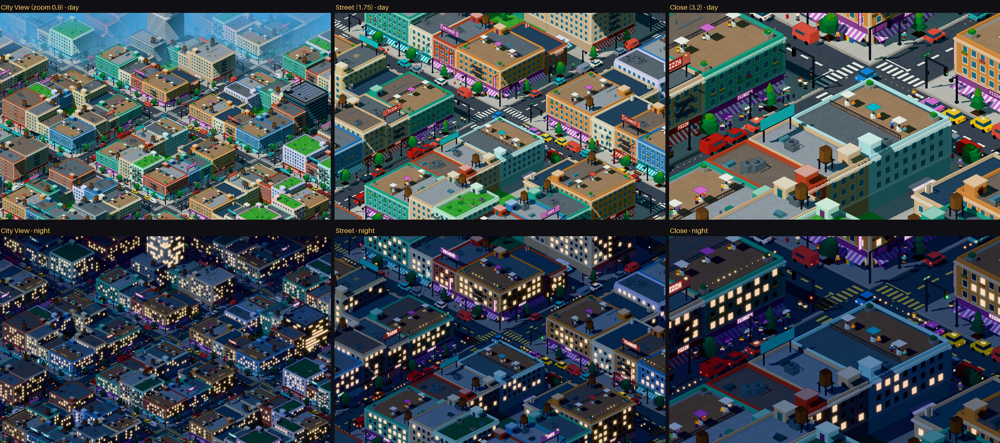
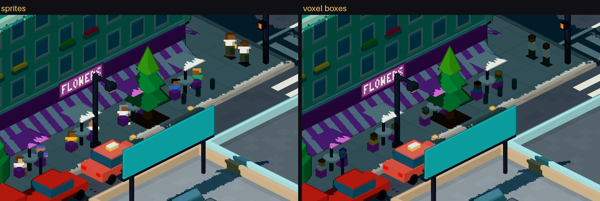
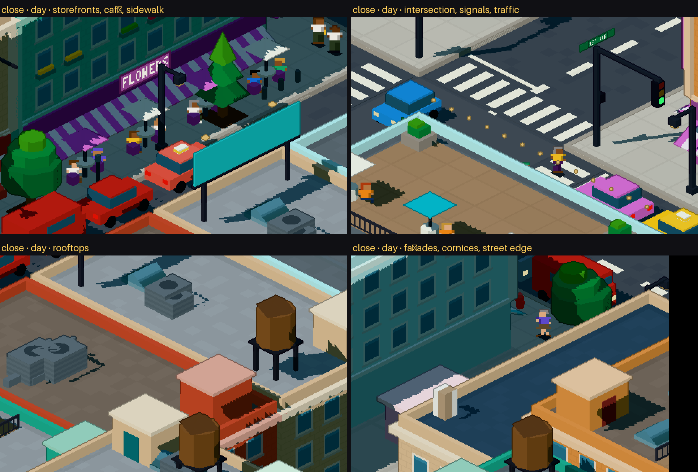
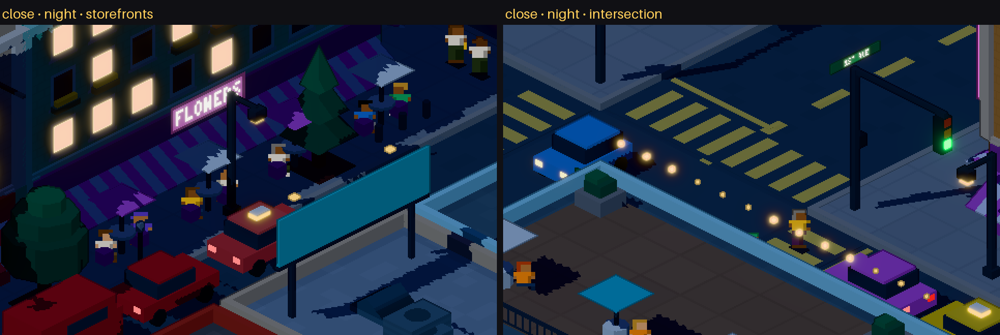
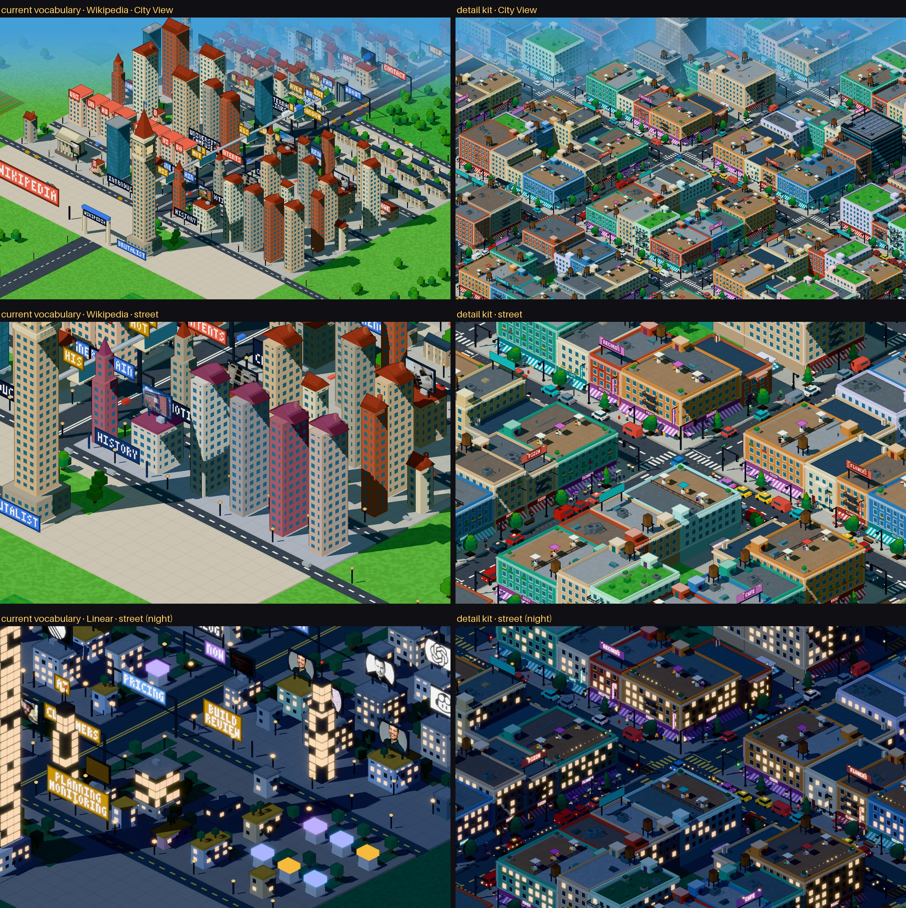

# Pixel city: kit de detalhe (protótipo)

> Pergunta: até onde a arquitetura atual (`Part` + instancing + geometria procedural) chega
> perto de uma cidade isométrica ilustrada, densa e legível, sem sprites nos prédios?
> Resposta curta: **bem perto.** O protótipo usa as mesmas primitivas, o mesmo renderer, a
> mesma câmera e o mesmo pós-processamento. Só foram necessárias quatro extensões pequenas e gerais.

```bash
npm run dev
# http://localhost:3000/pixel/kit?view=city|street|close&time=day|night&people=sprite|voxel
BASE=http://localhost:3000 OUT=docs/screenshots/kit-v1 node scripts/kit.mjs --current … v=1   # capturas desta página: o kit da rodada 1 está congelado em kit-v1 (?v=1)
```



*Um distrito de 4×4 quarteirões gerado só com o kit: dia e noite, nas distâncias da City View
(0,9), da rua (1,75) e de perto (3,2). Nada foi posicionado à mão.*

## 1. O que as primitivas existentes já fazem

O kit inteiro é feito das mesmas sete formas instanciadas que a cidade já usa: `box`, `cyl`,
`pyramid`, `prism`, `glow`, `sign` e `image`. A conta de partes do distrito é esta:

| Forma | Partes | Usada para |
|---|---|---|
| `box` | 14 081 | massas, pilastras, cornijas, platibandas, toldos, vitrines, portas, degraus, bancos, carrocerias, postes |
| `cyl` | 3 517 | caixas d'água, mesas, rodas, lixeiras, hidrantes, copas de árvore em camadas, frades |
| `glow` | 3 407 | postes, semáforos, faróis e lanternas, luzinhas de terraço, placas acesas |
| `sprite` | 682 | **só pessoas** |
| `pyramid` | 600 | guarda-sóis, coníferas, telhado de caixa d'água |
| `sign` | 340 | fachadas de loja, letreiros verticais, nomes de rua, outdoors, coroa da torre |
| `prism` | 83 | claraboias |

Gerar 22 710 partes (cerca de 250 prédios) leva **19 ms**. A cena roda a **~60 fps** (limite do
rAF) em 2880×1800, no Chrome headless com GPU. Para comparar, uma cidade de hoje tem 1,2–1,5 mil
partes, mais a terra em volta.

**O que só a geometria resolve bem:** volumes, silhuetas, profundidade e sombra. É o caso de
cornijas que projetam sombra, toldos inclinados, escadas de incêndio vazadas, caixas d'água,
carros com rodas e árvores em camadas. Tudo isso recebe luz em faixas, sombra dura e contorno de
graça.

**O que o shader resolve melhor que geometria:** padrões repetidos ancorados no mundo, como
janelas com moldura e peitoril, faixas de janela, vitrines, faixa de pedestre, lajotas e grade de
ventilação. Saem de graça em quantidade, ficam parados quando a câmera anda e não custam partes.

## 2. O que foi acrescentado (geral, não específico do protótipo)

**No renderer (4 extensões):**

1. `Part.rotX` / `Part.rotZ`: inclinação, além do giro em y. Permite painéis solares, rodas,
   toldos, escadas de incêndio e letreiros em ângulo. O `buildBatches` só monta a rotação
   completa quando a parte é inclinada.
2. `Part.variant`, que vai para o shader em `aMeta.w`. É a variante de superfície, por exemplo
   tijolo aparente em `FRAMED`.
3. Oito superfícies novas no shader, todas ancoradas no mundo:

   | Superfície | O que desenha |
   |---|---|
   | `STORE` | vitrine com montantes e bandeira, interior aceso à noite |
   | `FRAMED` | janela com moldura e peitoril, centrada na baia, uma fileira por andar (variante 1 tem fiadas de tijolo) |
   | `BANDS` | janelas em faixa (escritórios) |
   | `ZEBRA` | faixa de pedestre |
   | `RAIL` | guarda-corpo vazado: as frestas são descartadas |
   | `GRILLE` | aletas e ventilador |
   | `SOLAR` | células fotovoltaicas |
   | `SLABS` | lajotas de calçada |

   As superfícies antigas não mudaram. As cidades atuais renderizam igual.
4. `PartMesh "sprite"`: um quad alinhado à tela, com o pé no ponto do chão, amostrado nearest de
   um atlas. Recorta o fundo transparente e não projeta sombra.

**O vocabulário procedural** (`src/lib/pixelcity/kit/`). Cada peça é uma função de (moldura
local, parâmetros) que emite `Part`s:

| Família | Peças | Arquivo |
|---|---|---|
| Massa e estrutura | térreo + corpo; pódio, corpo e coroa recuada (torre); faixa entre pavimentos; pilastras de canto; aletas; cornija + platibanda + laje | `buildings.ts` |
| Térreo | `storefront` (pilastras, vitrine, porta com moldura, faixa de fachada com nome, toldo listrado inclinado, vitrine com mercadorias); `cafeTerrace` (mesas, cadeiras, guarda-sóis, gente sentada); `lobby` (vidro alto, porta giratória, marquise com nome, vasos); `stoop` (porta, 3 degraus, corrimãos, arandela) | `buildings.ts` |
| Fachada | `balconies` (laje, guarda-corpo vazado, plantas, às vezes alguém); `fireEscape` (patamares e lances); `windowBoxes` (floreiras alinhadas às janelas do shader); bay window; letreiro vertical | `buildings.ts` |
| Cobertura | `rooftop` (HVAC, caixa d'água, casa de máquinas com porta, antena com luz de aviação, fileiras solares, terraço com deck, guarda-sóis, gente e luzinhas, jardim) + `roofClutter` por área (respiros, claraboias, alçapões, ventiladores, eletrocalhas) + `rooftopBillboard` | `buildings.ts` |
| Receitas | `tower`, `office`, `midrise` (walk-up, esquina, apartamentos), `rowhouses`, `kiosk` | `buildings.ts` |
| Rua | asfalto entre cruzamentos, cruzamentos lisos, faixas de pedestre e linhas de retenção em todas as aproximações, anel de calçada com meio-fio | `street.ts` |
| Mobiliário | poste com braço, semáforo com braço e foco de pedestre, placa de rua, hidrante, lixeira, banco, parquímetro, caixa de correio, jornaleiras, frades, abrigo de ônibus, árvore em canteiro | `street.ts` |
| Vegetação | árvore redonda em 3 camadas, conífera em 3 pirâmides, arbusto, vaso | `street.ts`, `buildings.ts` |
| Veículos | sedã, hatch, táxi, van, caminhão de entrega (com nome), ônibus (janelas acesas à noite) | `vehicles.ts` |
| Gente | figuras geradas: 48 aparências × 4 poses; sombra no chão | `people.ts`, `core.ts` |

As peças são escritas numa **moldura local** (frente = +z) e posicionadas com
`kit.frame(x, z, rotação, …)`. As molduras se aninham: lote → fachada → vitrine. É isso que torna
cada peça reutilizável em qualquer lote, orientação ou prédio.

## 3. Sprites: só para gente



*Mesmo lugar, mesmas pessoas, em pixels 1:1. À esquerda, as figuras geradas como sprite; à
direita, as mesmas cores em 4 caixas.*

Na City View uma pessoa tem cerca de 11 pixels de render de altura. Em 4 caixas, ela vira um
toco escuro de 3–4 pixels de largura. Uma figura de 6×11 pixels desenhada lê como gente: cabelo,
pele, roupa e pose (em pé, dois quadros de caminhada, sentada). Custa um quad. Por isso as
pessoas viraram sprite e **nada mais virou**.

Prédios, mobiliário, carros e árvores ficaram em geometria. Assim mantêm luz, sombra, contorno,
leitura de profundidade e a animação de construção.

As figuras não são arte feita à mão: `people.ts` gera o atlas a partir de um hash (estilo de
cabelo, pele, cor de cima, saia ou calça, sapato, bolsa). Variar o vestuário pela paleta do site
é um passo natural depois.

## 4. O protótipo

O distrito é gerado assim:
- **Grade:** ruas a cada 18,8 tiles, com um cruzamento central na origem.
- **Lotes:** cada quarteirão tem lotes no perímetro (esquinas 4,6×4,6 e o meio da borda) e um
  pátio arborizado dentro.
- **Programas:** cada lote pega a próxima unidade de uma lista no formato do gerador
  (`kind`, `label`, `chars`, `links`) e a transforma num `Program` em `programFor`.
- **Ruas:** o mesmo padrão de mobiliário ao longo de todo meio-fio, semáforos em todos os
  cruzamentos, um ponto de ônibus, carros estacionados e esperando no sinal, pessoas.

O que o pedido listava, e onde aparece:

| Item | Onde |
|---|---|
| prédio alto | torre de 14 andares com pódio, aletas, coroa recuada, nome e antena (fundo, ao centro) + prédio de escritórios com outdoor e solar |
| prédios médios e baixos | walk-ups de tijolo e reboco, sobrados com escadinha e bay window, apartamentos com varanda, quiosques |
| térreo comercial | vitrines, toldos, nomes, letreiros verticais, cafés com mesas e gente |
| cruzamento | faixas, linhas de retenção, semáforos com braço, focos de pedestre, placa de rua |
| calçadas | lajotas, meio-fio, árvores em canteiro, postes |
| coberturas | caixas d'água, HVAC, casas de máquinas, claraboias, terraços, jardins, solar, outdoors |
| vegetação | árvores redondas e coníferas, arbustos, vasos, pátios |
| veículos | carros, táxis, vans, caminhão de entrega, ônibus |
| letreiros | faixas de loja, verticais, outdoors, coroa da torre, placa de rua, ponto de ônibus |
| escala humana | bancos, hidrantes, lixeiras, parquímetros, correio, jornaleiras, frades |
| pessoas | andando, esperando no sinal, atravessando, sentadas no café e nos terraços, no ponto, nas varandas |




## 5. Comparação com o vocabulário atual



*Mesma câmera e mesmas distâncias. À esquerda, Wikipedia e Linear como são geradas hoje; à
direita, o distrito do kit.*

Hoje cada unidade é **um** volume com janelas pintadas, um telhado e às vezes um letreiro. Lê
como uma maquete de primitivas. No kit, cada lote é uma composição:
- um térreo com função;
- uma fachada com estrutura;
- uma cobertura ocupada;
- uma calçada que é rua de verdade.

Quase não sobra superfície vazia.

## 6. Avaliação honesta

**Funcionou:** densidade, legibilidade das fachadas e dos térreos, coberturas ocupadas, rua
crível (meio-fio, faixas, semáforos), carros reconhecíveis, gente legível, e a noite. Tudo
gerado, tudo sobre o renderer atual.

**Ainda longe da referência:**
- **Silhuetas ainda retangulares.** Faltam chanfros e esquinas curvas (dá para fazer com `cyl`
  de 8 lados), mansardas, frontões e alturas mais escalonadas dentro de um quarteirão.
- **Letreiros pequenos.** Na City View, a fonte 3×5 numa faixa de 0,26 tile fica abaixo de 1 pixel
  de render por texel. Só lê de perto. A referência usa letreiros enormes, e aqui vale decidir
  o tamanho mínimo de um letreiro em relação ao andar.
- **Outdoors sem imagem.** O kit ainda não usa o atlas de imagens reais do site. Na integração,
  as imagens do site vão para outdoors, empenas e telas.
- **Alguma repetição.** Floreiras, aletas de HVAC e escadas de incêndio fazem ruído na City View;
  a frequência delas deveria depender da distância.
- **Cenas paradas.** Nada se move (de propósito: esta rodada não tem movimento).
- **Não é do site.** O distrito usa a paleta neutra de uma página vazia e uma lista de unidades de
  exemplo. Ele não tem marco, avenida, semântica nem influências. A integração precisa
  *preservar* o que faz Linear e Wikipedia serem lugares diferentes.

**Riscos para a integração:**
- **Cerca de 15× mais partes por cidade.** A GPU aguenta. Já o hover faz raycast em todas as
  instâncias a cada quadro e precisa ficar restrito às massas dos prédios.
- **Grade fixa de janela.** O shader assume baias e andares de 0,5 tile, o que limita as
  proporções.
- **Sprites e hover.** Sprites não entram no raycast (bom), e as sombras deles são caixinhas.

## 7. Como isso entraria no gerador (não implementado)

O `Program` é a ponte. Hoje o gerador já tem, por unidade, `kind`, texto, links, imagens,
botões, rótulo e estilo. Por região, tem hero, nav, feed, pricing etc. Por site, tem a gramática.

| Entrada do gerador | Decide no kit |
|---|---|
| `makeUnit` kind (`shops`, `office`, `house`, `rowhouses`, `kiosk`, `tower`) | a receita (`walkup`/`corner`, `office`, `apartments`/`walkup`, `rowhouses`, `kiosk`, `tower`) |
| texto (`chars`) | andares (como hoje) |
| `links`, rótulos dos links | térreo comercial, nome na fachada, letreiro vertical |
| imagens da unidade | outdoor de cobertura ou empena com a imagem real |
| botões / CTA | térreo de quiosque, marquise |
| região hero | torre com coroa e nome (o marco), lobby na entrada |
| região feed | fileira de lojas com nome por item, em ordem de ranking |
| `grammar.style` + `secondary` | paredes, cornija pesada ou leve, tijolo ou reboco, tipo de janela |
| `grammar.ornament` | cornijas, pilastras, floreiras |
| `grammar.parks` / airiness | terraços, jardins de cobertura, árvores de calçada |
| `grammar.industry` | HVAC, caixas d'água, escadas de incêndio |
| `grammar.repetition` | sobrados em série |
| `grammar.neon` / time | letreiros acesos, luzinhas, vitrines acesas |
| `grammar.traffic` | densidade de carros, táxis, ônibus |
| paleta do site | paredes, acentos (toldos, letreiros, carros), roupas das pessoas |

Os próximos passos seriam:
1. Trocar `placeUnit` por `building(kit, lote, programFor(unit))` mantendo o layout atual de
   distritos e avenida.
2. Fazer a avenida e as ruas do gerador usarem as superfícies e o mobiliário do kit.
3. Ajustar o nível de detalhe pela distância (aletas, floreiras e gente só de perto).

## Arquivos

| | |
|---|---|
| `src/lib/pixelcity/kit/core.ts` | `Kit`: molduras, `box`/`span`/`cyl`/`glow`, letreiros, pessoas (sprite ou voxel) |
| `src/lib/pixelcity/kit/buildings.ts` | peças de fachada, térreo e cobertura; receitas |
| `src/lib/pixelcity/kit/street.ts` | superfícies de rua e mobiliário |
| `src/lib/pixelcity/kit/vehicles.ts` | veículos |
| `src/lib/pixelcity/kit/people.ts` | gerador do atlas de pessoas |
| `src/lib/pixelcity/kit/district.ts` | o distrito do protótipo e `programFor` |
| `src/components/pixel/materials.ts` | 8 superfícies novas, `createSpriteMaterial` |
| `src/components/pixel/PixelScene.tsx` | inclinação nos instancings, mesh `sprite`, atlas de pessoas, `exploreZoom` |
| `src/lib/pixelcity/types.ts` | `rotX`/`rotZ`/`variant`, `Surf` novos, `sprite` |
| `src/app/pixel/kit/page.tsx`, `src/components/pixel/KitView.tsx` | rota do protótipo |
| `scripts/kit.mjs` | capturas desta página |
