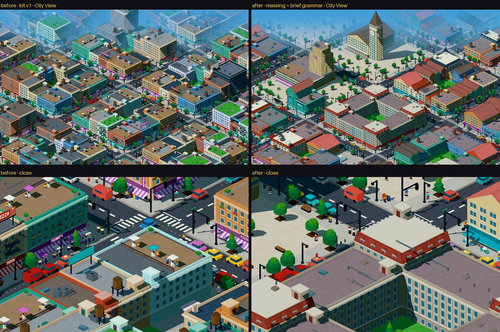
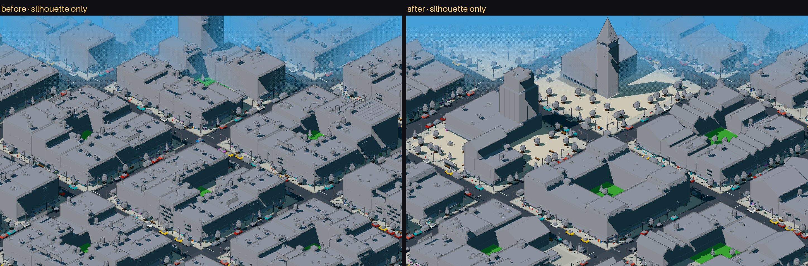
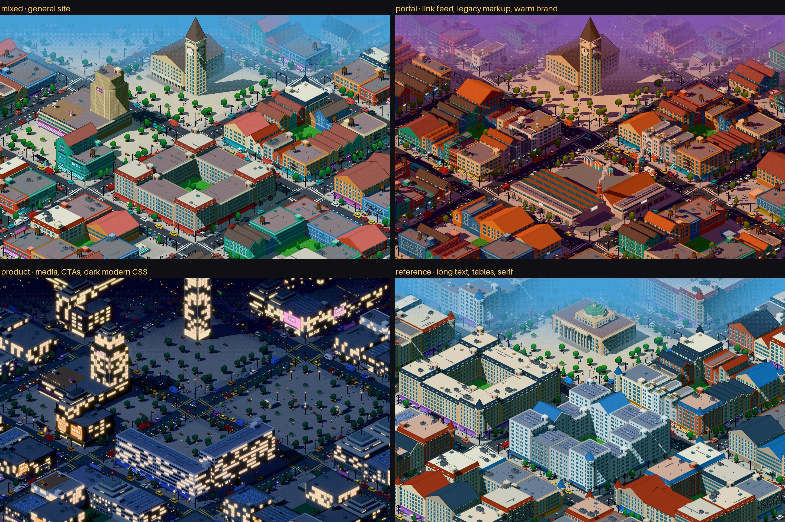
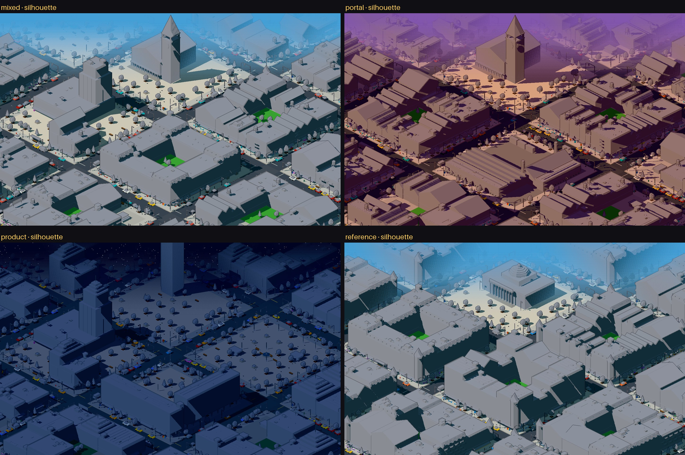
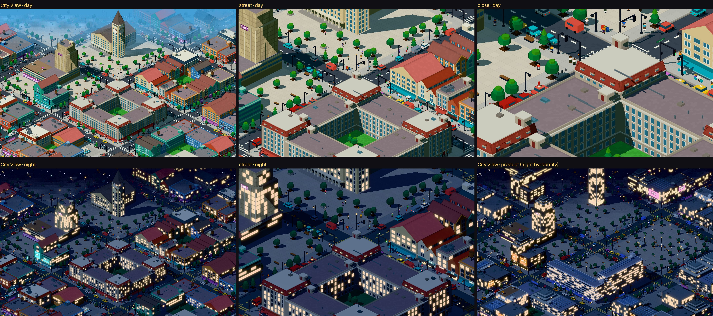

# Pixel city: kit de detalhe, passe de massing e silhueta

> Continuação de [PIXEL_KIT.md](PIXEL_KIT.md). Esta rodada não refaz o kit. Ela acrescenta
> **famílias de massa** reutilizáveis e uma **gramática pequena** que liga o `Program` semântico
> à forma dos prédios. Renderer, pipeline 900/600, câmera, pessoas em sprite, kit de rua e
> direção de arte continuam iguais. Nada foi integrado à cidade real (Linear, Wikipedia, etc.).

```bash
npm run dev
# http://localhost:3000/pixel/kit?view=city|street|close&time=day|night|golden
#   &profile=mixed|portal|product|reference   quatro "páginas" estruturalmente diferentes
#   &flat=1                                   teste de silhueta (uma cor, sem padrões, sem placas)
#   &v=1                                      o kit da rodada anterior, congelado (antes)
BASE=http://localhost:3000 node scripts/kit.mjs   # regenera tudo em docs/screenshots/kit
```



*Mesma câmera, mesma semente. À esquerda, o kit v1. À direita, o kit com massing e gramática.
Em cima, a City View (zoom 0,9). Embaixo, a vista de perto (3,2).*

## 1. Famílias de massa

Tudo continua sendo composto com as mesmas formas instanciadas (`box`, `cyl`, `pyramid`,
`prism`, `glow`, `sign`, `sprite`). A novidade é uma camada intermediária em
[`kit/massing.ts`](../src/lib/pixelcity/kit/massing.ts). Nela, `volume()` recebe um volume
(extensão, parede, superfície, variante de ritmo, família de telhado e cornija) e o constrói. As
famílias de prédio em [`kit/buildings.ts`](../src/lib/pixelcity/kit/buildings.ts) são só
combinações de volumes. **Nenhum prédio foi modelado à mão.**

**Telhados** (`RoofFamily`), todos paramétricos em largura, profundidade e altura:

| Telhado | Como é feito |
|---|---|
| `flat` | laje com cor neutra de deck, platibanda e cornija opcional |
| `terrace` | laje recuada com guarda-corpo, piso e plantas |
| `gable` | prisma de empena + dois planos inclinados (`rotX`/`rotZ`) + cumeeira |
| `mansard` | quatro planos inclinados + topo + mansardas em ritmo |
| `sawtooth` | planos inclinados em série + faixas de vidro (galpões) |
| `dome` | tambor + anéis de cilindros decrescentes + lanterna |
| `spire` | pirâmide alta sobre base quadrada |
| `crown` | três degraus recuados + antena com farol |

**Famílias** (`Family`) e suas peças:

| Família | Composição | Onde aparece |
|---|---|---|
| `walkup` | um volume, frente comercial ou residencial | lote comum |
| `corner` | volume com frente para duas ruas + torreão (classic), torre cilíndrica (soft) ou quina reta | lote de esquina |
| `rows` | casas geminadas (2–6 quando vêm da repetição) com ritmo comum, cada uma com largura, altura, telhado e loja próprios | conteúdo repetido (feeds, listas) |
| `apartments` | volume + varandas em ritmo | texto repetido, estilo soft |
| `lshape` | dois volumes em L, alturas diferentes | texto com peso |
| `asymmetric` | dois volumes divididos fora do centro, um 3 andares mais alto, fachadas e telhados trocados | mídia com peso |
| `slab` | lâmina larga com janelas em fita | texto ou dados em sites modernos |
| `podiumTower` | pódio envidraçado + torre recuada | mídia (major) |
| `stepped` | 2–4 recuos sucessivos, coroa ou terraço | marco (modern, soft) |
| `narrowTower` | agulha estreita com coroa | marco (tech) |
| `courtyard` | quatro alas + pavilhões de canto mais altos (+1/+2 andares) + pátio | texto major (classic e retro) |
| `shed` | galpão de dente de serra + docas + chaminé com fumaça | dados em sites retro |
| `civic` | salão com colunata e frontão + cúpula | marco (classic) |
| `clocktower` | salão + torre com relógio e agulha | marco (retro) |
| `kiosk` | quiosque na praça | ações pequenas |

Peças de composição em quarteirão (`composeBlock` em
[`kit/district.ts`](../src/lib/pixelcity/kit/district.ts)): `lots` (lotes com profundidade e
divisão variadas), `market`, `court`, `towers`, `slabs`, `works`, `plaza` (praça mobiliada:
árvores em grade, postes, bancos, floreiras, chafariz, pessoas) e `civic`.

## 2. A gramática: do `Program` à forma

A gramática está em [`kit/brief.ts`](../src/lib/pixelcity/kit/brief.ts). São cinco regras, e
cada uma lê um tipo de fato da página. Ela não mapeia todas as métricas. A ideia é que qualquer
prédio possa ser lido de volta como uma frase sobre a página.

| # | Fato da página | Decide | Exemplo |
|---|---|---|---|
| 1 | **Conteúdo** (`text`, `links`, `media`, `action`, `structured`) | tipologia, térreo, placas | links viram mercado (frentes estreitas, loja em toda fachada); mídia vira vitrine (pódio e torre de vidro, telas); ação vira chão público (praça, arcada, café); dados viram grade (lâminas, galpões ou pátios de arquivo) |
| 2 | **Proeminência** (papel + peso) | altura, escala do terreno, complexidade da silhueta | `landmark` ocupa um quarteirão inteiro com uma silhueta única (uma por página); `major` ocupa um quarteirão composto; `minor` ocupa um lote, com altura pelo peso; `support` é baixo e simples |
| 3 | **Repetição** (irmãos repetidos) | serialidade | 3 ou mais irmãos viram série geminada com ritmo comum (rows, alas de pátio); conteúdo singular vira massa singular e assimétrica |
| 4 | **Identidade do site** (estilo da gramática, vindo do CSS) | família de telhado, peso da cornija, proporção de janela, tipo de toldo, coisas no telhado e o marco | classic: mansarda, torreão, cúpula; retro: laje com caixa d'água, empena, tijolo, escada de incêndio; modern: recuos, terraço, marquise; soft: jardins; tech: vidro, coroa com farol |
| 5 | **Links e mídia** | a face da rua | muitos links dão vitrines e letreiros verticais; mídia dá telas e outdoors; texto dá portas e placas |

**Coerência:** a regra 4 vale para a cidade inteira. Um segundo estilo só entra na proporção
`secondaryShare` da gramática (mínimo de 15%), e é isso que mantém o distrito como um lugar só.

**O que ficou de fora de propósito:** densidade de imagem por prédio, profundidade do DOM por
andar, cor por seção, contagem de palavras por janela e outras métricas. Elas existem no
fingerprint, mas mapeá-las agora transformaria cada métrica num enfeite.

### Os quatro perfis de teste

Os perfis em `PROFILES` (`kit/district.ts`) são **briefs sintéticos escritos à mão**, não
extraídos de páginas reais. Cada um é uma lista de partes (papel, conteúdo, peso, repetição) mais
uma identidade:

| Perfil | Página que imita | Identidade |
|---|---|---|
| `mixed` | site genérico, um pouco de tudo | marcação meio legada, sans + serif |
| `portal` | agregador de links (feed de 30 itens, vagas, dados) | marcação legada, matiz quente → retro, golden hour |
| `product` | landing page (mídia, CTAs, preços) | escuro, mono, ornamentado → tech, noite |
| `reference` | artigo de referência (texto longo, índice, tabelas) | serif, profundo, denso → classic |

## 3. Menos repetição

| Motivo | Antes (v1) | Agora |
|---|---|---|
| Telhados | caixa d'água + jardim + guarda-sóis em quase todo telhado | `Topside` por estilo (`hvac`, `tank`, `terrace`, `garden`, `solar`, `bare`); a casa de máquinas, o HVAC, a caixa d'água e os painéis variam de forma e posição; telhado plano tem deck neutro |
| Toldos | listrado em quase toda loja | quatro tipos (listrado, liso, marquise, nenhum), sorteados por estilo; mercadorias variadas na vitrine |
| Escadas de incêndio | em muitos prédios | só retro, ≥3 andares, ~20% |
| Ritmo de fachada | uma grade de janelas | `FRAMED` com bits de variante: tijolo, quatro larguras de vão (0,5–1,25 tile, montante nos largos) e janelas altas |
| Lotes | profundidade e largura iguais | profundidade e divisão variadas por lado de quarteirão |
| Mobiliário de calçada | passo fixo | passo e cadência variados por lado |
| Letreiros | poucas palavras | 16 palavras de loja + rótulos do brief |

Efeito colateral: o distrito ficou **mais leve**. Antes eram 22 710 partes (18 ms). Agora são
14,6–17,8 mil partes, geradas em 9–14 ms, ainda a ~60 fps em 2880×1800 (Chrome headless, a mesma
medição da rodada anterior).

| Perfil | Partes | Geração | box | cyl | glow | sprite | sign |
|---|---|---|---|---|---|---|---|
| v1 | 22 710 | 18 ms | 14 081 | 3 517 | 3 407 | 682 | 340 |
| mixed | 15 697 | 13 ms | 8 790 | 3 198 | 2 441 | 470 | 123 |
| portal | 17 628 | 12 ms | 10 460 | 3 198 | 2 455 | 511 | 280 |
| product | 14 593 | 9 ms | 7 798 | 3 158 | 2 689 | 450 | 93 |
| reference | 17 787 | 14 ms | 10 314 | 3 234 | 2 610 | 492 | 49 |

## 4. Capturas



*Teste de silhueta: todos os prédios na mesma cor, sem padrão de superfície, sem placas e sem
pessoas. À esquerda o v1, à direita o kit atual.*



*O mesmo kit, a mesma câmera e a mesma semente, com quatro páginas diferentes.*





*As vistas do protótipo da rodada anterior (City View, rua e perto; dia e noite), regeneradas.*

Capturas individuais: `screenshots/kit/{kit,v1,profile}-*.jpg`. As imagens da rodada anterior
estão em `screenshots/kit-v1/`.

## 5. Avaliação

### 1. Dá para distinguir os prédios pela silhueta na City View?

**Sim, de dia.** É a mudança mais clara da rodada. No teste de silhueta do v1, todo quarteirão é
uma caixa com o mesmo topo picotado, e só a cor separava os prédios. Agora se reconhecem, sem
cor nenhuma, a torre do relógio com o salão, o bloco de pátio com pavilhões nos cantos, a série
de empenas do mercado, o pódio com torre, a cúpula com colunata, os galpões de dente de serra,
os recuos e a agulha. As praças abrem vazios que dão leitura ao resto.

Limites:
- **À noite, a silhueta depende das janelas acesas.** Torre e agulha se leem, mas os prédios
  baixos somem no escuro. Nas torres altas, os grupos de janelas acesas formam manchas grandes
  e quadradas, que na City View parecem ruído (`profile-product.jpg`).
- Nos lotes pequenos, `walkup` e `corner` ainda são caixas com variações de telhado. A diferença
  de silhueta está nos quarteirões compostos e nos marcos, não em cada lote.

### 2. O distrito ainda se lê como um lugar coerente, sem virar ruído?

**Sim, nos três perfis com identidade forte.** No `portal`, empenas, tijolo, caixas d'água e
galpões aparecem em luz dourada. No `product`, vidro, recuos, coroas e telas aparecem à noite. No
`reference`, há mansardas, torreões, pátios e uma cúpula. Cada um se lê como um bairro de um
lugar só, porque a regra 4 vale para a cidade inteira.

Limites:
- **O `mixed` é o mais carregado.** Num só recorte cabem cinco famílias de telhado e quatro
  composições. Ainda se lê, mas no limite. Páginas reais de conteúdo misto vão cair aqui. Antes
  da integração, vale limitar o número de famílias de telhado distintas por cidade (o estilo
  principal + um secundário).
- **Praças demais no `product`.** O marco (uma agulha sobre praça) e a seção de ação (outra
  praça) ficam juntos no centro. À noite isso vira um vazio escuro grande.
- **Perto, os quarteirões compostos têm telhados grandes e vazios.** A vista `close` agora cai
  sobre o telhado de mansarda de um pátio: uma superfície lisa enorme com poucas peças. Parte da
  "riqueza" do v1 de perto vinha justamente da repetição que esta rodada cortou. Telhados grandes
  precisam de um vocabulário próprio (claraboias em série, casas de máquinas maiores, faixas de
  manutenção), sem voltar a pôr caixa d'água em tudo.

### 3. Os motivos procedurais repetidos ficaram menos óbvios?

**Sim.** A caixa d'água, o jardim e o guarda-sol em todo telhado, o toldo listrado em toda loja e
a escada de incêndio por toda parte eram as marcas mais visíveis do v1 (compare as metades de
cima de `sheet-before-after.jpg`). Agora cada um aparece onde o estilo pede. As fachadas variam
em vão, tijolo e altura de janela.

O que ainda se repete: as árvores das praças em grade regular, o ritmo constante das mansardas,
a grade de janelas idêntica entre alas de um mesmo pátio e o mobiliário de calçada (melhor, mas
ainda regular). Na City View isso não salta. De perto, sim.

### 4. O vocabulário é amplo o bastante para sites diferentes ganharem identidades diferentes?

**Para sites estruturalmente diferentes, sim.** Os quatro perfis dão quatro cidades que não se
confundem nem em silhueta (`sheet-profiles-flat.jpg`). O vocabulário tem 8 composições de
quarteirão × 5 estilos, mais as famílias de lote, de térreo, de topo e de placa.

Onde ele é estreito:
- **O marco depende só do estilo** (5 opções). Dois sites classic ganham o mesmo salão com
  cúpula, só com outra paleta. Proeminência e conteúdo do marco deveriam escolher entre 2–3
  variantes.
- **Dois sites de texto no mesmo estilo** diferem só no peso e na repetição das seções. É pouco
  se a página real for 90% texto. A diversidade na prática vai depender de quão bem o analisador
  separa `text`, `links`, `structured` e `media` nas regiões reais. Isso ainda não foi testado: os
  perfis são sintéticos.
- **Ainda não há** pontes, arcos sobre a rua, igrejas, estações, mercados cobertos, nem
  quarteirões com miolo verde entre casas. É o tipo de coisa que diferencia um quarteirão de
  outro dentro da mesma família.

## 6. O que não foi feito

- Nada foi integrado a `generatePixelCity`. Linear e Wikipedia continuam com o vocabulário atual.
- O mapeamento das regiões reais do `Program` para `Brief` (papel, conteúdo, peso, repetição) não
  foi escrito. Os perfis são listas digitadas à mão.
- Sem destruição e sem movimento.

## Arquivos

| Arquivo | Papel |
|---|---|
| `src/lib/pixelcity/kit/massing.ts` | volumes, famílias de telhado, torreão, relógio, colunata, praça |
| `src/lib/pixelcity/kit/buildings.ts` | `Program`, famílias de prédio, térreos, placas, topo |
| `src/lib/pixelcity/kit/brief.ts` | a gramática: `Brief` → `BlockKind` e `Program` |
| `src/lib/pixelcity/kit/district.ts` | perfis de teste, composição de quarteirões, modo silhueta |
| `src/lib/pixelcity/kit-v1/` | o kit da rodada anterior, congelado (`?v=1`) |
| `src/components/pixel/materials.ts` | `FRAMED` com bits de variante (tijolo, vão, janela alta) |
| `src/components/pixel/KitView.tsx`, `src/app/pixel/kit/page.tsx` | `?profile=`, `?flat=1`, `?v=1` |
| `scripts/kit.mjs` | capturas desta página |
