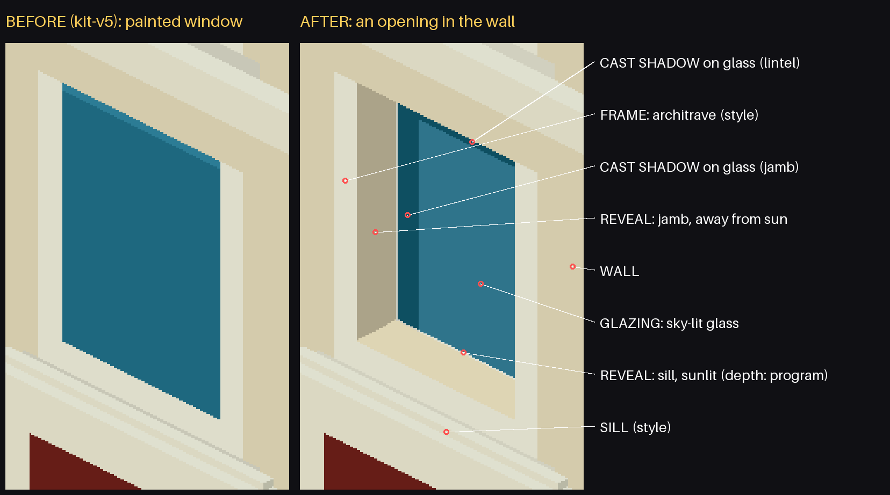
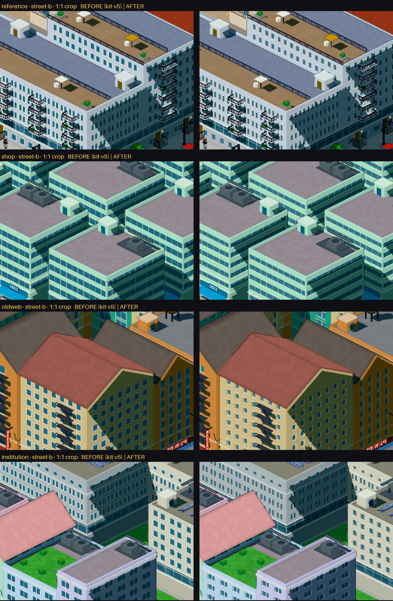

# Pixel city: openings depth

> Passe curto sobre a Surface Grammar congelada. Mesmas peças, mesmas posições e tamanhos, mesmas
> superfícies que o kit-v5 — só os bits de variante das superfícies com aberturas mudam (teste).
>
> - **Baseline:** a Surface Grammar foi congelada em `src/lib/pixelcity/kit-v5/` (`?v=5`, também no
>   Lab: `/pixel/surface-lab?set=openings&v=5`). [`openings/corpus-before.txt`](openings/corpus-before.txt)
>   guarda os hashes (cidades normal/flat/noite, Lab); `npm run test:openings` verifica que o kit-v5
>   ainda os reproduz. BEFORE em [`screenshots/openings/before/`](screenshots/openings/before).
> - **Modelo:** [`kit/openings.ts`](../src/lib/pixelcity/kit/openings.ts) · **desenho:** `pxRecess`
>   em [`materials.ts`](../src/components/pixel/materials.ts) · **tabelas:**
>   [`openings/tables.md`](openings/tables.md).



Folhas (`screenshots/openings/sheets/`), BEFORE = kit-v5, mesma câmera e seed:

| folha | o quê |
|---|---|
| [A-close-native](screenshots/openings/sheets/A-close-native.jpg) · [A-close-1](screenshots/openings/sheets/A-close-1.jpg) · [A-close-2](screenshots/openings/sheets/A-close-2.jpg) | Close, páginas reais (recortes 1:1 e quadros inteiros) |
| [B-street-native](screenshots/openings/sheets/B-street-native.jpg) · [B-street-1](screenshots/openings/sheets/B-street-1.jpg) · [B-street-2](screenshots/openings/sheets/B-street-2.jpg) | Street, páginas reais |
| [C-anatomy](screenshots/openings/sheets/C-anatomy.png) | a abertura, camada por camada |
| [D-programs-classic](screenshots/openings/sheets/D-programs-classic.jpg) · [D-programs-modern](screenshots/openings/sheets/D-programs-modern.jpg) | mesmo volume, cinco usos (só parede + aberturas) |
| [E-styles-residential](screenshots/openings/sheets/E-styles-residential.jpg) · [E-styles-office](screenshots/openings/sheets/E-styles-office.jpg) | mesmo uso, quatro estilos |
| [F-lighting](screenshots/openings/sheets/F-lighting.jpg) | sol de frente / rasante / contraluz |
| [G-night-lab](screenshots/openings/sheets/G-night-lab.jpg) · [G-night-real](screenshots/openings/sheets/G-night-real.jpg) | noite |
| [H-city](screenshots/openings/sheets/H-city.jpg) | City View (idêntica) |
| [I-distance](screenshots/openings/sheets/I-distance.jpg) | o mesmo prédio em Close / Street / City |

Páginas: IKEA (`shop`), Python Docs (`docs`), Wikipedia (`reference`), Linear (`saas`), GOV.UK
(`institution`), NASA (`media`), Paul Graham (`oldweb`).



## 1. Problema

Auditoria do kit-v5 (como as aberturas eram desenhadas):

- **Tudo é shader, nada é geometria.** Uma peça por zona (base, corpo, coroamento) com `FRAMED`
  (janelas recortadas), `BANDS` (faixas), `GLASS` (pele de vidro) ou `STORE` (vitrine). O padrão é
  calculado por fragmento em coordenadas de face (`fc`, em unidades de mundo): o vão (`bay` =
  0,5/0,75/1/1,25) vem dos bits 2–4 da variante, a janela é um retângulo centrado no vão
  (`hw`, `y0`, `y1` por padrão: simples, pareada, vertical, ático), com um anel de moldura de 0,035 e
  um peitoril. Janelas altas: bit 8 (`y0` 0,08, `y1` 0,43).
- **A janela era só cor**: vidro chapado (`uGlass`) com uma faixa clara no topo; moldura e peitoril
  na cor do *trim*, todos no mesmo plano da parede. A luz cel-shaded ilumina a face inteira por
  igual, então janela e parede recebem o mesmo sol — nenhuma pista de profundidade.
- **Noite**: o retângulo inteiro vira `uLit` → quadrados luminosos.
- **Vitrines** (`STORE`): pilastras e fascia já são geometria (0,05–0,07 à frente do vidro), mas o
  vidro é um retângulo com mainéis pintados.
- **Sem janelas** por desenho: paredes cegas (`PLAIN`), galpões, quiosques; pele de vidro (`GLASS`)
  é janela-parede (fica plana).

## 2. Implementação escolhida

**Shader puro.** Cada abertura é resolvida como uma **caixa recuada em paralaxe**, por fragmento:

```
fragmento p dentro do retângulo da abertura
  o = profundidade × (vista ao longo da face / vista para fora)      → largura do reveal visível
  g = p − o                                                           → ponto do vidro que se vê
  g fora do retângulo → é o REVEAL (jamba ou peitoril), com a cor da parede × a luz da SUA face
  g dentro           → é o VIDRO; sombra se g + profundidade × (sol ao longo / sol para fora)
                       sai do retângulo (o lintel e a jamba do lado do sol fazem sombra)
fora da abertura      → MOLDURA / LINTEL / PEITORIL no plano da parede, conforme o estilo
```

Vista e sol vêm do próprio pipeline (`viewMatrix`, `directionalLights[0]`), o referencial da face
(normal e direção de `fc.x`) vem do vértice — **nenhum uniforme novo, nenhuma peça nova**. Tudo é
arredondado para **pixels inteiros de render** (`pxSnap`), e há um **LOD**: com pixel maior que
0,024 unidades (mais longe que a Street View), o desenho antigo é usado tal e qual.

## 3. Por que shader e não geometria

- **Custo:** as cidades têm 13–19 mil peças; ~230–970 delas são zonas com janelas, cobrindo dezenas
  de milhares de aberturas. Geometria por janela (moldura + 2 jambas + peitoril + vidro) seria
  ×5 peças por abertura — centenas de milhares de instâncias novas. O shader não muda nenhuma peça.
- **Luz correta de graça:** a paralaxe dá o reveal certo para qualquer azimute de câmera, e a sombra
  segue o sol (frente, lado, contraluz) — testado no Lab com sol forçado.
- **Pixel art:** larguras em pixels inteiros, cores em degraus (sem gradiente), nada abaixo de 1 px.
- **Limite do shader** (honesto): o reveal não projeta sombra na parede, e a sombra do *mundo*
  (shadow map de outro prédio) não é conhecida pelo cálculo da face: uma fachada na sombra de um
  vizinho mantém o reveal "do lado do sol" claro. A alternativa híbrida (uma peça extra por zona,
  p. ex. um plano recuado) não resolveria isso e não foi necessária.

## 4. Anatomia da abertura

| camada | onde | decidido por | desenho |
|---|---|---|---|
| WALL | plano da parede | Surface Grammar | inalterado (tijolo, rusticado, cor da zona) |
| FRAME | plano da parede, ao redor | **estilo** | arquitrave (anel, cabeça 1,7× quando cabe no andar) · lintel (só a verga) · limpo (nenhum) · mínimo (aro metálico de 1 px) |
| SILL | sob a abertura | **estilo** | peitoril saliente + 1 px de sombra na parede (sol de cima) |
| REVEAL | dentro, jambas e peitoril visíveis | **programa** (profundidade) | cor da parede (em paredes escuras, um material mais claro) × luz da face do recesso (jamba virada ao sol mais clara; contrária mais escura) |
| GLAZING | fundo do recesso | sol | vidro com reflexo de céu quando ensolarado; sombra do lintel e de uma jamba; caixilho (1 px) e mainel no plano do vidro |

Profundidade nunca passa de 55% da meia-largura da abertura (janela estreita continua janela).

## 5. Diferenças por programa

| uso | abertura | profundidade |
|---|---|---|
| residencial, comercial (andares) | janela recortada, doméstica | média (0,06) |
| escritório | pilares / faixas, vidro próximo da face | rasa (0,04) |
| cívico, institucional | parede grossa, monumental | profunda (0,085) |
| industrial, serviço | funcional: sem moldura, caixilho de aço, peitoril | média |
| pele de vidro (tech) | o vidro é a parede | plana |
| vitrines, lobbies, portais | vidro atrás de pilastras/fascia | sombra no vidro + moldura escura + linha de balcão interna |

## 6. Diferenças por estilo

| estilo | moldura | peitoril | caixilho |
|---|---|---|---|
| clássico | arquitrave | sim | claro |
| retro | lintel | sim | claro |
| moderno | limpa | não | escuro |
| soft | limpa | sim | claro |
| tech | mínima | não | escuro |

O estilo não muda a profundidade (teste: mesma profundidade nos cinco estilos de cada uso).

## 7. Day / night

**Dia.** A profundidade vem da luz, não de contorno: jamba virada ao sol mais clara, a contrária
mais escura; peitoril do recesso iluminado por cima; sombra do lintel (e de uma jamba) no vidro;
vidro ensolarado com um pouco de reflexo de céu, vidro sombreado escuro. Com o sol forçado no Lab
(folha F): **de frente**, sombra curta no topo do vidro; **rasante**, quase todo o vidro na sombra e
uma jamba acesa; **contraluz**, a fachada inteira na sombra e o reveal claro ainda desenha a
abertura. No BEFORE as três condições produzem a mesma janela pintada.

**Noite.** A janela acesa continua sendo uma abertura: só o vidro emite; o reveal recebe um pouco da
luz interior (borda morna); o caixilho e a moldura continuam apagados — a grade de quadrados
luminosos vira uma grade de janelas emolduradas (folhas G). A iluminação em si (quais janelas
acendem, por apartamento / por andar) é a da Surface Grammar, sem mudança.

## 8. Close / Street / City

Mesmo prédio, mesma seed, três distâncias (folha I) e as páginas reais (folhas A, B, H):

- **Close**: profundidade claramente perceptível — reveal de 4–9 px, sombra no vidro, moldura e
  peitoril (folha C, A-close-native).
- **Street**: a janela deixa de ser um quadrado pintado: reveal de 2–5 px e a sombra no topo do vidro
  sobrevivem à câmera real (B-street-native, recortes 1:1). **O efeito é real mas modesto**: em
  janelas pequenas (0,24 de largura) é um L escuro de 2–3 px + vidro mais claro; quem não compara
  lado a lado pode não notar em fachadas claras. Faixas de janela (escritórios, IKEA) ganham a
  leitura mais forte (sombra da faixa de peitoril superior ao longo de toda a fachada).
- **City**: **nenhuma mudança** — o LOD devolve o desenho antigo; diferença de pixels City e
  `flat=1` contra o BEFORE: 0,00% nas 7 páginas (teste de imagem), contra 1,5–19% em Street/Close.

## 9. Performance

Tabelas completas em [`openings/tables.md`](openings/tables.md).

| | kit-v5 | agora |
|---|---|---|
| peças (14 cidades) | idênticas | idênticas (mesmos objetos; só bits de variante) |
| draw calls | — | inalteradas (mesmas peças → mesmos lotes instanciados; nenhum material novo) |
| geração (soma, 14 cidades, mediana de 7) | 95 ms | 97 ms (ruído) |
| FPS, 4 páginas × city/street/close/noite | 60 | 60 (teto do vsync) |
| FPS sob estresse (4× fragmentos, mediana de 3) | 60 | 60 |
| shader | — | vértice: +2 *varyings* (referencial da face). Fragmento, para todos: vista e sol no referencial da face, 4 derivadas, decodificação de 5 campos de bits. Só nas zonas com aberturas e perto (LOD): `pxRecess` (~40 operações, sem laços, sem textura) |

Não houve perda mensurável. O custo do shader é pequeno e restrito aos fragmentos de fachada com
janelas na Street/Close View; em City View o LOD volta ao desenho antigo.

## 10. Limitações restantes

1. **A sombra do mundo não entra no cálculo.** O recesso sabe a orientação da face ao sol, não o
   shadow map: numa fachada à sombra de um vizinho, a jamba "do lado do sol" continua clara (GOV.UK
   close-a). Corrigir exigiria ler o shadow map no cálculo da face — fora do escopo.
2. **Troca de LOD**: ao aproximar de City para Street, as aberturas passam de pintadas a recuadas em
   um degrau (zoom ≈ 1,2). Em pixel art é aceitável, mas é um "pop" visível no zoom contínuo.
3. **O reveal não projeta sombra na parede** (só o peitoril tem 1 px de sombra); moldura saliente
   não tem lado próprio.
4. **Janelas estreitas** (pareadas em vão de 0,5) perdem até metade do vidro para o recesso em
   Street — limitado a 55% da meia-largura, ainda assim ficam finas.
5. **Contraste em paredes extremas.** Vidro ensolarado ficou um pouco mais claro (reflexo) e o
   sombreado mais escuro: em paredes muito claras a janela perde algum contraste em Street (reflexo
   reduzido na calibração para limitar isso). Em **paredes escuras** (tech, Python Docs) a primeira
   versão fazia as janelas sumirem — o anel claro do BEFORE carregava a leitura; corrigido com um
   aro metálico de 1 px e reveal de material mais claro, mas essas fachadas continuam mais
   discretas que no BEFORE (janelas pareadas estreitas + recesso).
6. **Fora da gramática ficam planos**: pele de vidro (por desenho), famílias sem anatomia (marco
   cívico, torre do relógio, *narrowTower*, rotundas cilíndricas), as janelas do gerador antigo
   (superfícies 1, 2, 7) e as portas que são geometria colorida (*stoops*, porta de serviço). Portais
   cívicos, entradas de esquina, lobbies e vitrines (superfície `STORE`) receberam o tratamento.
7. **Vitrines** ganham pouco: a profundidade real já existia (pilastras/fascia); o shader acrescenta
   a sombra da fascia, moldura escura e uma linha de balcão interna — e o toldo cobre boa parte.
8. **Repetição**: moldura e peitoril seguem só o estilo; todas as janelas de um estilo são iguais
   (sem variação por prédio). Não tratado aqui, como pedido.
