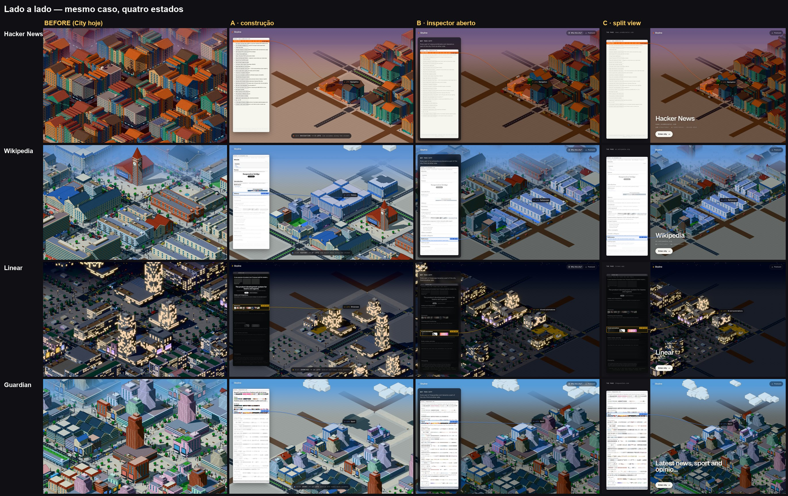
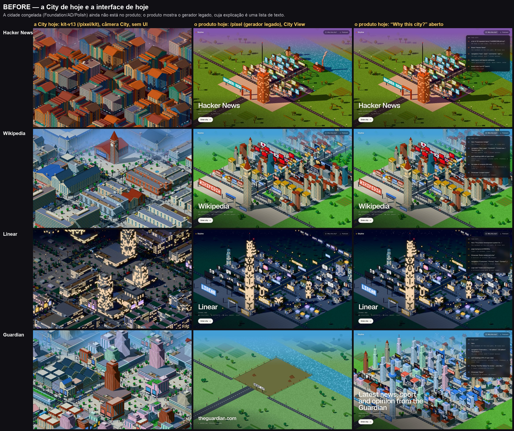
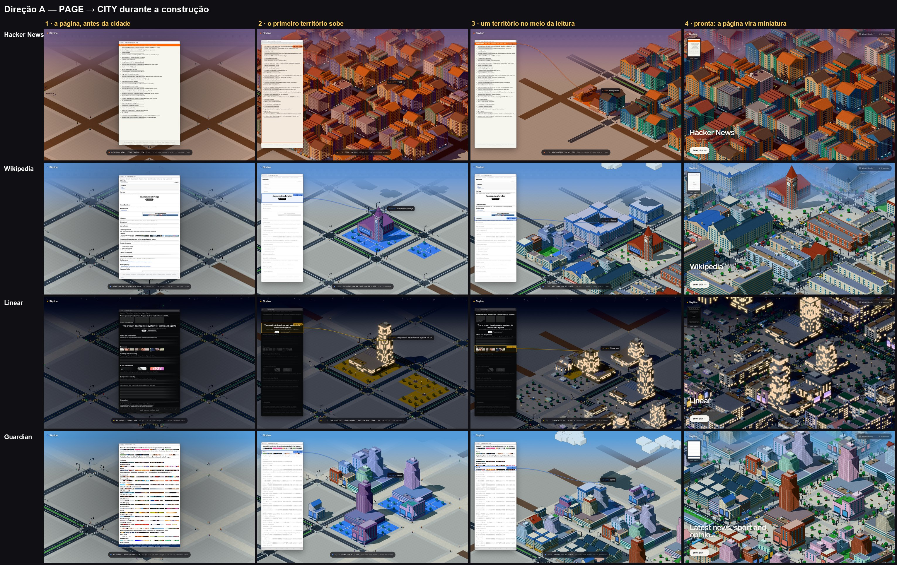
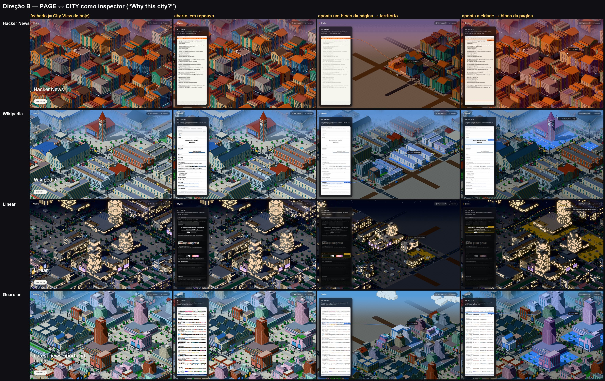
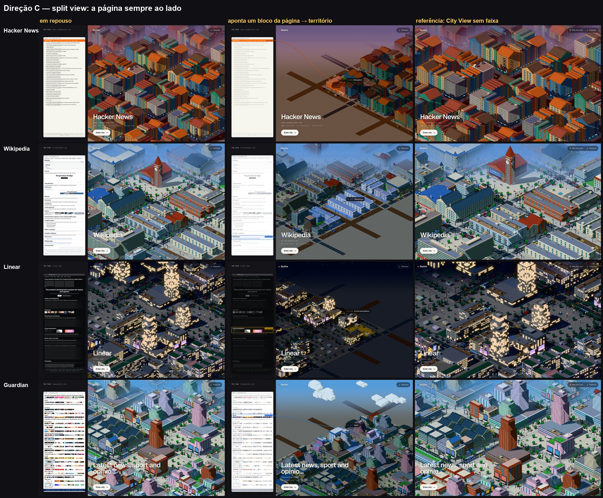
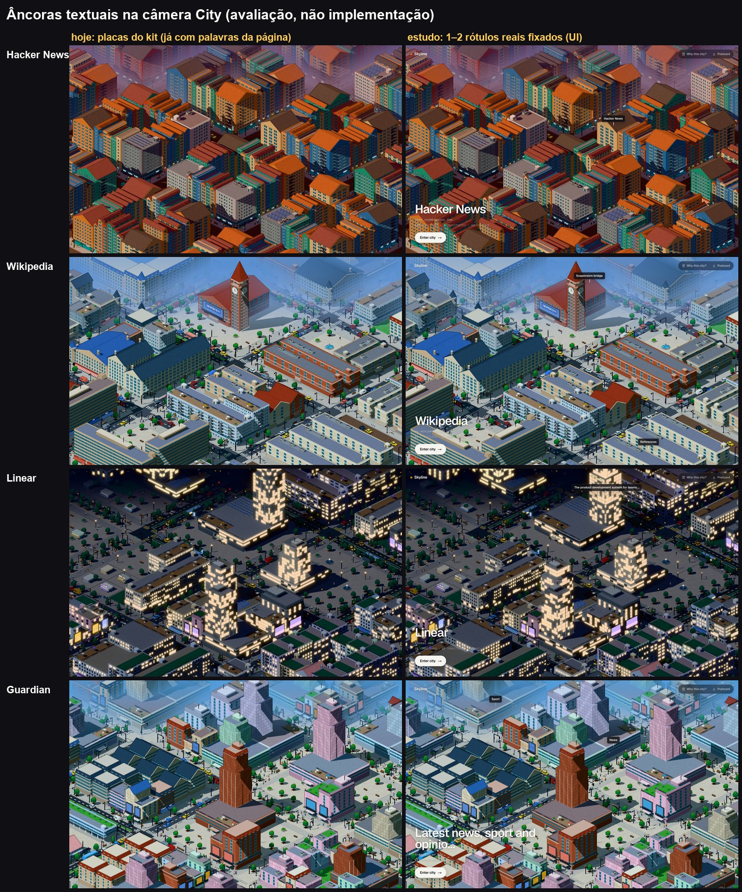
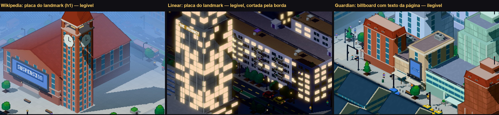

# Pixel city: Product Communication, estudo (PAGE → CITY)

> **Decisão (2026-10-05): A como direção principal, B como complemento final.** C e as novas
> âncoras textuais foram descartadas. A implementação está em `/pixel` (§13). O que segue abaixo é o
> estudo que levou à decisão; a rota e os scripts de estudo foram removidos depois dela.

> **Estudo, não implementação.** Nenhuma direção entrou no produto. Nada de semantic extraction,
> Page Model, allocation, territories, composition, massing, Program ou Art Direction foi alterado:
> a cidade de todos os quadros é `generateKitDistrict(fp, { profile: plan })`, exatamente a de
> `/pixel/kit` (kit-v13). O renderer também não foi tocado. **Nenhum commit.**
>
> Pergunta: *uma pessoa vendo Skyline pela primeira vez consegue perceber rapidamente que ESTA
> cidade é uma transformação DESTA página?*

## Resposta curta

- **Recomendo A, a página durante a construção, como direção principal.** É a única das três que
  responde à pergunta **sem pedir nada** à pessoa. Primeiro ela vê a página, reconhecível. Depois,
  cada pedaço da página acende enquanto o terreno dele é marcado e os prédios dele sobem. O momento
  “ah, ESTE pedaço virou ESTE pedaço” acontece sozinho, na ordem da leitura, nos quatro casos.
- **B, o inspector, entra como complemento, e só porque A termina nele.** No fim da construção a
  página se dobra numa miniatura no canto, e essa miniatura é o “Why this city?”. É o mesmo
  componente, com o mesmo realce e a mesma geometria. Sozinha, B não responde à pergunta: a
  primeira impressão fica idêntica à de hoje, e a ligação só aparece para quem clica.
- **C, split view, não compensa.** Entende-se o mesmo que em B, só que sem o clique. Em troca, a
  cidade perde 26% da largura e 18% da escala na sessão inteira. A coluna clara da página (HN,
  Wikipedia, Guardian) compete com a cidade. E a página parada ao lado lê como legenda, não como
  causa.
- **Âncoras textuais na câmera City: não agora.**
  - O kit já escreve palavras reais da página em placas (SUSPENSION, HISTORY, SPORT, CHANGELOG).
    Na câmera City só a placa do landmark se lê. As outras somem e se misturam com letreiros
    genéricos (RAMEN, TACOS, BAKERY).
  - Um ou dois rótulos de UI legíveis **dão nome** a um bairro, mas não mostram que ele **veio** da
    página.
  - No HN, o único rótulo possível é o nome do site, justamente o que queremos evitar.
- **Achado de partida, maior que as três direções: a City congelada não está no produto.** A cidade
  das fases Foundation, Art Direction e Polish **ainda não está no produto**. `/pixel` roda o
  gerador legado, e o kit só existe em `/pixel/kit`, sem interface. Qualquer direção pressupõe
  primeiro ligar o kit ao shell do produto (§9.1).
- **Achado do protótipo ao vivo:** a animação de subida do renderer achata as peças empilhadas do
  kit **no lugar**. Antes de subir, os prédios aparecem como lajes flutuando na altura final.
  - Hoje isso não aparece porque o kit nasce inteiro: em `/pixel/kit` só a câmera chega.
  - Aparece assim que alguém cronometra a construção do kit: a direção A, ou portar para o kit a
    construção que o produto já tem (§9.2).

*Mesmo caso, quatro estados: a City de hoje, A no meio da construção, B com o inspector aberto e um
bloco apontado, C com o mesmo bloco apontado.*

## 1. Como o estudo foi feito

- **Rota de estudo, isolada:** `/pixel/study?page=<id>&dir=a|b|c|anchors`. Ela desenha a cidade
  real do kit dentro do chrome do produto (wordmark, pílula, cartão de identidade, a legenda da
  construção) e acrescenta o page map. Nada dela é importado pelo produto.
- **A cidade é a mesma de `/pixel/kit`.** O estudo faz só três coisas por cima:
  - re-etiqueta cada peça com o índice do seu território (`part.node = território`). Assim o
    hover e o realce que o renderer já tem (`highlight`, `spotlight`) funcionam por território;
  - num quadro de construção congelado, esconde os territórios que “ainda não subiram” e a vida
    de rua;
  - marca no chão os lotes do território apontado, com placas finas na cor de destaque da
    paleta.
- **A ligação na tela** (a curva do bloco ao território, o ponto e o chip) é HTML/SVG. Os pontos
  vêm da câmera da própria cena, projetados a partir da geometria dos lotes (`alloc.path`) e da
  altura dos prédios do território.
- **Casos:** os snapshots congelados `hn` (Hacker News), `reference` (Wikipedia, Suspension bridge),
  `saas` (Linear) e `news` (Guardian). São 1440×900 @2x, seed 7, na hora do dia de cada página.
- **Capturas brutas e ferramentas do estudo não foram guardadas.** Ficaram as pranchas desta
  página e o animatic da Wikipedia.

## 2. BEFORE

*Primeira coluna: a City de hoje, câmera City, sem interface. Segunda e terceira: o produto de hoje
(`/pixel`), com o gerador legado.*

- **A City de hoje não tem nenhuma ponte para a página.** É uma cidade bonita e coerente, mas nada
  na tela diz de onde ela veio. A única pista é o nome do site, se ele aparecer.
- **O produto de hoje explica com texto e contagens:**
  - a construção mostra legendas como “3/7 · Paving 5 streets” e “Building 34 structures”;
  - “Why this city?” abre uma lista de cinco influências em prosa (“a list of 30 repeated
    items → 30 shops in rank order”).
  - A página em si nunca aparece.
- **O gerador legado faz exatamente o que você quer evitar.** Ele escreve o nome do site e as
  palavras da página em placas enormes (HACKER NEWS, WIKIPEDIA, LINEAR). A identidade vem do texto,
  não da estrutura.
- **A City congelada não está no produto:**
  - `/pixel` → `usePixelCity` → `generatePixelCity` (gerador legado);
  - o kit só roda em `/pixel/kit`, a partir de snapshots congelados, sem UI.

## 3. A representação da página (page map)

O page map é a mesma peça nas três direções. Ele **não é um screenshot**. É desenhado a partir do
que o pipeline já sabe: `page-map-data.ts` monta os dados e `PageMap.tsx` desenha.

| o que aparece | de onde vem |
|---|---|
| um bloco por território, na ordem do documento | `plan.territories` (ordem = `territory.order`, o nó da região) |
| altura do bloco ∝ peso do território, com um piso para continuar legível | `territory.weight`, o mesmo peso que compra o terreno |
| títulos reais | `territory.label` ou o primeiro heading do território |
| links reais (barra de navegação, rodapé) | `label` / `linkLabels` dos nós do território |
| itens reais (as 30 manchetes do HN, o sumário da Wikipedia, as referências) | `region.items` → título do item (heading ou o link mais longo) |
| primeira frase real de um texto corrido | `snippet` do primeiro nó de texto do território |
| imagens reais (fotos do Guardian, da Wikipedia, telas do Linear) | `node.image.src` (no produto viria o `proxy` que `/api/capture` já assina) |
| cores e tipo da página | `doc.colors`, `style.pageBg`, `fingerprint.type` (serif / mono), `node.tint` da região (a barra laranja do HN, o rodapé azul do Guardian, o fundo do infobox) |
| texto que o modelo só conta | linhas cinza (greeking) |

**O que funciona:**

- **Reconhecível em 1 segundo no HN e na Wikipedia.**
  - HN: barra laranja com “Hacker News new past comments…”, 30 manchetes numeradas, rodapé.
  - Wikipedia: caixa “Contents”, títulos serifados com fio, links azuis, infobox com a foto da
    ponte, galeria, referências.
- **O Guardian lê como “capa de jornal”.** São seções com faixas de fotos reais, “Most viewed” e o
  rodapé azul.
- **Nada é inventado.** O que não tem texto conhecido vira greeking. O que não tem título não ganha
  título.

**Limites honestos:**

- **Não há layout 2D.** A captura estática não tem caixas, então o mapa é uma coluna em ordem de
  leitura:
  - o infobox e as colunas laterais não ficam no lugar real;
  - o reconhecimento vem do conteúdo, das cores e do tipo, não da diagramação.
- **Linear é o caso mais fraco.**
  - Página escura, várias seções sem título (painéis de interface).
  - À noite, o mapa escuro sobre a cidade escura perde contraste.
- **HN: a lista é 95% do peso.** O bloco da lista ocupa quase o mapa inteiro, e o espaço que sobra
  abaixo das 30 linhas é real: é o peso do bloco.
- **O nome do Guardian vem errado.** O passe semântico devolve como `siteName` o título inteiro
  (“Latest news, sport and opinion from the Guardian”). O problema é de antes deste estudo, mas
  aparece no cartão de identidade.

## 4. Direção A: PAGE → CITY durante a construção

1. **A página primeiro.** O page map aparece grande, no centro, sobre a grade vazia de ruas.
   Legenda: “Reading en.wikipedia.org · 24 parts of the page · 24 will become land”.
2. **Cada território, na ordem do plano:**
   - o bloco da página acende (os já lidos ficam normais, os por ler ficam apagados);
   - os lotes dele são marcados no chão e os prédios sobem;
   - a câmera vai até ele e uma curva liga o bloco ao lugar;
   - legenda: “7/24 · History → 27 lots · one built mass along the street”.
3. **A cidade cresce do centro para fora**, na espiral da alocação. A ordem da construção é a ordem
   em que a página foi lida: hero, conteúdo, chrome, rodapé.
4. **Pronta:** a página se dobra numa miniatura no canto (“the page”), e a City View fica idêntica
   à de hoje.

**O que funciona:**

- **O primeiro passo já é o “ah”** nos casos com hero. Na Wikipedia, “Suspension bridge” acende e,
  sozinha no terreno vazio, sobe a torre do relógio com 20 lotes marcados. No Linear, o h1 acende e
  sobe a torre-landmark.
- **No HN, o “ah” muda de escala, mas existe.** A lista inteira acende e a cidade inteira sobe (242
  de 256 lotes). Depois, a barra laranja vira uma esquina de 6 lotes, e esse é o “ah” pequeno e
  claro.
- **Nada da cidade muda.** A ordem e o terreno são os da alocação, e a legenda usa as palavras do
  próprio `compose.ts` para a composição.

**O que falha ou custa:**

- **Duração.** O protótipo levou 5 s no HN e 13 s nas outras (24–28 territórios), contra os 5,4 s
  da construção de hoje.
  - Treze segundos é longo para quem volta.
  - É preciso agrupar territórios pequenos e/ou permitir pular.
- **Guardian: sem hero, o primeiro passo é fraco.** Começa por um showcase de 6 lotes. E com 28
  territórios, 18 deles vitrines parecidas (“More features”, “What to watch”, “Food”…), a sequência
  fica monótona.
- **A câmera precisa se mover.** Na câmera City quase todo o distrito fica fora do quadro ou na
  faixa de névoa. Nos quadros congelados, a câmera vai até cada território. No vídeo, usei uma
  câmera fixa mais aberta (§8).

## 5. Direção B: PAGE ↔ CITY como inspector

- **Fechado**, é a City View de hoje com um botão “Why this city?”.
- **Aberto**, uma gaveta à esquerda mostra a página: “Every part of en.wikipedia.org became a part
  of the city. Point at either side.”
- **Apontar um bloco da página:**
  - o resto da cidade escurece (o `spotlight` que já existe);
  - o território ganha a cor de destaque e os lotes marcados;
  - a câmera desliza até ele, e uma curva com um chip (“30 lots · References”) liga os dois.
- **Apontar a cidade:** o território sob o cursor acende na página. Na Wikipedia, apontar a torre
  do relógio acende o título “Suspension bridge”.

**O que funciona:**

- **É a explicação mais precisa:** os dois sentidos, qualquer território, no ritmo da pessoa. Para
  quem quer entender, é melhor que A.
- **Custo zero em repouso.** Fechado, é a tela de hoje.

**O que falha:**

- **Não responde à pergunta da primeira vez.** A primeira impressão é idêntica ao BEFORE, e a
  ligação só existe para quem clica. A experiência de hoje já tem esse botão (com uma lista de
  texto), e ele é exatamente o tipo de coisa que quem vê pela primeira vez não abre.
- **A câmera precisa ir até o território.** Na Wikipedia, “References” fica fora do quadro City; no
  Guardian, “Sport” fica na borda do distrito, com terreno vazio ao lado. Sem o movimento, metade
  dos hovers não teria o que mostrar.
- **No HN, apontar a cidade é quase sempre apontar a lista.** A ligação por território é quase
  trivial: um território tem 95% do terreno.

## 6. Direção C: split view

- **A página fica sempre numa faixa de 380 px à esquerda**, e a cidade ocupa o resto.
- **O hover funciona como em B**, sem precisar abrir nada.

**O que funciona:**

- **A relação fica sempre sugerida:** a página ao lado da cidade, o tempo todo.
- **Como imagem parada, é a mais didática.** Daria um bom pôster.

**O que falha:**

- **A cidade encolhe.** Perde 26% da largura e, como o enquadramento do world frame segue a
  diagonal da tela, também 18% da escala (√(1060²+900²) / √(1440²+900²) = 0,82). Deixa de ser “a
  cidade é a tela” (a rodada de enquadramento).
- **A coluna da página compete com a cidade.** Nas páginas claras (HN creme, Wikipedia e Guardian
  brancos), ela é a área mais clara e mais nítida do quadro. Puxa o olho para fora da cidade.
- **Parada, a página não explica.** Sem hover, ela é uma legenda ao lado. Mostra que as duas coisas
  estão relacionadas, mas não que uma **virou** a outra. Para isso precisa da mesma interação de B.
- **Não existe no celular.** O split não cabe em 390 px.

## 7. Avaliação

### 7.1 Compreensão imediata

Esta avaliação é **minha leitura dos quadros, não um teste com pessoas** (ver §11). Notas de 1 a 5:
“quem vê pela primeira vez, sem fazer nada, entende que esta cidade veio desta página?”, e entre
parênteses “quem explora, entende o quê veio de onde?”.

| | HN | Wikipedia | Linear | Guardian | precisa de ação? | primeira coisa vista |
|---|---|---|---|---|---|---|
| BEFORE | 1 (1) | 1 (1) | 1 (1) | 1 (1) | n/a | a cidade |
| **A** construção | **4** (3) | **5** (4) | **4** (3) | **3** (3) | não | **a página**, depois a cidade nascendo dela |
| B inspector | 1 (3) | 1 (**5**) | 1 (4) | 1 (**4**) | sim: clicar e apontar | a cidade (= hoje) |
| C split view | 3 (3) | 3 (5) | 2 (4) | 3 (4) | só para a ligação parte a parte | as duas, sem ordem |

**Por quê:**

- **A é a única que tem ordem.** “Isto é a página” vem antes de “isto é a cidade”, e a ligação é
  mostrada como **causa**, um pedaço por vez. As outras mostram **correspondência**.
- **B é a melhor explicação, mas para quem pergunta.** Na pergunta desta rodada (primeira vez,
  rapidamente), ela não muda nada.
- **C sugere a relação sem demonstrá-la.** Linear cai para 2 porque o mapa escuro, ao lado da
  cidade noturna, quase desaparece.
- **Por caso:** a Wikipedia é o melhor caso de todas as direções (o título vira o landmark). O
  Guardian é o mais fraco: sem hero e com seções repetidas, o primeiro “ah” demora mais.

### 7.2 Impacto sobre a beleza e a imersão da City

| | durante | depois | permanente |
|---|---|---|---|
| **A** | a página ocupa ~22% à esquerda, com marcas de lote e realce temporários | **igual à City View de hoje**, mais uma miniatura de 86 px | nada |
| B | — | gaveta de 25% e a cidade escurecida enquanto aberta (é um modo de inspeção) | nada |
| C | — | — | **cidade 18% menor, 26% mais estreita, coluna clara competindo** |

- **A melhora a construção em si.** A cidade nascendo do centro para fora, território por
  território, a partir da página, é mais bonita e tem mais sentido do que as legendas de contagem.
- **O custo de A é tempo, não espaço.**

### 7.3 Complexidade de implementação

| peça | A | B | C | observação |
|---|---|---|---|---|
| **pré-requisito comum:** o kit no produto (§9.1) | L | L | L | rodada própria, maior que qualquer direção |
| page map: dados + componente | M | M | M | prototipado (`page-map-data.ts`, `PageMap.tsx`) |
| território ↔ peças (re-etiquetar `node`), geometria e projeção | S | S | S | no produto, a cena deve expor a projeção (o estudo lê a câmera de `_roots`) |
| marcar os lotes ao vivo | S–M | S–M | S–M | hoje só funciona em quadro congelado: no ao vivo, mudar as peças reconstrói a cena; precisa de uma camada de chão realçável no renderer |
| construção por território (`BuildPlan`, só re-timing, como `construction.ts`) | S | — | — | prototipado (`?play=1`) |
| subida de peças empilhadas (§9.2) | **M** | — | — | renderer; afeta qualquer construção cronometrada com o kit |
| câmera: aberta na construção, depois assenta / desliza até o território | S–M | M | M | `view.pan` já faz o deslize |
| gaveta, hover nos dois sentidos, chip, curva | — | S–M | S–M | prototipado (`&live=1`) |
| layout dividido, enquadramento, celular | — | — | M–L | e o celular não tem solução boa |
| **total, depois do pré-requisito** | **M** | **M** (S se vier depois de A) | **M–L** | |

## 8. Reaproveitamento para o vídeo / demo do portfólio

- **A é o próprio vídeo.** Numa tomada, sem narração, vai de “esta é a página” a “esta é a cidade
  dela”.
  - Animatic montado com os quadros congelados, câmera fixa, transições (~25 s na Wikipedia e
    ~11 s no HN, mais lento que o alvo por causa das transições):
    [`a-animatic-reference.mp4`](screenshots/communication/video/a-animatic-reference.mp4)
    (Wikipedia).
  - Dois quadros já são stills de portfólio: a página sozinha sobre a grade vazia, e o landmark
    subindo sozinho no terreno marcado.
- **A versão ao vivo (`?play=1`) ainda não serve para gravar.** Ela usa a coreografia do próprio
  renderer, com uma cidade e os atrasos re-cronometrados. Mas a subida achata as peças empilhadas
  do kit em lajes flutuantes (§9.2). Gravei, vi o artefato e não guardei o vídeo.
- **B dá um insert de 5 s**, com cursor roteirizado: apontar “References” acende as pilhas baixas;
  apontar a torre do relógio acende o título. Funciona bem depois de A.
- **C só serve como pôster** (página | cidade), e esse pôster sai dos quadros de A sem que o
  produto precise ter C.

## 9. O que qualquer direção exige antes

### 9.1 O kit no shell do produto

- **A troca de dados é pequena.** `/api/capture` já devolve o `NormalizedDocument`, com as imagens
  assinadas. No cliente, bastaria rodar
  `analyzeSemantics(doc, { contentMedia: true, explicitFooter: true })` → `computeFingerprint` →
  `planFromPage` → `generateKitDistrict`, como `realPage` faz.
- **O shell, não.** O Explore, o inspector, os chips de hover, o “Why this city?” de hoje
  (`city.influences`) e a legenda da construção (`planConstruction`) leem campos do gerador
  legado. `zones`, `buildings`, `influences`, `rail` e `entrance` vêm vazios no kit.
- **Por isso é uma rodada própria, com BEFORE × AFTER.** O page map e a geometria de território
  deste estudo são o que substituiria `zones` e `influences`.

### 9.2 A subida de peças empilhadas

- **A animação de construção escala só o y local de cada peça:** `transformed.y *= grow`,
  `materials.ts`.
- **No gerador legado** um prédio era quase sempre uma caixa só, e isso bastava.
- **No kit**, corpo, coroamento, cornija e cobertura são peças separadas, cada uma já na sua
  altura. Antes de subir, elas aparecem achatadas **onde vão ficar**, como lajes flutuando.
- **A correção é do renderer:** a peça precisa subir a partir do chão, não da própria base.
- **Hoje ninguém vê isso.** Em `/pixel/kit` a cidade já está inteira 1,3 s depois de carregar: só a
  câmera chega. O artefato aparece assim que a construção é cronometrada, seja na direção A, seja
  ao portar para o kit a legenda de construção que o produto já tem.

## 10. Âncoras textuais na câmera City (avaliação separada)

**Hoje (coluna da esquerda):**

- **O kit já escreve palavras reais da página em placas.** Por exemplo: HISTORY, REFERENCES,
  SUSPENSION, CONTENTS (Wikipedia); SPORT, MORE SPORT, MOST VIEWED, NEWSLETTERS (Guardian);
  CHANGELOG, TESTIMONIALS, INTAKE AND (Linear).
- **Na câmera City, só a placa do landmark se lê.** Na Wikipedia, “SUSPENSION” na fachada da torre
  do relógio já é uma âncora real e legível, de graça. No Linear, “THE PRODUCT…” no alto da torre
  se lê, mas fica cortado pela borda do quadro. O HN e o Guardian não têm hero, e portanto não têm
  essa placa.
- **As outras placas têm poucos pixels e somem.** E dividem a sinalização com nomes que **não** vêm
  da página: RAMEN, TACOS, BAKERY, WINE, FEED, MAIN ST, M5.

*Recortes da câmera City em resolução cheia: a placa do landmark se lê; o texto dos billboards, não.*

**Estudo (coluna da direita): um ou dois rótulos de UI, com texto real, presos ao lugar:**

| caso | 1º rótulo | 2º rótulo |
|---|---|---|
| Wikipedia | “Suspension bridge” na torre | “References” nas pilhas baixas |
| Guardian | “News” | “Sport” |
| Linear | “The product development system for teams…” (longo demais) | “AI and automations” |
| HN | **“Hacker News”** | nenhum: nenhum outro território tem nome |

**Veredito: não melhoram a ligação de forma significativa.**

- Um rótulo diz **como** um bairro se chama, não **que** ele veio da página. Quem não viu a página
  lê “References” como nome de bairro.
- O HN mostra o modo de falha: o único rótulo disponível é o nome do site. É exatamente “resolver
  a identidade escrevendo o nome”.
- O que um rótulo daria, A e B já dão de forma temporária: a legenda da construção, o chip do
  território, o chip do hover.
- **Recomendação:**
  - nenhum rótulo permanente na câmera City;
  - manter a placa do landmark que já existe (é a única âncora diegética que se lê);
  - se for preciso mais, o lugar é a legenda de A, não a cidade.

## 11. Recomendação

**Direção principal: A, a página durante a construção.**

- É a única que responde à pergunta da rodada sem ação: primeira vez, rapidamente.
- A transformação é a protagonista: a página vira cidade na frente da pessoa, na ordem da leitura,
  e cada pedaço leva o seu terreno.
- Depois de pronta, a City View fica idêntica à de hoje, sem custo de beleza.
- Não é uma feature nova. Ela **reinterpreta uma fase que já existe** (a construção de hoje tem
  legendas de contagem; A troca as contagens pela página).
- É o melhor material para o vídeo.

**Complemento (opcional, não obrigatório): B, como o estado final de A.**

- A página dobrada no canto é o “Why this city?”: mesmo componente, mesma geometria, mesmo realce.
- Serve a quem quer explorar depois, sem pedir nada a quem não quer.
- Se B não for feita, A continua inteira.

**Não recomendo C**, nem âncoras textuais permanentes na câmera City.

**Antes de implementar A** (cada item numa rodada própria):

1. trazer o kit para o produto (§9.1);
2. corrigir a subida de peças empilhadas (§9.2);
3. definir a duração: agrupar territórios pequenos, mirar ≤ 8 s, permitir pular;
4. **fazer um teste de 5 segundos com 4 ou 5 pessoas que não conhecem o Skyline**, nos quatro
   casos. É a única validação real da §7.1.

## 12. Arquivos do estudo

Removidos depois da decisão (rota `/pixel/study`, componentes e scripts de captura, 92 MB de
capturas brutas). Ficaram as pranchas em `docs/screenshots/communication/` e o animatic.

## 13. Implementação (A + B)

| arquivo | o que é |
|---|---|
| `src/lib/pixelcity/kit-city.ts` | página capturada → cidade do kit (as mesmas chamadas de `kit/real-page.ts`), peças etiquetadas por território, geometria dos territórios, page map e a construção em grupos |
| `src/lib/pixelcity/page-map.ts` | os dados do page map (imagens pelo `proxy` assinado de `/api/capture`) |
| `src/components/pixel/PageMap.tsx`, `src/app/pixel/page-map.css` | o page map desenhado |
| `src/components/pixel/PixelApp.tsx` | o fluxo: a página no centro → encaixada à esquerda enquanto a cidade sobe → miniatura “the page” → gaveta “Why this city?” (página ↔ cidade nos dois sentidos); Explore mostra, para o prédio clicado, o pedaço da página de onde ele veio |
| `src/components/pixel/PixelScene.tsx` | `skip` (o relógio da construção salta para o fim) e `cameraRef` (para posicionar marcas sobre a cidade) |
| `src/components/pixel/materials.ts` | a subida escala a peça em direção ao chão (y do mundo), então peças empilhadas sobem junto; antes de começar, a peça não aparece |

- **Construção:** a página sozinha por 1,3 s (a grade de ruas se desenha embaixo). Depois, até 6
  grupos (o hero sozinho; os demais territórios em ordem do plano até ~1/6 do terreno). Por fim,
  vida de rua e luzes. Total de 5–7 s depois da captura.
- **Skip:** botão no canto e Esc / Espaço / Enter.
- **Nada de Foundation, Art Direction ou Polish mudou**: a cidade é `generateKitDistrict(fp, { profile: plan })`.
