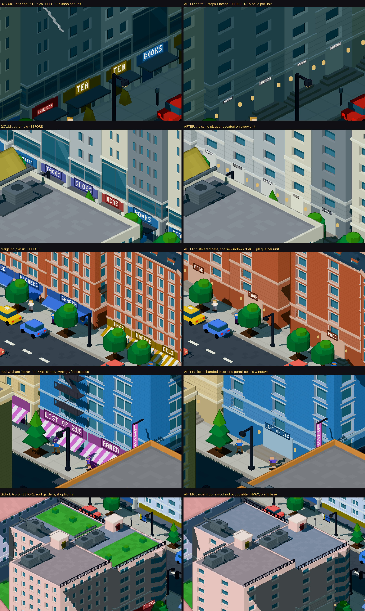
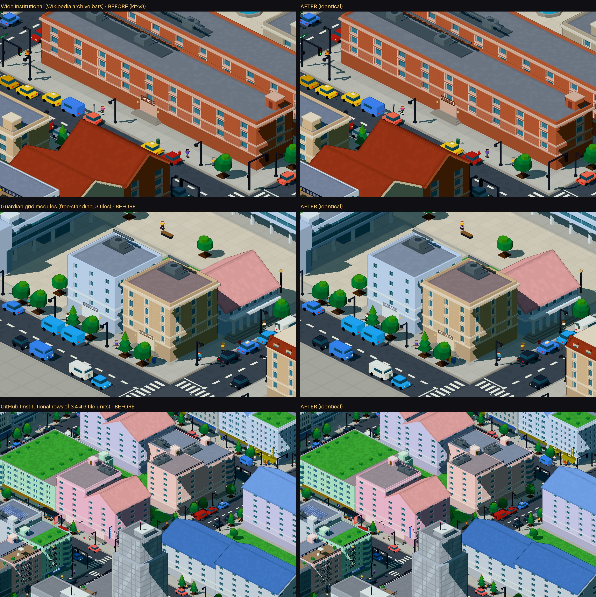
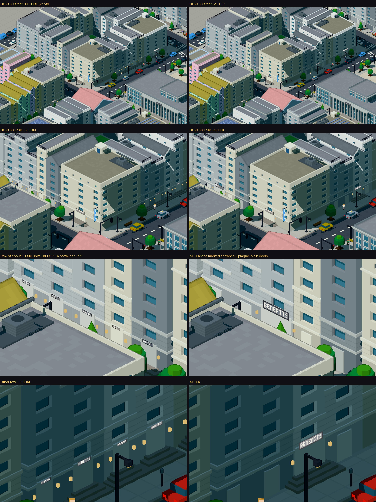
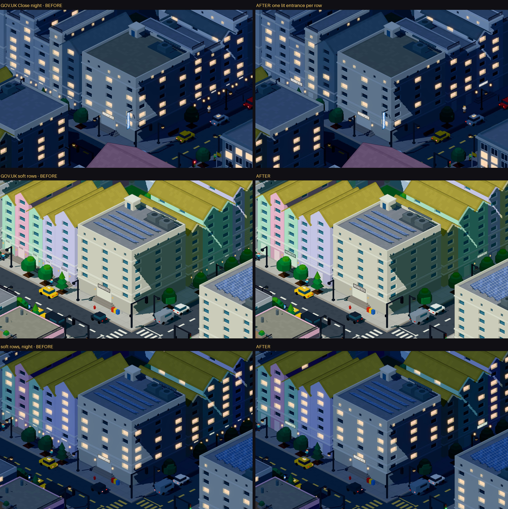
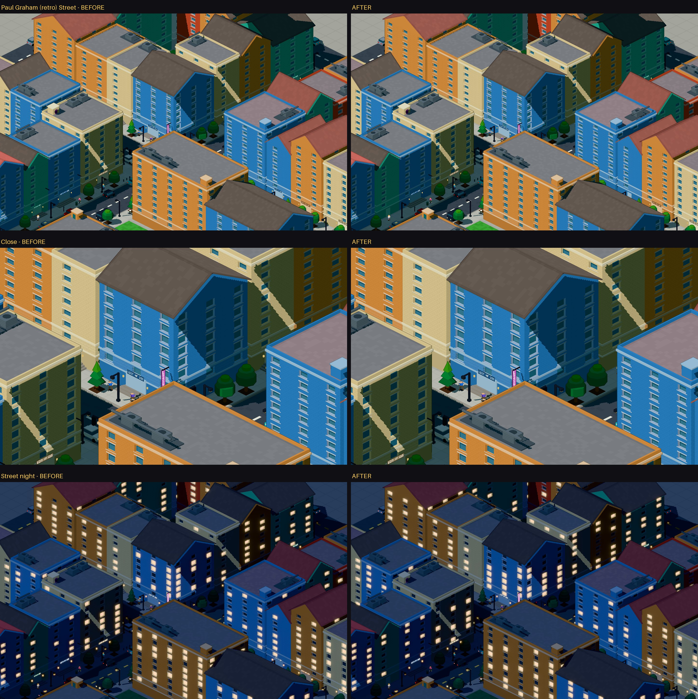
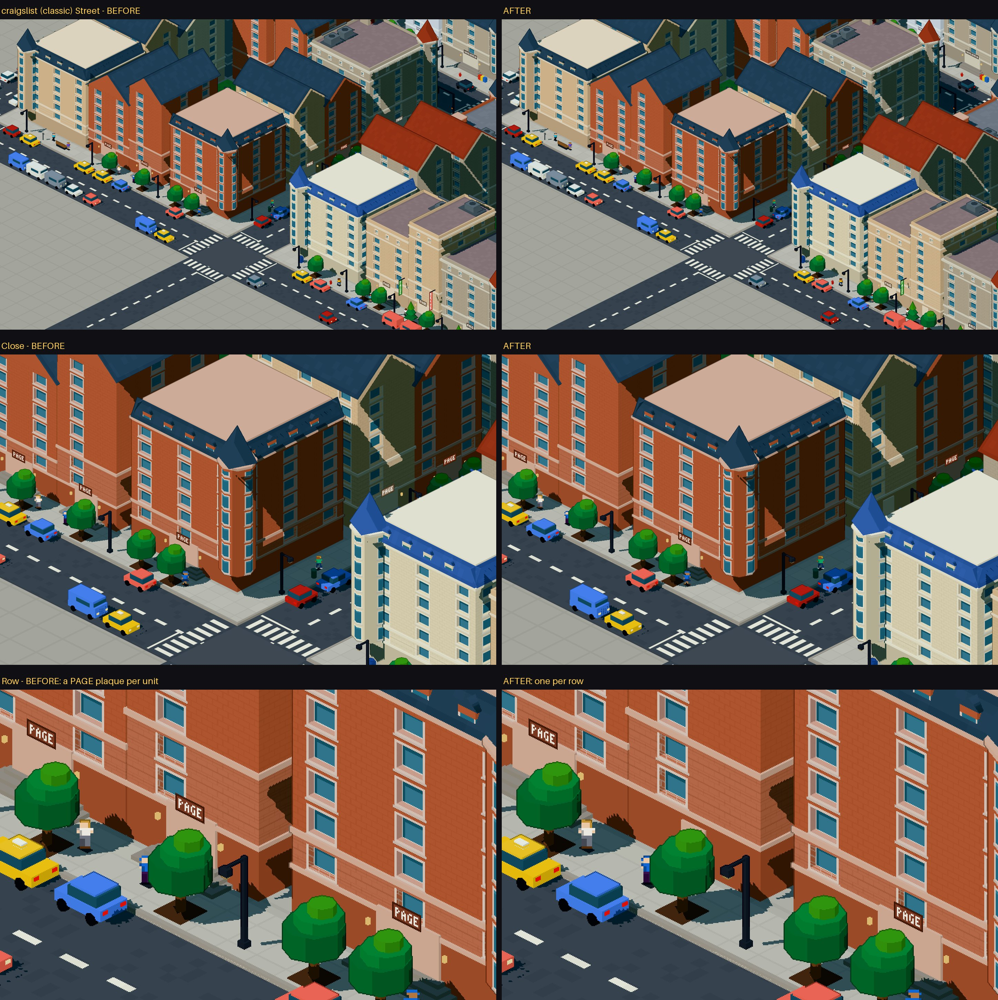
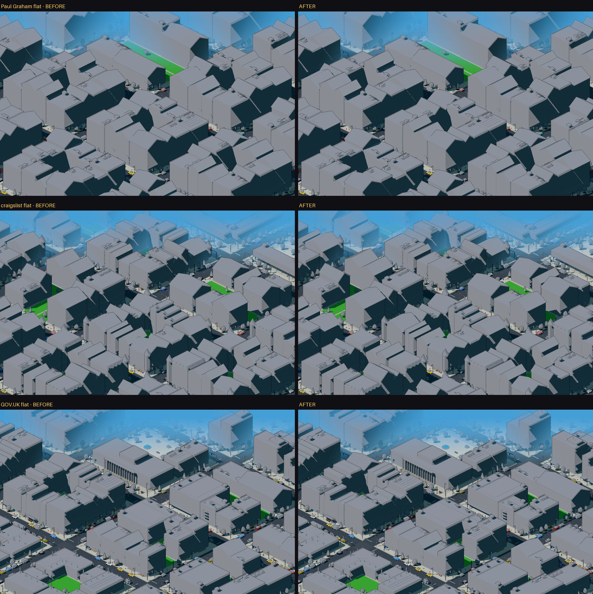

# Pixel city: program differentiation — `Territory.items` e auditoria do vocabulário

> Segunda etapa da rodada do funil comercial: o descritor aditivo `Territory.items` e a auditoria do
> vocabulário de Programs (partes 0–12). A **terceira etapa** (parte 13) é o experimento aprovado
> "índice simples → institutional", com a decisão (a) para as listagens com metadados. A **quarta**
> (parte 14, no fim) adapta o institutional à largura das unidades estreitas (decisão b).
> Dados: [`program/forms.md`](program/forms.md) (forma, função e simulações por território) ·
> [`program/audit-before.md`](program/audit-before.md) (kit-v7) · testes: `npm run test:program`.

## 0. Resposta curta

**"O vocabulário atual consegue representar causalmente as funções que conseguimos inferir da
página?" Não por inteiro.**

- Ele representa com causa: **índice** (institutional, que o kit já usa para sumário, referências e
  diretórios), **apoio** (service), **dados** (office) e **identidade** (famílias de marco).
  **Leitura → residential** é uma metáfora (tecido de fundo), mas é consistente.
- Para **transação** (commercial) ele tem a palavra certa, mas a página quase não dá evidência: no
  corpus só o IKEA, e com evidência no nível do território, não do item.
- **Vitrine → office** é uma convenção (torre com telas), não uma causa. Não existe um Program de
  galeria ou exposição.
- **Listagem com metadados não tem Program.** São itens com vários links cada (título ou destino,
  mais autor, data, comentários, tags ou um segundo arquivo): lobste.rs, a tabela de arquivos do
  GitHub, as referências da Wikipedia. Isso dá 463 volumes, **23% da cidade**. Pior: pela forma, essa
  função não se separa. Índice anotado, publicação e discussão produzem o mesmo item estrutural.

Por isso a proposta revisada (§9) muda **uma só coisa**: índices de itens com um destino deixam de
ser lojas. Para listagens com metadados, **paro aqui**, como pede a condição de parada. Elas
continuam commercial, agora declaradas como *fallback*, até haver uma decisão sobre o vocabulário
(§12).

## 1. `Territory.items` no corpus

[`kit/items.ts`](../src/lib/pixelcity/kit/items.ts) é anexado depois de tudo o que o território
decide, no mesmo escopo de nós que `structure`.

| campo | o que é |
|---|---|
| `count`, `shape`, `parents` | itens da série dominante (`pai > item`, juntada no território inteiro) |
| `coverage` | parte dos links (ou do texto) do território dentro dos itens |
| `linksPerItem`, `charsPerItem`, `mediaPerItem`, `controlsPerItem` | medianas por item (um cluster normalizado conta como seus *n* itens) |
| `titled`, `titledShare` | itens com **um** título: um título que é o próprio link, ou um único título simples |
| `groups`, `itemsPerGroup` | pertença a grupos, quando `structure` observou grupos |
| `confidence`, `evidence` | `high` (cobertura ≥ 80% e ≥ 5 itens), `medium`, `none`, com o porquê |

**Regra da série.** Uma série são ≥ 3 filhos irmãos de uma tag que têm link ou texto. Concorrem as
séries que cobrem ≥ 50% dos links (ou do texto). Ganha a série de membros **titulados**: entradas,
cujas partes repetidas (os links de metadado) não viram itens. Se não houver, ganha a série **mais
fina**. Um membro titulado por um título *simples* que contém uma série mais fina é um **grupo com
cabeçalho** (prateleira de produtos, coluna de rodapé), não uma entrada. Nesse caso, os itens dele
vencem.

| página | item observado | links/item | texto/item | mídia | ctl | titulado | grupos | conf. |
|---|---|---|---|---|---|---|---|---|
| **Paul Graham** | 215 × `table > td` | 1 | 22 | 0 | 0 | 0% | – | high |
| **lobste.rs** | 25 × `ol > div` | 10 | 139 | 0 | 0 | 100% | – | high |
| **craigslist** (resto) | 323 × `ul > a` | 1 | 10 | 0 | 0 | 0% | 41 (~8/grupo) | high |
| **GitHub** (arquivos) | 29 × `tbody > tr` | 2 | 26 | 0 | 0 | 0% | – | high |
| **GOV.UK** (serviços) | 16 × `ul > div` | 1 | 74 | 0 | 0 | 100% | – | high |
| IKEA (produtos) | 25 × `div > div` | 2 | 14 | 1 | 0 | 28% | 14 | medium |
| Wikipedia (referências) | 28 × `ol > li` | 3 | 122 | 0 | 0 | 0% | – | high |
| Python Docs (seção principal) | 21 × `section > dl` | 2,2 | 920 | 0 | 0 | 0% | – | high |
| NASA (galeria) | 7 × `div > div` | 1 | 22 | 1 | 0 | 100% | – | high |
| Linear | nenhuma lista de links: blocos de texto e cards, ≤ 1 link/item em todos os 14 territórios | | | | | | | |

Os cinco casos de ouro saem como pedido. Paul Graham: 215 itens simples. lobste.rs: entradas
tituladas com 10 links de metadado. craigslist: itens simples em 41 grupos. GitHub: linhas de 2
links. GOV.UK: títulos com texto. Os 156 territórios do corpus estão em
[`forms.md` §1](program/forms.md).

Os 47 controles do IKEA são do território (carrossel e alternância de preço), **não** dos cards.
Por isso `controlsPerItem` = 0.

## 2. Prova de que é aditivo

| verificação | resultado |
|---|---|
| territórios sem `items` (peso, rawWeight, chave, ordem, tier, mix, métricas, structure, why) = kit-v7 | 14/14 |
| alocação, caminho, donos, segmentos e lotes = kit-v7 | 14/14 |
| cidade normal e flat = kit-v7 (nada lê `items`) | 28/28 byte a byte |
| corpus completo (dia, noite, flat) = kit-v7 ([`corpus.ts`](../scripts/program/corpus.ts)) | 42/42 |
| `items` e evidência no trace; determinístico | ✓ |
| `items.ts` não lê URL, host, nome de site, rótulos nem palavras | ✓ |

Testes sintéticos (`test:program`): 60 links simples, 30 linhas de 2 links, 12 entradas tituladas de
5 links, 10 cards com imagem, link e botão, 4 prateleiras com cabeçalho de 6 cards (dão os 24 cards),
4 colunas de rodapé com cabeçalho (dão os 20 links) e prosa (sem série). Typecheck, lint, build e
`test:allocation`, `hygiene`, `surface`, `openings`, `composition` e `program` passam. O teste
aditivo do `composition` agora também remove `items`, já que compara com o kit-v6.

## 3. Três camadas separadas

| camada | pergunta | lê | hoje |
|---|---|---|---|
| **FORMA DE CONTEÚDO** | como é um item desta parte da página? | `items`, `structure`, métricas | descrita (este passo); nada a lê |
| **COMPOSIÇÃO** | como o terreno se organiza? | mix (métricas), tipo de região | `parcelled`, `grid`, `continuous`… |
| **PROGRAMA** | que função os prédios abrigam? | deveria ler a **função**, que se infere da forma | `USE[composição]`: a composição decide o programa |

O funil nasce na terceira linha: **a composição `parcelled` (muitas unidades estreitas) implica
loja**. Fileira de lotes estreitos é tipologia, não função. A forma descreve a página; a função é
uma inferência a partir da forma; o Program é a palavra do vocabulário para a função, quando
existe.

## 4. Taxonomia observada de FORMA DE CONTEÚDO

Lida só de `items` (+ `structure`), sem palavras. Esta é a contagem de territórios com ≥ 4 lotes:

| forma | regra | territórios | volumes | exemplos |
|---|---|---|---|---|
| índice de links | ≤ 1 link/item, ≥ 0,5, sem título | 43 | 436 | Paul Graham, listas do GitHub, menus |
| índice de links agrupado | idem + grupos explícitos | 13 | 276 | craigslist, rodapés |
| entradas tituladas | ≥ 50% dos itens com um título | 5 | 350 | lobste.rs, GOV.UK, "mais lidas" do Guardian |
| linhas compostas | ≥ 1,5 link/item, < 80 caracteres | 4 | 201 | arquivos do GitHub, tabela da Wikipedia |
| lista anotada | ≥ 1,5 link/item, ≥ 80 caracteres | 2 | 23 | referências da Wikipedia |
| cards de mídia | ≥ 0,5 mídia/item, < 200 caracteres | 28 | 310 | Guardian, NASA, IKEA, portfólio |
| seções ilustradas | mídia + ≥ 200 caracteres/item | 9 | 85 | seções de artigo da Wikipedia |
| prosa | ≥ 200 caracteres/item | 10 | 201 | Python Docs |
| itens de texto | série sem links | 10 | 33 | tabela do itertools, blocos do Linear |
| sem série | – | 32 | 138 | heróis, formulários, seções únicas |

## 5. Inventário dos Programs

| uso | função arquitetônica pretendida | o que a Surface Grammar faz com ele | volumes (terra) | de onde vem hoje | sinais que o justificariam | esses sinais chegam à atribuição? |
|---|---|---|---|---|---|---|
| **commercial** | comércio, troca | térreo de lojas por unidade (largura cai com a densidade de links), toldos, letreiro, térreo envidraçado; janelas sobre as lojas; HVAC/caixa d'água; terraço até 5 andares | 1169 = 57% (47%) | `parcelled`, `grid`, `navigation` | transação: cards com mídia **e** controles, formulário de compra; preço só por palavras (proibido) | **quase nunca.** Só o tipo `pricing` (com falso positivo no Guardian). 84% chega por `parcelled` (densidade de links ou tipo `feed`), que não é sinal de comércio |
| **residential** | morar; tecido de fundo | portas com degraus, janelas domésticas, sacadas, escada de incêndio, caixa d'água, chaminés | 406 = 20% (22%) | `continuous` | leitura: texto longo, prosa | sim, pelas métricas (pouco link/imagem/controle) |
| **office** | trabalho, sede | lobby central, pilares verticais / pele de vidro, andares acesos inteiros, base envidraçada e penthouse ≥ 6 andares | 307 = 15% (19%) | `media`, `structured`, marcos | dados (tabelas ≥ 30%): sim; vitrine de mídia: só por convenção | sim, pelas métricas |
| **institutional** | arquivo, biblioteca, instituição | térreo fechado, entrada central marcada, placa, aberturas esparsas, base rusticada ≥ 3 andares, ático ≥ 5 | 51 = 2% (4%) | `archive` = tipos `toc`, `references`, `directory` | índice: itens com um destino; lista anotada | **só pelo tipo de região.** A mesma forma sem o tipo vira loja (caso A, §7) |
| **service** | bastidores | uma porta de serviço, fachada cega, poucas aberturas regulares | 116 = 6% (6%) | `support` (rodapé) | rodapé, *chrome* | sim |
| **civic** | monumento público | entrada axial cerimonial, vãos largos com aberturas altas, cornija pesada, cobertura limpa | 4 = 0,2% (2%) | marco de página de texto (`statement` → civic) ou de links (`gateway` → clocktower) | identidade (já usada); "autoridade pública" só por palavras ou host | sim, no marco (um por página) |
| **industrial** | produção, carga | portas de carga numa frente cega, letreiro pintado, sem coroa | 0 | nenhuma composição; só o *fallback* de família (galpão/docas), que o compose nunca produz | nenhuma função de página | não, e não há o que chegar |
| **kiosk** | atendimento | fora da Surface Grammar (quiosques e praças não têm anatomia) | 0 volumes de fachada | `marker`, `interactive` | controles, formulário, CTA | sim, na **composição** (praça com quiosques), não na fachada |

## 6. Funções observáveis e o vocabulário

A função vem da forma. O tipo de região só entra para chrome e identidade.

| função | como se lê (sem palavras) | volumes | uso hoje | Program defensável | confiança |
|---|---|---|---|---|---|
| **índice** | ≥ 5 itens de **um** destino (≤ 1 link), sem mídia nem controles; título, se houver, é o próprio link | 640 | commercial 82%, residential 11%, office 3%, institutional 4% | **institutional**, o mesmo que o kit dá aos índices nomeados | alta |
| leitura | prosa, seções ilustradas | 286 | residential 75%, office 16%, commercial 8% | residential (metáfora já consistente) | alta como convenção |
| dados | tabelas ≥ 30% | 14 | office | office | média |
| apoio | rodapé | 116 | service | service | alta |
| identidade | marco | 7 | civic / office pela família | família do marco | alta |
| vitrine | cards de mídia sem controles | 188 | office 99% | office, **por convenção**; não há "galeria" | média-baixa |
| transação | cards de mídia num território com ≥ 3 imagens e ≥ 3 controles | 121 | commercial 115 (IKEA), office 6 (Linear) | commercial | **baixa.** O Linear é falso positivo (abas de produto); os controles do IKEA não estão nos cards |
| navegação | `nav` | 44 | commercial (arcada) | nenhum. A arcada (composição) já diferencia | – |
| **listagem com metadados** | itens com ≥ 2 links (destino + autor, data, comentários, tags, segundo arquivo) | 463 | commercial 93%, institutional 5% (referências), residential 2% | **nenhum** | – |
| desconhecida | sem série, texto sem links, controles por item | 174 | misto | – | – |

A linha "listagem com metadados" mostra o problema inteiro. A **mesma** função vira institutional
quando a semântica chama a região de `references` e vira loja quando a chama de `feed` ou `faq`. E
não há como resolver só pela forma:

- a tabela de arquivos do GitHub é um **índice anotado** (arquivo + último commit);
- lobste.rs é um **agregador**: um índice de links externos, com autor, comentários e tags;
- uma lista de notícias ou discussões tem o mesmo item.

Mandar tudo para institutional reproduz o teste a seco revertido: institutional chegaria a 49%. Para
office ("publicação"), seria inventar um sentido. Civic não funciona em escala de lote: 234 prefeituras
minúsculas.

## 7. Programs mortos: A ou B

| uso | volumes | diagnóstico |
|---|---|---|
| **industrial** | 0 | **B.** Nenhuma forma do corpus, nem que eu consiga definir sem palavras, significa produção ou carga. Também é inalcançável (nenhuma composição leva a ele). **Não inflar.** |
| **civic** | 4 | **Vivo como papel singular** (marco de página de texto/links, 2% da terra). A função "instituição pública" (governo, ONU) é **B**: só se lê por palavras ou host. **Não inflar.** |
| kiosk | 0 de fachada | **Não está morto, está em outra camada.** A interação chega à cidade como praça com quiosques (composição). |
| **institutional** | 51 (2%) | **A.** A evidência existe (640 volumes de índice), mas a atribuição só deixa institutional quando a semântica nomeia o tipo. |

## 8. O que se infere com confiança e o que é ambíguo

**Com confiança:**

- índice → institutional;
- apoio → service;
- leitura → residential (como convenção já estabelecida);
- dados → office;
- identidade → marco.

**Ambíguo ou sem Program:**

- listagem com metadados: sem Program, e a função não se separa pela forma;
- transação: evidência fraca e com falsos positivos;
- vitrine: office por convenção;
- navegação: sem Program, mas a composição já cobre;
- itens de texto e formas sem série.

## 9. Proposta revisada de atribuição (não implementada)

> Em território **`parcelled` ou `grid`**, se `items` é um **índice**, o uso é `institutional`, o
> mesmo que o kit já dá a índices nomeados (`archive`). Índice quer dizer:
>
> - ≥ 5 itens;
> - ≤ 1 link por item (mediana);
> - mídia < 0,5 e controles < 0,5 por item;
> - sem título, ou com título que é o próprio link.
>
> **Todo o resto fica igual.** O trace passa a dizer por que cada volume tem seu uso: *evidência*
> (função), *convenção* (composição) ou *fallback*.

Por que é defensável:

- não cria mapeamento novo, porque estende ao mesmo **conteúdo** a regra que já existe para o
  mesmo **tipo**;
- lê só a forma do item;
- não depende de estilo nem de RNG;
- deixa intactas as formas ambíguas;
- não mexe em `continuous`, `media`, `structured`, `support`, `navigation` nem no marco.

Não usa a confiança `high` como corte: ela dividiria o craigslist (2 dos 5 continentes têm cobertura
< 80%) com a mesma forma.

**Fica de fora, de propósito:**

- listagem com metadados (lobste.rs, arquivos do GitHub, tabela da Wikipedia);
- transação além do que já existe;
- vitrine;
- navegação.

## 10. Distribuição simulada (volumes do corpus, semente 7)

| uso | BEFORE (kit-v7) | teste a seco revertido | **PROPOSED** |
|---|---|---|---|
| commercial | 57% | 10% | **32%** |
| residential | 20% | 20% | 20% |
| office | 15% | 15% | 15% |
| institutional | 2% | 49% | **27%** |
| service | 6% | 6% | 6% |
| civic | 0,2% | 0,2% | 0,2% |

Por que o que resta é commercial:

| motivo | BEFORE | PROPOSED |
|---|---|---|
| evidência de transação (IKEA) | 115 | 115 |
| convenção: arcada de navegação | 44 | 44 |
| **fallback** (nenhuma função que o vocabulário nomeie) | **1010 (49% da cidade)** | **498 (24%)** |

Do *fallback* restante:

- 431 volumes são listagem com metadados: lobste.rs 234, GitHub 177 e outros;
- 31 são desconhecidos;
- 22 são leitura;
- 14 são índices com menos de 5 itens.

Por página (commercial → institutional):

| página | BEFORE | PROPOSED |
|---|---|---|
| Paul Graham | 100% / 0% | 0% / **100%** |
| craigslist | 99% / 0% | 6% / **93%** |
| GOV.UK | 60% / 0% | 2% / **58%** |
| Vercel | 43% / 0% | 22% / 22% |
| GitHub | 89% / 2% | 77% / 13% |
| Guardian | 20% / 0% | 12% / 8% |
| NASA | 17% / 0% | 10% / 7% |
| Wikipedia | 21% / 24% | 19% / 25% |
| IKEA | 88% / 0% | 88% / 0% |
| **lobste.rs** | 99% / 0% | **99% / 0%** |
| Linear, portfolio, Python Docs, Wikipedia 2 | praticamente iguais | |

Institutional não vira um novo funil por *fallback*: cada volume novo carrega evidência de índice.
Ele se concentra nas páginas que **são** índices. Mesmo assim, chega a 27%, e isso merece ser visto
na cidade antes de ser aceito (§12).

## 11. Casos individuais

| página | território principal (lotes) | forma (items) | função | BEFORE | PROPOSED |
|---|---|---|---|---|---|
| **IKEA** | produtos, `grid` (194) | cards de mídia: 25 × 2 links, mídia 1, 0 ctl/item (território: 46 imagens, 47 controles) | transação (fraca) | commercial 115 | = (agora com evidência, não por *fallback*) |
| **Paul Graham** | ensaios, `parcelled` (247) | índice: 215 × 1 link | índice | commercial 177 | **institutional 177** |
| **craigslist** | cidades, `parcelled` (115 + 4 continentes) | índice agrupado: 323 × 1 link, 41 grupos | índice | commercial 162 | **institutional 162** (navegação e 3 linhas compostas ficam) |
| **lobste.rs** | histórias, `parcelled` (247) | entradas tituladas: 25 × 10 links, 139 caracteres | listagem com metadados | commercial 234 | **= (fallback declarado; parada)** |
| **GitHub** | arquivos, `parcelled` (108) | linhas compostas: 29 × 2 links | listagem com metadados | commercial 177 | = (fallback) |
| | listas da lateral, `parcelled` (14, 13, 7, 19, 19) | índices: 7–15 × 1 link | índice | commercial 29 | institutional 29 |
| **GOV.UK** | serviços, `parcelled` (67) | entradas tituladas: 16 × 1 link (o título é o link), 74 caracteres | índice | commercial 84 | **institutional 84** |
| | tópicos, `continuous` (24) | entradas tituladas: 6 × 1 link | índice | residential 17 | = (não é `parcelled`) |
| **Python Docs** | seções, `continuous` (129 + 89) | prosa: 21 × 920 caracteres | leitura | residential 154 | = |
| | tabela do itertools, `parcelled` (19) | itens de texto: 49 × 0 links | desconhecida | commercial 11 | = (fallback) |
| **Wikipedia** | referências, `archive` (30) | lista anotada: 28 × 3 links | listagem com metadados | institutional 13 | = |
| | seções, `continuous`/`media` | seções ilustradas | leitura | residential/office | = |
| | tabela, `parcelled` (17) | linhas compostas: 12 × 2 links | listagem com metadados | commercial 10 | = (fallback) |
| **NASA** | galeria, `media` (54) | cards de mídia: 7 × 1 link, mídia 1 | vitrine | office 14 | = |
| | links de seção, `parcelled` (15) | índice: 7 × 1 link | índice | commercial 6 | institutional 6 |
| **Linear** | seções de produto | sem série / itens de texto; vitrine com abas | desconhecida; "transação" falsa | residential / office | = (nada muda) |

## 12. Limitações, riscos e decisão pendente

1. **Institutional em lote estreito nunca foi renderizado.** Hoje ele só aparece em `archive`
   (barras largas e baixas). Em `parcelled`, cada unidade estreita da fileira ganharia térreo
   fechado, entrada central e aberturas esparsas. Fica uma fileira de casas institucionais: plausível,
   mas não verificado. Se ler mal nessa escala, o problema é da Surface Grammar, que está fora do
   escopo, e eu paro de novo.
2. **A transação continua fraca.** Os controles do IKEA são do território, não dos cards. O Linear
   mostra que mídia + controles também é aba de produto. Não proponho reforçar commercial com isso.
3. **Ainda há heurística de forma.** A forma é robusta nos casos de ouro, mas a fronteira
   "≤ 1 link por item" separa o índice de serviços do GOV.UK (1 link) da tabela de arquivos do GitHub
   (2 links). Essa é a fronteira certa (um destino contra destino + metadado), mas é uma fronteira.
   Nenhum território do corpus fica entre 1 e 1,5 link por item, fora os cards de mídia.
4. **Decisão sobre "listagem com metadados" (23% da cidade).** O vocabulário não tem palavra para ela,
   e a forma não diz se é índice anotado, publicação ou discussão. As opções que vejo, sem
   recomendar nenhuma como inevitável:
   - **(a)** manter commercial como *fallback* **declarado** no trace;
   - **(b)** um Program novo de grão médio para "entradas com metadados", o que exige trabalho de
     Surface Grammar e está fora deste escopo;
   - **(c)** tratar como índice anotado (institutional), que reproduz o funil do teste a seco e
     **não recomendo**.

## 13. Experimento: índice simples → institutional (etapa 3)

> Aprovado como experimento. Decisão (a): as listagens com metadados continuam `commercial`, como
> *fallback* rastreável. Allocation, composição, massing, estilo, Surface Grammar e Openings ficam
> congelados. Dados: [`program/experiment.md`](program/experiment.md) · visual:
> [`scripts/program/visual.sh`](../scripts/program/visual.sh) · testes: `npm run test:program`.
> **Resultado: a classificação está semanticamente correta, mas `institutional` não funciona
> arquitetonicamente nos lotes mais estreitos. Parei aqui, sem ajustar a Surface Grammar.**

### 13.1 O que foi implementado

`compose.ts`: `assignUse(t, comp)` vale para `parcelled` e `grid`. Se `simpleIndex(t)`, o uso é
`institutional`; senão vale a tabela de sempre. A regra é a aprovada:

- ≥ 5 itens;
- 1 link por item (mediana entre 0,5 e 1);
- itens curtos (< 200 caracteres, a mesma fronteira de "prosa" da simulação);
- sem mídia e sem controles;
- sem título além do próprio link.

Um título *dentro* do link (`a > h3`) conta como o próprio link; foi isso que pôs a lista "mais lidas"
do Guardian (`grid`) no experimento. A tabela de usos agora tem o **motivo** de cada um, e o trace
guarda `program: { use, reason }` em cada prédio:

| program | reason | volumes |
|---|---|---|
| institutional | **simple-index evidence** | 512 |
| institutional | region kind: index (toc, references, directory) | 51 |
| commercial | **fallback — no matching architectural program** | 482 |
| commercial | region kind: pricing / product grid | 131 |
| commercial | convention: navigation arcade | 44 |
| residential | composition: continuous text | 406 |
| office | convention: media showcase · composition: tables · landmark family | 290 · 14 · 3 |
| service | region kind: footer | 116 |
| civic | landmark family | 4 |

Não tentei reduzir o *fallback* além do que a regra faz.

### 13.2 Medidas (corpus, semente 7)

| | BEFORE (kit-v7) | AFTER |
|---|---|---|
| commercial (volumes · terra) | 56,9% · 46,7% | **32,0% · 24,8%** |
| institutional (volumes · terra) | 2,5% · 4,1% | **27,4% · 25,9%** |
| *fallback* declarado (volumes · terra) | 48,0% · 36,2% | **23,5% · 14,7%** |
| prédios alterados | – | 326 de 1305 (512 volumes), em 21 territórios de 10 páginas |

A simulação da etapa 2 previa 32% / 27%; o experimento confirma.

**Nada além do uso mudou** ([`experiment.md` §5](program/experiment.md)):

- os programas dos prédios alterados (família, andares, telhado, unidades, seed) são idênticos ao
  kit-v7;
- as peças fora deles são idênticas no modo normal (fora as posições de letreiro no atlas) e no
  flat;
- sem `items`, a cidade inteira é byte a byte o kit-v7 (28/28);
- a mudança de contorno (até 1 tile) vem só do toldo da entrada de esquina das lojas, que o uso
  institucional não tem;
- as alturas mudam até −0,6 (o equipamento de cobertura).

**Estabilidade de semente:** as sementes 7, 8 e 9 mudam os mesmos prédios nas 14 páginas, com os
mesmos usos e motivos.

**Distância de imagem.** Normalização E2E: 1,0 é a distância mediana entre duas páginas diferentes.
O ruído de semente é a mesma página com seed 7 contra seed 8:

| | Paul Graham | craigslist | GOV.UK | GitHub |
|---|---|---|---|---|
| Street BEFORE × AFTER | **0,83** | 0,64 | 0,47 | 0,42 |
| ruído de semente (Street) | 0,54 | 0,43 | 0,32 | 0,62 |
| Close | 0,59 | 0,65 | 0,55 | 0,33 |
| City | **1,00** | 0,65 | 0,46 | – |
| **flat** | **0,53** | 0,09 | 0,16 | 0,08 |

**Controles:**

- idênticos: IKEA, lobste.rs e Wikipedia 2 (Street e City; 0,000);
- Wikipedia: 0,06 (um prédio, a lista de idiomas);
- Guardian "mais lidas" (Close): 0,27.

**O flat não fica estável no Paul Graham (0,53).** As massas são as mesmas. O que some são as
escadas de incêndio e as caixas d'água, que no flat são geometria. A Surface Grammar só as dá a
walk-ups residenciais e comerciais retrô. Nas outras páginas, o flat fica estável (0,08–0,16).

### 13.3 A classificação é semanticamente correta?

**Sim, nos casos de ouro e em 89% dos prédios alterados.** Para responder, li as amostras dos links
como auditor; o descritor e a regra não leem palavras.

| prédios | o que é | veredito |
|---|---|---|
| 119 | Paul Graham: 215 ensaios (+ 20 links) | índice de documentos ✔ |
| 119 | craigslist: cidades por continente | diretório ✔ |
| 36 | GOV.UK: "Benefits", "Popular on GOV.UK", "More on GOV.UK" (serviços) | catálogo de serviços ✔ |
| 9 | Guardian: "mais lidas" (títulos-link) | índice ordenado de artigos ✔ |
| 4 · 3 · 1 | NASA "Suggested Searches" · GitHub "About" (tópicos) · Wikipedia (lista de idiomas) | índices ✔ |
| **35** | menus do site que a semântica não tipou como `nav`: produtos do GitHub (15), produtos da Vercel (15), *skip links* do Guardian (3), barra lateral do Python Docs (2) | **índice, mas função de navegação** |

O segundo grupo é estruturalmente um índice. A inconsistência vem de antes: um menu tipado como
`nav` fica na arcada comercial (convenção), e um menu não tipado vira institutional. Isso é um
problema de detecção de `nav`, não da regra, e não mexi nisso.

**Os controles ficam onde devem:**

- lobste.rs (10 links/item) e a tabela de arquivos do GitHub (2 links/item) continuam
  `commercial / fallback`;
- o IKEA continua `commercial / pricing grid`;
- as referências da Wikipedia continuam `institutional / region kind`.

### 13.4 `institutional` funciona nos lotes estreitos? **Não em todos. Parei aqui.**

O institutional da Surface Grammar foi desenhado para **um** prédio:

- térreo fechado com **uma** entrada central marcada (portal, degraus, luminárias, placa);
- poucas aberturas;
- base rusticada;
- cobertura com HVAC e não ocupável.

No `parcelled`, cada unidade da fileira é um prédio. Hoje esse caso só aparecia no `archive`, em
barras largas. As frentes institucionais novas, por largura de unidade:

| largura da unidade | unidades | onde |
|---|---|---|
| < 1,5 tile | 72 | GOV.UK (60, ~1,1 tile), craigslist (12) |
| 1,5–2,5 | 66 | craigslist |
| 2,5–3,5 | 224 | Paul Graham, GitHub, Guardian, Vercel… |
| ≥ 3,5 | 150 | esquinas, lotes, módulos |



**O que funciona:**

- unidades largas e esquinas: a esquina do GOV.UK tem portal, degraus, placa e ático, e lê como
  instituição;
- o estilo clássico: no craigslist, a base rusticada em tijolo e as janelas esparsas leem como um
  bairro de faculdades e clubes;
- os módulos de 3 tiles do `grid` do Guardian;
- na distância Street, o bairro moderno do GOV.UK fica coerente com o marco cívico ao lado.

**Problemas, em ordem de gravidade:**

1. **Uma entrada cerimonial por unidade.** Com ~1,1 tile por unidade (GOV.UK), a fileira vira uma
   sequência de portais com degraus e luminárias a cada tile. "Uma entrada marcada" perde o
   sentido: lê como uma fileira de escadinhas de sobrado, não como instituição.
2. **A mesma placa em todas as unidades.** O portal usa o rótulo do território, então aparece
   "BENEFITS", "LIST OF 215" ou "PAGE" em cada unidade. No comercial, cada unidade tinha seu próprio
   letreiro; a variedade de itens vira repetição.
3. **O ritmo dos itens some no térreo.** O térreo fechado (transparência 0,25) une as N unidades
   numa base contínua e cega. A mensagem do `parcelled` ("muitos itens") passa a depender só da
   variação de altura, cor e telhado.
4. **A identidade do estilo se perde em parte:**
   - **retrô** (Paul Graham): escadas de incêndio e caixas d'água somem, todo telhado ganha HVAC, e
     torres estreitas de 7–8 andares com janelas esparsas leem como depósitos. É também o que
     derruba o flat;
   - **soft** (GitHub): os jardins de cobertura somem, porque a cobertura institucional não é
     ocupável.

Os problemas 1 e 2 são de **escala**: uma gramática de prédio único aplicada por unidade. O 4 é a
gramática fazendo o que foi desenhada para fazer. Nenhum deles é erro de classificação.

### 13.5 Decisão pendente

Como pedido, não ajustei a Surface Grammar. As opções:

1. **Manter commercial** nos índices: desfaz o experimento, a classificação fica só no trace.
2. **Expressão institucional para lotes estreitos.** Exemplos: uma entrada marcada por run ou
   fileira, não por unidade; placa só nessa entrada; uma porta modesta por unidade, que mantém o
   ritmo dos itens; coberturas e elementos de estilo que não dependam só do uso.
3. **Rever o Program**: uma variante "institucional de fileira" ou outro uso para índices em lote
   estreito.

**Recomendo a opção 2.** A classificação está certa; o que falha é a gramática numa escala para a
qual ela não foi desenhada.

**Pendente também (fora deste experimento):** os 35 prédios de menus não tipados como `nav`.

O experimento continua ligado na árvore de trabalho, **sem commit**. Os testes antigos (`surface`,
`openings`, `composition`) comparam sem `items` (`withoutItems`), como antes faziam sem `structure`.

Pranchas:

- [Paul Graham](screenshots/program/sheets/pg-street-close.jpg)
- [craigslist](screenshots/program/sheets/cl-street-close.jpg)
- [GOV.UK](screenshots/program/sheets/gov-street-close.jpg)
- [GitHub](screenshots/program/sheets/gh-street-close.jpg)
- [controles](screenshots/program/sheets/F-controls.jpg)
- [City](screenshots/program/sheets/G-city.jpg)
- [flat](screenshots/program/sheets/H-flat.jpg)
- [grid do Guardian](screenshots/program/sheets/I-grid.jpg)

## 14. Institutional em lotes estreitos (etapa 4)

> Decisão (b), com escopo mínimo: só uma adaptação do institutional à largura. A classificação
> "índice simples → institutional" fica como estava. Baseline congelado: **kit-v8** (`?v=8`, o
> experimento da parte 13); atual = `?v=9`. Dados: [`program/narrow.md`](program/narrow.md) ·
> visual: [`scripts/program/narrow-visual.sh`](../scripts/program/narrow-visual.sh) · testes:
> `npm run test:program`. **Sem commit.**

### 14.1 Threshold e justificativa

O threshold sai da geometria da fachada institucional atual (`portal()` em
[`buildings.ts`](../src/lib/pixelcity/kit/buildings.ts)), não da auditoria:

| elemento | medida atual |
|---|---|
| portal (entrada central) | `w = min(0,9, 0,3 × span)`: o tamanho de projeto, 0,9, só vale a partir de 3,0 tiles; abaixo disso a gramática já encolhe o portal |
| degraus | 3 níveis; o mais largo excede o portal em 2 × (0,15 + 2 × 0,1) = **0,7** |
| luminárias | a ±(w/2 + 0,2), dentro dos degraus |
| conjunto da entrada no tamanho de projeto | 0,9 + 0,7 = **1,6** |

A Surface Grammar define o térreo institucional como "uma entrada marcada, plinto majoritariamente
fechado". Isso só vale se o plinto fechado for pelo menos igual ao conjunto da entrada:

```
span ≥ 2 × (0,9 + 0,7) = 3,2 tiles        (CEREMONIAL_SPAN)
```

Abaixo de 3,2, o portal de projeto com degraus ocupa mais da metade da frente. Abaixo de 3,0, o
portal encolhe e degraus, moldura e luminárias tomam a unidade inteira. O critério se aplica pela
**largura média das unidades de uma série geminada** (`rows`), porque a expressão é do conjunto,
não de cada unidade.

Prédios soltos ficam como estavam, mesmo abaixo de 3,2: os módulos de 3,0 do `grid` do Guardian e
os lotes de 3,1 das referências da Wikipedia. Um prédio solto precisa da sua entrada; o problema
era a repetição ao longo de uma frente contínua.

### 14.2 O que mudou (só a Surface Grammar, só institutional)

- `surface.ts`: `AnatomyInput.series?: { main }`. No institutional, a unidade principal de uma série
  estreita mantém o térreo atual ("the row's one marked entrance"). As outras recebem
  `entrance: "secondary"` e `signage: "none"`. Os outros Programs ignoram o campo.
- `buildings.ts`:
  - na família `rows`, se a média das unidades é < 3,2, a série tem **uma** unidade principal, a que
    contém o meio da série;
  - o portal dela é dimensionado pela série, `min(0,9, 0,3 × largura da série, unidade − 0,2)`, e
    pode ter degraus mais largos que a unidade;
  - a placa fica nessa entrada;
  - as outras unidades ganham `plainDoor` (folha e verga, sem degraus, luminárias nem placa) e
    perdem bandeira, tela e outdoor de cobertura;
  - o ritmo das unidades continua: uma porta por unidade, mesmas alturas, cores e telhados.
- Nada mudou em extração, `items`, `structure`, allocation, composition, massing, atribuição de
  Program, estilo ou Openings.

### 14.3 Institutional largo (controle)

| | BEFORE (kit-v8) × AFTER |
|---|---|
| prédios institucionais largos (fora de séries estreitas) | **0 de 242** mudam de geometria |
| barras do arquivo da Wikipedia (Close) | 0,000 |
| módulos do `grid` do Guardian (Close) | 0,000 |
| fileiras do GitHub (unidades de 3,4–4,6) (Street) | 0,000 |

Distâncias de imagem com a normalização E2E. Séries institucionais por largura média de unidade:

- < 1,5 tile: 18
- 1,5–2,5: 44
- 2,5–3,2: 73
- ≥ 3,2: 35, inalteradas



**Efeito do atlas de letreiros.** No Paul Graham, o atlas de letreiros (512²) estava cheio no
kit-v8 (205 letreiros, até a linha 510), e as últimas placas eram descartadas. Com menos placas
repetidas (176), 13 prédios largos voltam a mostrar a placa que já tinham. A geometria deles é
idêntica; só a presença do letreiro muda.

### 14.4 GOV.UK (~1,1 tile, caso crítico)

Antes, cada unidade tinha portal, degraus, duas luminárias e a placa "BENEFITS": 15 placas
repetidas. Agora cada fileira tem **uma** entrada marcada, com a placa grande sobre ela, e as outras
unidades têm portas simples. O ritmo continua (uma porta por unidade), e a fileira lê como uma
instituição.

- **À noite:** uma entrada iluminada por fileira, no lugar de um colar de luminárias.
- **Soft e modern:** comportam-se do mesmo jeito.
- **Números:** 14 séries, com 14 entradas marcadas e 56 portas simples.
- **Distâncias:** Street 0,025, Close 0,029, Close à noite 0,123, soft à noite 0,081.




### 14.5 Paul Graham (retrô)

São 56 séries de 2 unidades (~2,7 tiles cada): metade das unidades troca o portal por uma porta
simples. A mudança é pequena na distância Street (0,013 de dia, 0,081 à noite), porque as unidades
já eram largas o bastante para não parecer uma fileira de escadinhas. Não há perda de identidade
retrô **nova**. As escadas de incêndio e as caixas d'água sumiram na etapa 3 (uso institucional);
não as restaurei, como pedido.



### 14.6 craigslist (clássico)

São 61 séries (unidades de 1,2 a 3,2 tiles), com 61 entradas marcadas e 39 portas simples. A placa
"PAGE" aparece uma vez por fileira, não por unidade. A base rusticada e o ritmo de tijolo
continuam. Distâncias: Street 0,017, Close 0,014.



### 14.7 Guardian e GitHub

Os dois ficam idênticos (0,000). O `grid` do Guardian é feito de módulos soltos, e as fileiras
institucionais do GitHub têm unidades ≥ 3,2. A Vercel muda 4 séries.

### 14.8 Invariância de flat e massing

| verificação | resultado |
|---|---|
| volumes (andares, base, coroa, cobertura e equipamento) dos 135 prédios alterados | idênticos |
| volumes da cidade inteira em flat | idênticos |
| geometria fora dos prédios alterados, dia / noite / flat | idêntica nas 14 páginas |
| o que difere dentro deles | térreo (portal, degraus, portas, luminárias); letreiros; 29 braços de letreiro de bandeira removidos das unidades secundárias |
| flat (imagem) | Paul Graham 0,007, craigslist 0,005, GOV.UK 0,012 (0,05–0,31% dos pixels, todos no térreo) |
| sementes 7, 8, 9 | os mesmos prédios mudam nas 14 páginas |
| GOV.UK, semente 8 | 0,032 (ruído de semente da mesma vista: 0,345) |



### 14.9 Regressões

Typecheck, lint, build e `test:allocation`, `hygiene`, `surface`, `openings`, `composition` e
`program` passam. O `test:program` ganhou 8 checagens desta etapa: o threshold; largo inalterado;
só séries estreitas mudam; uma entrada marcada por série; letreiros só na entrada; volumes intactos
(normal e flat); geometria de fora idêntica; sementes.

**Limitações:**

- A unidade principal é a do meio. Em séries de 2 unidades (Paul Graham), isso dá a entrada a uma
  das duas, conforme as larguras sorteadas da fileira (sorteio determinístico, igual em todas as
  sementes).
- O portal da série pode ter degraus mais largos que a sua unidade (até 0,25 de cada lado, em
  unidades de ~1,1). Fica na calçada, sem colidir com as portas vizinhas.
- À noite, as fileiras estreitas ficam mais escuras no térreo (uma luz por fileira). É coerente com
  um plinto fechado, mas é uma mudança visível (0,08–0,12).

### 14.10 Backlog (não corrigido nesta rodada)

**Semantic Hygiene:** 35 prédios de menus do site que a semântica não tipou como `nav` viram índice
simples → institutional:

- produtos do GitHub (15);
- produtos da Vercel (15);
- *skip links* do Guardian (3);
- barra lateral do Python Docs (2).

Um menu tipado como `nav` fica na arcada comercial. A correção é na detecção de `nav` (Semantic
Hygiene), não na regra de índice.
