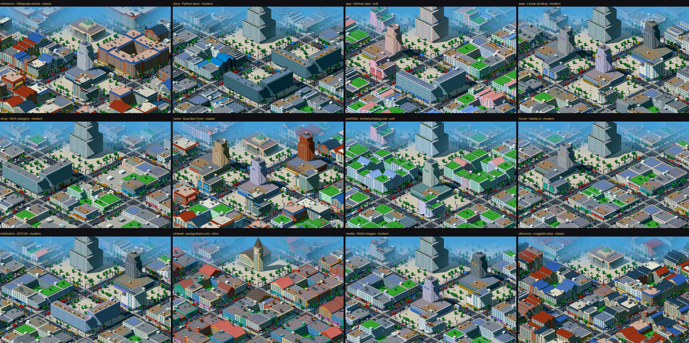
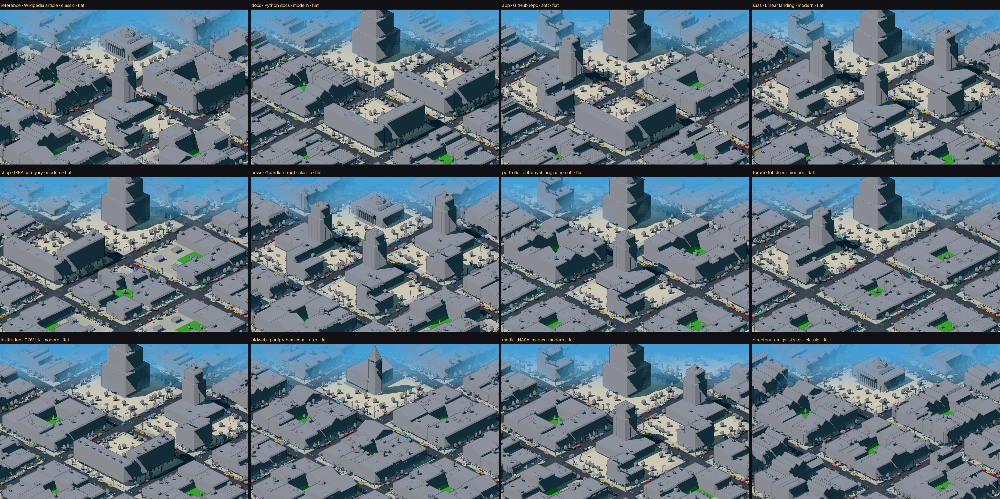
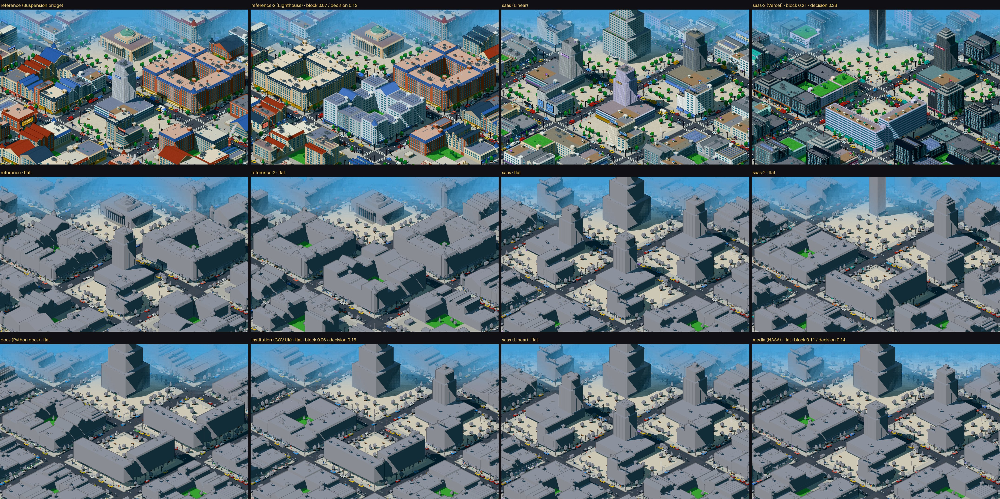
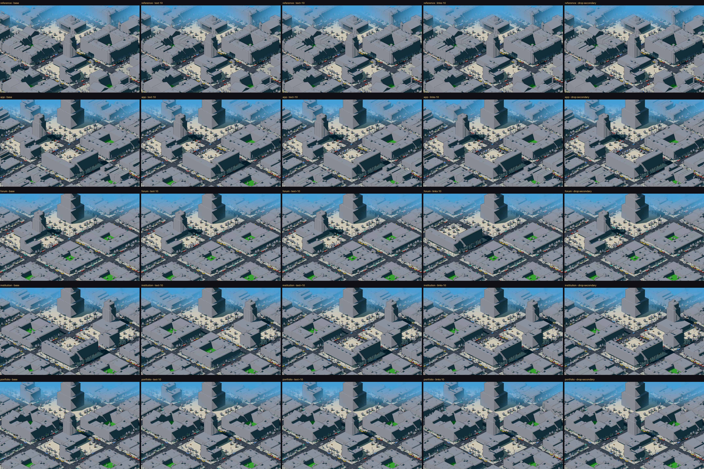
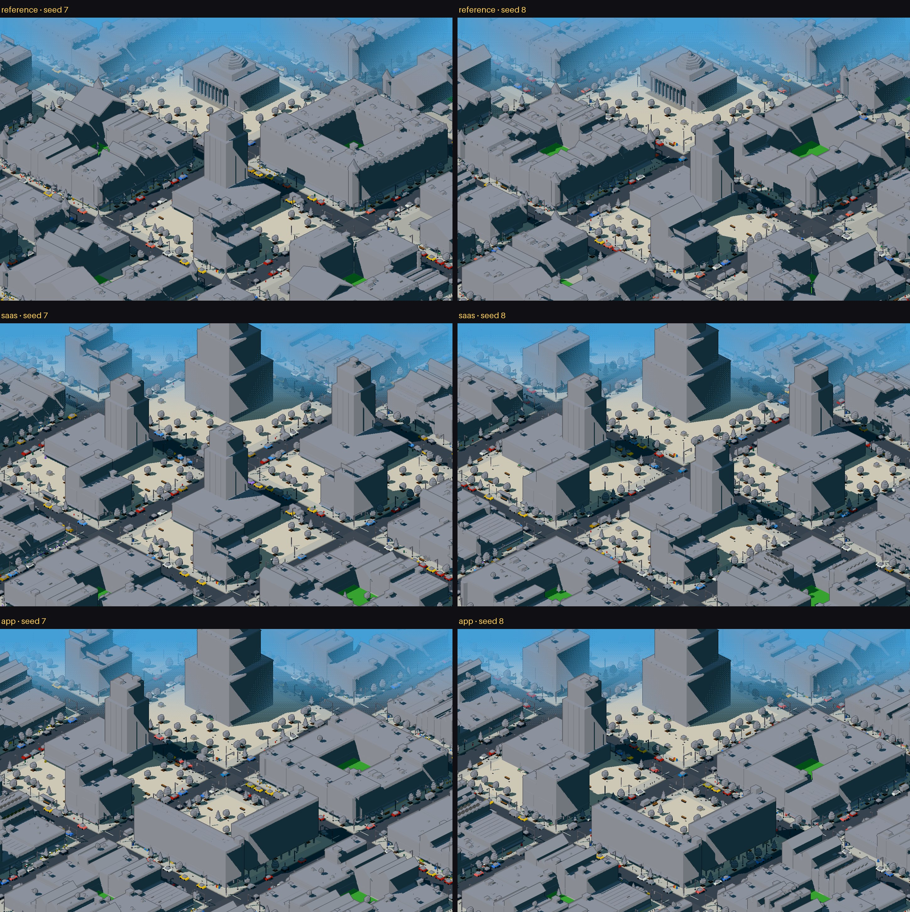

# Pixel city: validação com páginas reais

> Pergunta: a gramática arquitetônica do massing pass generaliza para páginas reais, ou os bons
> resultados dependiam dos quatro perfis escritos à mão?
>
> **Resposta curta: generaliza pela metade.** Ela lê páginas reais e gera cidades diferentes,
> determinísticas e rastreáveis, e as diferenças entre páginas ficam muito acima do ruído da seed.
> Mas só cerca de 6 dos 16 quarteirões falam da página. Os outros 85–95% dos prédios são
> enchimento: um ciclo dos briefs menores que ignora o peso de cada um e que reembaralha tudo
> quando uma região aparece ou some. Além disso, o estilo (decidido pela fonte) é a entrada que
> mais pesa no vocabulário: **8 das 12 cidades têm o mesmo landmark**, uma torre escalonada no
> mesmo ponto, e ele é a primeira coisa que se vê. Nada foi corrigido além de um bug de render (§0.3). As recomendações
> estão em §10 e **não foram implementadas**.

```bash
npm run dev
# http://localhost:3000/pixel/kit?page=<id>&time=day[&flat=1][&perturb=text-10|text+10|links-10|drop-secondary][&seed=8]
npx tsx scripts/real-pages/fetch.ts        # congela as páginas (já feito: docs/real-pages/snapshots)
npx tsx scripts/real-pages/analyze.ts      # trace, métricas, perturbações → docs/real-pages/
```



*As 12 páginas com a mesma câmera, o mesmo enquadramento, o mesmo viewport (1440×900 @2x), a
mesma seed (7) e o horário forçado em dia.*

---

## 0. O que foi preciso montar (e o que não mudou)

### 0.1 A ponte página → brief

O massing pass só tinha perfis sintéticos. Para rodar páginas reais faltava uma peça que
transformasse os fatos já extraídos (regiões semânticas, métricas do DOM, fingerprint) em
`Brief`s. Ela está em [`kit/page-brief.ts`](../src/lib/pixelcity/kit/page-brief.ts). Faz parte do
que está sendo testado, então as regras são poucas e gerais:

| Regra | O que decide | Como |
|---|---|---|
| B1 papel | landmark / major / minor / support | landmark = a região *hero* (senão a marca). Majors = os distritos com ≥ 4% do peso da página, no máximo os 5 maiores, em ordem de leitura. Um distrito com > 50% da página é tratado como contêiner, e os filhos dele entram no lugar. O rodapé vira *support*. Todo o resto fora do landmark e dos majors vira minor |
| B2 conteúdo | text / links / media / action / structured | pelo tipo da região quando a análise semântica já o nomeou (feed → links, gallery → media, pricing → structured, form → action…). Nos tipos genéricos (section, features, hero, brand…), pelas métricas: ≥ 30% dos elementos em tabelas → structured; ≥ 3 imagens e ≥ 2 por 1000 caracteres → media; ≥ 2,5 links por 100 caracteres → links; ≥ 3 controles → action; senão text |
| B3 peso | `weight` | fração do peso estrutural da página |
| B4 repetição | `repeat` | itens repetidos que a análise semântica encontrou |
| B5 rótulo | `label` | título da região (o nome do site, no landmark) |

A identidade do site é o próprio fingerprint, sem perfil.

**Não há regra por site.** Não existe `hostname` em lugar nenhum, nem perfil por página, nem
constante ajustada olhando um resultado. As constantes (4%, 5, 50%, 2,5 links/100…) foram
fixadas antes da primeira execução e não mudaram depois.

### 0.2 Instrumentação

[`kit/district.ts`](../src/lib/pixelcity/kit/district.ts) aceita um perfil vindo de uma página e
um `trace` opcional. O trace registra, para cada quarteirão, o brief, o tipo de composição e o
`Program` final de cada prédio, com o intervalo de partes que ele gerou. **A saída não muda:** os
quatro perfis do massing pass geram partes byte a byte idênticas antes e depois (hash SHA-1 das
partes, das placas e da fumaça, nos modos normal e flat). `kit-v1`, o massing pass, os screenshots
e os docs anteriores não foram tocados.

### 0.3 Correções de bugs objetivos

1. **Índice negativo nas floreiras da torre escalonada** (`buildings.ts`): o índice da cor era
   `(t + Math.round(x)) % 2` e, com `x` negativo, dava −1, ou seja, cor `undefined`. Isso derrubava
   o render (`Cannot read properties of undefined (reading '0')`) em 8 das 14 páginas. Os perfis
   sintéticos nunca caíam nesse caso. Correção: módulo positivo. A saída dos quatro perfis
   continua idêntica. Conferi 420 cidades (14 páginas × 5 variantes × 2 seeds × 3 horários), sem
   nenhuma parte inválida.
2. **Página sem nenhuma região menor** (o caso do HTML antigo): o kit faz ciclo sobre a lista de
   minors e quebraria com ela vazia. O adaptador cria então um brief *fallback* a partir da página
   inteira e marca isso como **suspeito** no trace. É a única decisão sem fato de página por trás.

### 0.4 Medidas

Além das capturas, o `analyze.ts` mede três distâncias entre duas cidades, em que 0 quer dizer
"iguais":

- **bloco**: para cada um dos 16 quarteirões, compara cobertura construída e altura média, máxima
  e desvio, só dos prédios. É a medida de morfologia.
- **decisão**: diferença das distribuições de tipo de quarteirão, família, telhado e estilo. É a
  medida de vocabulário.
- **massa fina**: heightmap de 0,5 tile. **Descartada:** só a seed já move essa medida em
  0,16–0,45, então ela mede jitter, não morfologia.

Todas as comparações usam a mesma câmera, viewport, seed e horário. A seed só muda nos testes que
servem justamente para medir o efeito dela.

---

## 1. Dataset

Congelado em 2026-10-03 com fetch estático (a única estratégia de aquisição implementada). Os
snapshots estão em [`docs/real-pages/snapshots/`](real-pages/snapshots), e todas as execuções e
capturas leem esses arquivos, não a rede.

| id | categoria | URL | nós | regiões | distritos |
|---|---|---|---|---|---|
| reference | artigo / referência longa | https://en.wikipedia.org/wiki/Suspension_bridge | 877 | 25 | 12 |
| docs | documentação técnica | https://docs.python.org/3/library/itertools.html | 323 | 11 | 1 |
| app | dashboard / app | https://github.com/sveltejs/svelte | 417 | 29 | 2 |
| saas | landing de produto / SaaS | https://linear.app/ | 781 | 12 | 6 |
| shop | e-commerce | https://www.ikea.com/us/en/cat/tables-chairs-fu002/ | 603 | 7 | 1 |
| news | jornal / editorial | https://www.theguardian.com/international | 1429 | 32 | 23 |
| portfolio | portfolio | https://brittanychiang.com/ | 167 | 27 | 4 |
| forum | fórum / comunidade | https://lobste.rs/ | 460 | 6 | 1 |
| institution | institucional | https://www.gov.uk/ | 202 | 17 | 3 |
| oldweb | HTML antigo / simples | https://www.paulgraham.com/articles.html | 135 | 1 | **0** |
| media | muito orientada a mídia | https://www.nasa.gov/images/ | 228 | 23 | 3 |
| directory | muito orientada a links | https://www.craigslist.org/about/sites | 1057 | 8 | 5 |
| reference-2 | *irmã de reference* (teste B) | https://en.wikipedia.org/wiki/Lighthouse | 800 | 18 | 8 |
| saas-2 | *irmã de saas* (teste B) | https://vercel.com/ | 415 | 12 | 4 |

**Substituições** (log completo em [`fetch-log-*.txt`](real-pages)):

- **e-commerce:** allbirds.com tinha HTML acima de 4 MB e foi recusado; patagonia.com devolveu 19
  nós (casca de SPA). Ficou a IKEA (o redirect de `chairs-fu002` para `tables-chairs-fu002` é do
  próprio site).
- **mídia:** unsplash.com redireciona para login. Ficou a NASA.
- **HTML antigo:** berkshirehathaway.com deu 1 elemento; paulgraham.com/articles.html deu 0
  distritos; danluu.com deu 0 distritos; spacejam.com/1996 deu 34 nós. **Todas as páginas antigas
  testadas falham do mesmo jeito**, então substituir não resolveria. Mantive paulgraham.com como
  representante da categoria e como caso de falha (F1).

As capturas rejeitadas ficam em `snapshots/*.rejected.json`.

## 2. Extração

Os números são o fingerprint (0..1). O estilo e o horário saem de `deriveGrammar`. Os traces
completos estão em [`docs/real-pages/trace/<id>.md`](real-pages/trace).

| id | estilo (2º, fração) | por quê | texto | imagens | links | horário natural |
|---|---|---|---|---|---|---|
| reference | classic (modern 0,15) | serif 49% | 0,96 | 0,42 | 0,78 | dia |
| docs | modern (tech 0,22) | sans 92%, mono 8% | 0,60 | 0,03 | 0,07 | noite (fundo escuro) |
| app | soft (modern 0,31) | raio 0,60, ornamento 1,0 | 0,20 | 0,96 | 0,37 | dia |
| saas | modern (soft 0,27) | sans 100%, ornamento 0,85 | 0,35 | 1,00 | 0,10 | noite |
| shop | modern (soft 0,26) | sans 100%, ornamento 0,85 | 0,32 | 1,00 | 0,26 | dourado |
| news | classic (soft 0,33) | serif 41% | 0,44 | 1,00 | 0,25 | dia |
| portfolio | soft (modern 0,33) | raio 0,50, respiro 0,40 | 0,80 | 0,64 | 0,29 | noite |
| forum | modern (soft 0,19) | sans 88% | 0,38 | 1,00 | 0,92 | dourado |
| institution | modern (soft 0,19) | sans 99% | 0,75 | 0,34 | 0,62 | dia |
| oldweb | retro (modern 0,15) | legado 1,0 | 0,10 | 1,00 | 0,32 | dia |
| media | modern (soft 0,31) | sans 73%, mono 24% | 0,24 | 1,00 | 0,32 | dia |
| directory | classic (modern 0,17) | serif 42% | 0,45 | 0,00 | 1,00 | dia |
| reference-2 | classic (modern 0,16) | serif 49% | 0,91 | 0,41 | 0,81 | dia |
| saas-2 | tech (soft 0,26) | mono 52% | 0,34 | 1,00 | 0,58 | noite |

Seis das doze páginas principais caem em **modern**. Com fetch estático, quase todo site
contemporâneo é "sans + sombras", e é isso que decide o estilo.

## 3. Briefs

★ = landmark. Os majors aparecem na ordem de leitura; o primeiro ocupa o quarteirão central e os
seguintes vão para fora.

| id | majors (conteúdo: rótulo, % da página) | minors | quarteirões compostos |
|---|---|---|---|
| reference | ★links: Wikipedia (hero 7,5%) · links: Contents 6,4% · text: History 10,2% · media: Longest spans 8,2% · links: References 11,7% · structured: External links 11,6% | 17 | civic, market, court, towers, market, court |
| docs | ★text: Python (marca, 0%) · links: Feed 7,1% · text: Itertool Functions 50,3% · text: Recipes 34,8% | 4 | civic, market, slabs, slabs |
| app | ★text: GitHub (marca) · media: Navigation Menu 28,5% · links: (section) · structured: Latest commit · media: Repository files · links: About | 2 | civic, towers, market, slabs, towers, market |
| saas | ★media: Linear (hero 14,4%) · media ×4 (19,2 / 11,8 / 9,3 / 26,2%) | 5 | civic, towers ×4 |
| shop | ★media: IKEA (hero 7,3%) · structured: grade de produtos 74,7% | 3 | civic, slabs |
| news | ★links: hero 0,3% · media: News · media: More features · media: Sport · text: Most popular | 22 | civic, towers ×3, court |
| portfolio | ★links: Brittany Chiang · text: About · text: Experience 42% · media: Projects · media: Writing | 1 | civic, court ×2, towers ×2 |
| forum | ★links: Lobsters · media: lista de histórias 96,4% | 1 | civic, towers |
| institution | ★text: GOV.UK · links: Popular · media: Services 54% · text: Government activity | 4 | civic, market, towers, slabs |
| oldweb | ★text: Essays (marca) | 1 (fallback) | civic |
| media | ★text: NASA · links: Suggested · media ×3 · action: “Was this page helpful?” 5,1% | 7 | civic, market, towers ×3, plaza |
| directory | ★text: craigslist · links: Alberta · Austria · Bangladesh · Argentina | 3 | civic, market ×4 |
| reference-2 | ★links: Wikipedia · text: History · Technology · Building · links: References · structured: External | 9 | civic, court ×3, market, court |
| saas-2 | ★media: Vercel · links: Introduction · media: Build agents · text: Recently shipped | 4 | civic, market, towers, slabs |

## 4. Trace: as perguntas da cadeia causal

Cada decisão de quarteirão aponta para uma região e uma regra (`trace/<id>.md`). Seguem as
perguntas do pedido, respondidas pelo trace:

| Pergunta | Resposta do trace | Rastreável? |
|---|---|---|
| **Por que existe uma torre aqui?** (docs, a torre escalonada de 21 andares) | landmark ← região *brand* “Python” (a página não tem `<h1>`, então a marca vira monumento) → B1 landmark → bloco civic → estilo modern → família `stepped` → altura `16 + 8 × verticalidade` | **Suspeita.** O maior prédio da cidade vem de um logo com 0 caracteres. A altura vem de constantes do estilo, não de algum fato do landmark |
| (saas, as 4 torres de pódio) | 4 distritos que a análise semântica classificou como logos/showcase → B2 media → bloco `towers` → `podiumTower` com `9 + 8 × verticalidade` andares | Sim, mas as 4 seções diferentes viram 4 quarteirões quase iguais (§7, C) |
| **Por que esse distrito tem prédios baixos?** (forum, todos os lotes com 1–2 andares) | o único minor é o rodapé (0,9% da página) → B1 support → `walkup`, 1 andar → o kit faz ciclo sobre esse único brief em **152 lotes** | Rastreável e **errado**: 0,9% da página vira 98% dos prédios |
| **Por que apareceu uma praça?** (media) | “Was this page helpful?” (4 controles, 5,1%) → B2 action → bloco `plaza` com quiosques | Rastreável. Discutível: um widget de feedback vira uma praça inteira |
| (praças em geral) | os blocos `civic`, `towers` e `slabs` são compostos sobre praça | Por regra, não por fato. É por isso que toda cidade tem praças |
| **Por que esses edifícios são repetidos?** (directory, 96 casas geminadas de empena) | 4 distritos “features” (países), cada um com 4 itens repetidos de links → B2 links → 4 blocos `market` → `rows` em estilo classic → empenas | Sim, e a repetição corresponde a uma repetição real da página |
| **Qual fato da página levou a esse landmark?** (reference, a cúpula) | região hero (contém o `<h1>` “Suspension bridge”, começa nos primeiros 9% da página) → landmark → bloco civic; serif 49% → classic → `civic` com cúpula | Sim. O *tipo* do landmark vem só do estilo; o conteúdo do hero não tem nenhum efeito |

**Decisões suspeitas** (sem fato da página ou contra o peso do fato):

1. A altura e a família do landmark independem do landmark: um logo vira uma torre de 21 andares.
2. Os lotes cíclicos: a quantidade de prédios que cada minor recebe não tem relação com o peso dele.
3. A praça como fundo padrão das composições.
4. O fallback do HTML antigo.

## 5. Comparação


Material secundário: os horários naturais, que são o que cada página escolheria
([`sheet-natural.jpg`](screenshots/real-pages/sheet-natural.jpg)). Ficam fora da comparação
principal porque à noite as janelas acesas mascaram o massing.

## 6. Silhuetas



*Modo flat: uma cor, sem padrões, placas, pessoas nem luzes. Mesma câmera.*

O que a folha de silhuetas mostra:

- **O landmark é o mesmo em 8 das 12 cidades**: docs, app, saas, shop, portfolio, forum,
  institution e media. É a torre escalonada no quarteirão central, o elemento mais alto e mais
  visível da City View. As famílias de landmark são escolhidas só pelo estilo, e modern e soft
  levam à mesma família. Só reference, news e directory (cúpula, classic) e oldweb (campanário,
  retro) fogem dela.
- **A diferença entre cidades está no anel de quarteirões compostos ao redor do landmark**:
  pátios × lâminas × torres de pódio × mercados de empena. É ali que a página aparece.
- **docs × institution e saas × media são quase a mesma silhueta.**
- **directory, oldweb, reference e news se reconhecem sem cor.**

> Limite da comparação: a câmera da City View é fixa (foi exigência desta rodada) e corta o topo
> dos landmarks mais altos (torres escalonadas de 20–22 andares, em docs, app, saas e shop). As
> métricas usam os prédios inteiros.

### Ruído da seed contra diferença de página

| medida (mín / média / máx) | só a seed muda | páginas irmãs | páginas diferentes |
|---|---|---|---|
| **bloco** (morfologia) | 0,02 / 0,03 / 0,06 | 0,07 / 0,14 / 0,21 | 0,06 / **0,19** / 0,34 |
| **decisão** (vocabulário) | 0,00 / 0,02 / 0,04 | 0,13 / 0,26 / 0,38 | 0,13 / **0,40** / 0,66 |
| massa fina (descartada) | 0,16 / 0,23 / 0,45 | 0,35 / 0,39 / 0,42 | 0,19 / 0,43 / 0,63 |

Em média, a diferença entre duas páginas é **6×** o ruído da seed em morfologia e **20×** em
vocabulário. O par mais próximo de páginas diferentes (docs × institution, bloco 0,06) fica no
nível do ruído (F6).

| | estilo igual (19 pares) | estilo diferente (47 pares) |
|---|---|---|
| decisão média | 0,22 | **0,47** |
| bloco médio | 0,16 | 0,20 |

O vocabulário (telhados, famílias, landmark) é **metade estilo**. A morfologia depende pouco do
estilo e vem dos briefs. As matrizes completas estão em [`real-pages/tables.md`](real-pages/tables.md).



*Teste B (semelhança de família). Em cima, Wikipedia × Wikipedia (bloco 0,07, decisão 0,13).
Linear × Vercel saem diferentes: Vercel é `tech` por causa da fonte mono. Embaixo, os pares de
páginas diferentes mais parecidos: docs × institution e saas × media.*

## 7. Casos de falha

Cada falha está classificada pela camada onde o problema mora: **extração** (aquisição ou análise
semântica), **adaptador** (página → brief), **gramática** (brief → decisões) ou **vocabulário** (o
kit não tem como dizer).

| # | Caso | Camada | O que acontece |
|---|---|---|---|
| F1 | HTML antigo (paulgraham, danluu, berkshire, spacejam) | extração | layout em tabela e listas soltas: a análise semântica não acha nenhum distrito. A cidade fica com um campanário mais 164 lotes de um único brief fallback |
| F2 | lojas e serviços renderizados por JS (patagonia, allbirds, unsplash) | extração | só existe fetch estático: casca vazia, HTML grande demais ou redirect para login |
| F3 | **inundação pelo rodapé** (portfolio, forum) | gramática | os lotes fazem ciclo sobre os minors, ignorando o peso. Quando o único minor é o rodapé (0,9–2,4% da página), ele vira 120–152 prédios: **100% do enchimento** |
| F4 | **peso não vira área** (shop, docs) | gramática | a grade de produtos da IKEA (74,7%) recebe um quarteirão, como uma seção de 4%. O peso dos majors tem efeito **0,00** em todas as páginas (§8) |
| F5 | formulários super-representados (shop: busca → 51 quiosques; media: feedback → praça central) | gramática | `action` vira quiosque ou praça, sem nenhum teto por peso |
| F6 | **páginas perigosamente parecidas** (docs × institution, bloco 0,06 / decisão 0,15; saas × media, 0,11 / 0,14) | gramática + vocabulário | documentação Python × portal do governo britânico; landing Linear × arquivo de imagens da NASA. Os dois pares são modern, com o mesmo landmark escalonado, composições do mesmo tipo e enchimento parecido |
| F7 | composições idênticas para regiões diferentes (saas: 4 × towers; o `market` de institution e o de media saem com os **mesmos prédios**) | gramática | as composições dependem de posição, estilo e repetição, e não de quanto ou do que a região contém |
| F8 | história da comunidade lida como mídia (forum: avatares contam como imagens → showcase → torre de pódio) | extração | erro de classificação da análise semântica |
| F9 | cabeçalho de app lido como distrito (app: “Navigation Menu”, 28,5% → torre de pódio) | extração | o header do GitHub passa no corte de distrito |
| F10 | introdução da Wikipedia vira `structured` | adaptador | a infobox aninhada põe 76% dos elementos da introdução em tabelas (regra B2) |
| F11 | landmark de logo (docs, app, oldweb, media, directory, institution) | gramática | sem `<h1>`, a marca vira um monumento com altura de constante |
| F12 | referências, índice e feed viram o mesmo mercado de lojas | vocabulário | a gramática vê o tipo (`references`, `toc`, `feed`, `nav`), mas o kit só tem uma tipologia de links |
| F13 | **o mesmo landmark em 8 de 12 cidades** | gramática + vocabulário | `landmarkFamily` depende só do estilo, e modern e soft dão a mesma torre escalonada, com a altura de uma constante. A peça mais visível da cidade é a que menos fala da página |

## 8. Estabilidade

### Perturbações pequenas

Quatro perturbações em todas as 14 páginas (56 execuções), aplicadas no snapshot, antes de
qualquer análise:

- **text±10**: o texto próprio de cada elemento ±10%.
- **links-10**: remove um em cada dez links.
- **drop-secondary**: remove o menor `section`/`article`/`aside` que tem 1–6% do texto.

| resultado | execuções |
|---|---|
| bloco ≤ 0,01 (praticamente idêntica) | 46 / 56 |
| bloco ≤ 0,04 | 53 / 56 |
| decisão = 0 | 45 / 56 |

O sistema não é caótico na maior parte do tempo. Os casos instáveis:

| página / perturbação | bloco | decisão | causa |
|---|---|---|---|
| app / text-10 | **0,11** | 0,18 | a análise semântica reorganiza as regiões (29 → 24; some o `showcase` do cabeçalho) e o `nav` deixa de ser minor → a lista de minors cai de 2 para 1 → **todos** os lotes mudam |
| portfolio / links-10 | 0,07 | 0,19 | a região do rodapé deixa de ser detectada → entra o fallback (a página inteira como texto) → todos os 120 lotes mudam de família |
| portfolio / drop-secondary | 0,04 | 0,03 | a seção removida (“Writing”, 4,7%) era um major → um bloco `towers` vira lotes |
| forum / text+10 e links-10 | 0,03 | 0,02 | o tipo semântico passa de `showcase` para `faq` → media → text → `towers` vira `slabs` |
| institution / text±10 | 0,03 | 0,03 | limite B2 de 2,5 links por 100 caracteres: “Popular” e “Government” trocam entre links e text → `market` ↔ `slabs` |
| saas / links-10, news / links-10 | 0,02 | 0,00–0,02 | uma região some e a lista de minors encurta em 1 → **o ciclo reembaralha todos os lotes** (alturas parecidas, prédios diferentes: massa fina 0,11–0,18) |



*Linhas: reference (estável), app, forum, institution e portfolio (instáveis). Colunas: base,
text−10, text+10, links−10, drop-secondary. Tudo em modo flat.*

### Limites instáveis encontrados

1. **Detecção de regiões na análise semântica** (extração): ±10% de texto ou de links cria,
   apaga ou troca o tipo de uma região (showcase ↔ faq, rodapé some).
2. **O ciclo dos minors** (gramática) amplifica qualquer mudança de ±1 na lista: não é um limite,
   é um amplificador. É a causa da maior parte dos saltos.
3. **B2, 2,5 links por 100 caracteres** (adaptador): troca market ↔ slabs.
4. **O arg-max de estilo** (gramática): +0,25 de serif leva docs de modern para classic, com bloco
   0,10, o mesmo que separa duas páginas diferentes. +0,25 de mono leva várias páginas para tech.
5. **Corte de major em 4% e no 5º maior** (adaptador): a introdução da Wikipedia (5,5%) é a 6ª
   maior e vira minor.

### Seed

| | seed 7 → 8, 9, 10 (média) |
|---|---|
| bloco | 0,03 |
| decisão | 0,02 |



*Mesma página, seed 7 × 8 (flat). A seed mexe nos lotes, em ±1 andar e no estilo secundário de
alguns prédios. Não troca nenhuma composição de quarteirão nem o landmark.*

### Sensibilidade por entrada

Cada campo do fingerprint foi movido 0,25 em direção ao meio, um de cada vez, nas 12 páginas.
Valores = distância de bloco.

| entrada | efeito máximo | via |
|---|---|---|
| breadth, regularity, sections, linkDensity, headings, interactivity, forms, colorfulness | **0,00** | alimentam campos da gramática que o kit não lê (`units`, `coverage`, `avenue`, `traffic`, `billboards`, `neon`, `industry`, `repetition`, `towers`) |
| imagery, darkness, hues | 0,00 no massing | só paleta e horário (o horário estava forçado em dia) |
| size, depth, textDensity | 0,02 | verticalidade → andares das torres e lâminas |
| legacy | ≤ 0,01 | estilo secundário |
| roundness, airiness, ornament | até 0,05–0,08 | trocam o estilo (soft ↔ modern ↔ classic) |
| **type.serif, type.mono** | **até 0,10** | trocam o estilo principal → landmark, telhados e composições |

E nos briefs:

| mudança | efeito máximo |
|---|---|
| peso dos majors ×1,25 | **0,00** |
| peso dos minors ×1,25 | 0,04 |
| repetição +3 em tudo | 0,03 |
| ordem dos minors invertida | 0,04 |
| primeiro minor removido | 0,10 |
| conteúdo dos majors → text | 0,13 |

## 9. Findings

**1. A gramática atual generaliza para páginas reais?**
Em parte. Ela roda nas 14 páginas sem nenhuma regra por site. Gera cidades determinísticas (hash
idêntico em execuções repetidas) com diferenças 6× (morfologia) a 20× (vocabulário) acima do ruído
da seed. Páginas irmãs ficam parecidas. Mas ela só fala da página em ~6 dos 16 quarteirões; o resto
é enchimento que distorce o peso das regiões (F3, F4). E três categorias quebram antes de chegar à
gramática (F1, F2, F8).

**2. Quais regras funcionaram melhor?**
- *Conteúdo → tipologia* nos majors: grupos de links viram mercados de casas geminadas, mídia vira
  torres, texto vira pátios (classic) ou lâminas (modern). É legível e é rastreável.
- *Identidade → estilo da cidade inteira*: cada cidade continua sendo um lugar só, e as irmãs se
  reconhecem (Wikipedia × Wikipedia: bloco 0,07).
- *Hero → landmark* quando há `<h1>`.
- *Repetição → série*, quando a repetição é real (craigslist).

**3. Quais regras comprimem informação demais?**
- **Peso → nada**: uma região de 75% e outra de 4% recebem o mesmo quarteirão.
- **Cinco conteúdos → quatro composições na prática**: `feed`, `toc`, `references`, `nav` e
  `directory` viram todos o mesmo `market`; `gallery`, `showcase` e `logos` viram o mesmo `towers`.
- **Landmark → cinco famílias, só pelo estilo**: 8 das 12 páginas (todas as modern e soft) têm a
  mesma torre escalonada (F13).
- **Família do lote → posição**: `walkup` sai de 12 combinações diferentes de fatos e `corner` de
  10. O que decide é a esquina, não o brief.

**4. Quais inputs parecem irrelevantes?**
Oito campos do fingerprint, com efeito 0,00: breadth, regularity, sections, linkDensity, headings,
interactivity, forms e colorfulness. Também o peso dos majors (0,00) e, quase, o dos minors (≤ 0,04)
e a repetição (≤ 0,03). Imagery, darkness e hues só aparecem na cor e no horário.

**5. Quais inputs dominam demais?**
- **A fonte**, via o arg-max de estilo: metade da diferença de vocabulário entre cidades vem dela
  (decisão 0,22 com estilo igual contra 0,47 com estilo diferente), e +0,25 de serif vale o mesmo
  que trocar de página.
- **A composição da lista de minors**: quem está nela decide 85–95% dos prédios. Um rodapé de 0,9%
  pode decidir 98% da cidade.

**6. Onde o problema é da gramática?**
- Alocação de área (F3, F4, F5).
- O ciclo de minors como amplificador de instabilidade (§8).
- Landmark sem relação com o fato que o gerou (F11).
- Composições que dependem da posição, e não da região (F7).
- Estilo winner-takes-all.

No adaptador, que também é código novo e sob teste: a regra de tabela (F10) e o limite de 2,5
links/100.

**7. Onde o problema é só do vocabulário?**
- A gramática vê o *tipo* da região (no brief, `kind`), mas o kit só tem uma tipologia por
  conteúdo: arquivo, índice, avenida e feed são todos "mercado"; galeria, vitrine e logos são todos
  "torres de pódio"; formulário e CTA são todos "quiosque/praça" (F12).
- Não existe composição maior que um quarteirão para regiões dominantes (shop 75%, forum 96%).
- O distrito tem tamanho fixo (4×4), então o `size` da página não tem para onde ir.
- Landmarks altos saem do enquadramento fixo.

**8. Quais páginas ficaram perigosamente parecidas?**
- docs × institution (bloco 0,06, decisão 0,15)
- saas × media (0,11 / 0,14)
- saas × institution (decisão 0,13)
- shop × institution (decisão 0,14)

Todas modern. Ver a linha de baixo de `sheet-family.jpg`. Na escala da cidade inteira, as 8
páginas modern e soft compartilham o landmark (F13).

**9. Quais páginas produziram cidades surpreendentemente distintas?**
- **directory** (craigslist): quatro mercados de empenas em classic, porque a fonte do craigslist
  é serif.
- **reference** e **news**: as duas são classic, mas a Wikipedia vira pátios e cúpula, e o Guardian
  vira três quarteirões de torres.
- **forum**: quase vazia, mas pelo motivo errado (F3).
- **reference × forum** é o par mais distante (bloco 0,34).

**10. Existem thresholds instáveis?**
Sim, cinco (§8). O mais grave não é um limite: é o ciclo dos minors, que transforma qualquer
mudança de ±1 região numa cidade periférica nova. 46 de 56 perturbações deram cidades praticamente
idênticas; as 10 restantes vêm todas dessas cinco causas.

**11. O sistema parece determinístico e explicável?**
- **Determinístico, sim**: mesmo snapshot gera a mesma cidade, verificado por hash.
- **Explicável, nos quarteirões compostos, sim**: cada um aponta para região, regra e evidência.
- **Nos lotes, não**: dá para dizer de qual brief cada prédio veio, mas não *por que* aquele brief
  recebeu aquele lote. A resposta honesta é "porque era a vez dele no ciclo".

**12. Qual é o menor conjunto de mudanças antes do surface-detail pass?** Ver §10.

## 10. Mudanças mínimas propostas (não implementadas)

Em ordem de impacto. Nenhuma adiciona tipo de prédio.

1. **Alocar área por peso, com atribuição estável.** Trocar o ciclo de minors por uma distribuição
   de lotes proporcional ao peso (maiores restos). Cada região ocupa lotes contíguos, identificados
   pela região e não pelo índice na lista. O rodapé fica na borda, com teto. Isso resolve F3, F4,
   F5, o "peso dos minors é irrelevante" e o amplificador de instabilidade.
2. **Landmark a partir dos fatos.** Altura e porte vindos do peso e do tipo da região (hero com
   `<h1>` > marca); uma marca sem `<h1>` vira um marco pequeno, não a torre mais alta (F11). E a
   família escolhida pelo conteúdo do hero, com o estilo só como acabamento, para que 8 de 12
   cidades não abram com a mesma torre (F13). As famílias que já existem bastam: stepped,
   narrowTower, civic e clocktower.
3. **Margem nos limites.** Histerese em B2 (links/100, imagens/1000) e no arg-max de estilo:
   trocar de categoria exige passar o limite por uma margem, ou a decisão vira uma mistura
   ponderada. Isso tira os saltos de institution e docs.
4. **Usar o tipo da região onde ele já existe.** Dentro das famílias que já existem, separar no
   máximo duas ou três variantes de composição por conteúdo, por exemplo `references`/`toc` =
   arquivo de lâminas baixas contra `feed` = mercado (F12, F7). É o único item que toca o
   vocabulário, e é opcional.

**Fora da gramática** (a extração precisa resolver antes de qualquer integração; à parte desta
rodada):

- segmentar HTML antigo (F1);
- não contar avatares como imagens (F8);
- não tratar o cabeçalho como distrito (F9);
- dar estabilidade aos limites da análise semântica;
- ter captura renderizada para SPAs (F2).

**Dead inputs:** não proponho mapear os oito campos mortos agora. Eles só devem entrar se uma das
mudanças acima precisar deles.

---

## Arquivos

| Arquivo | Papel |
|---|---|
| `src/lib/pixelcity/kit/page-brief.ts` | **novo**: página → brief (regras B1–B5) |
| `src/lib/pixelcity/kit/real-page.ts` | **novo**: snapshot → fatos, perturbações |
| `src/lib/pixelcity/kit/district.ts` | perfil de página, `trace` (sem efeito na saída) |
| `src/lib/pixelcity/kit/buildings.ts` | correção do índice negativo (§0.3) |
| `src/app/pixel/kit/page.tsx`, `src/components/pixel/KitView.tsx` | `?page=`, `&perturb=`, `&seed=` |
| `scripts/real-pages/{dataset,fetch,inspect,analyze}.ts` | dataset, congelamento, inspeção, análise |
| `docs/real-pages/snapshots/` | as páginas congeladas |
| `docs/real-pages/trace/<id>.md` | a cadeia completa de cada página |
| `docs/real-pages/tables.md`, `report.json` | todas as matrizes e números |
| `docs/screenshots/real-pages/` | capturas e sheets |
