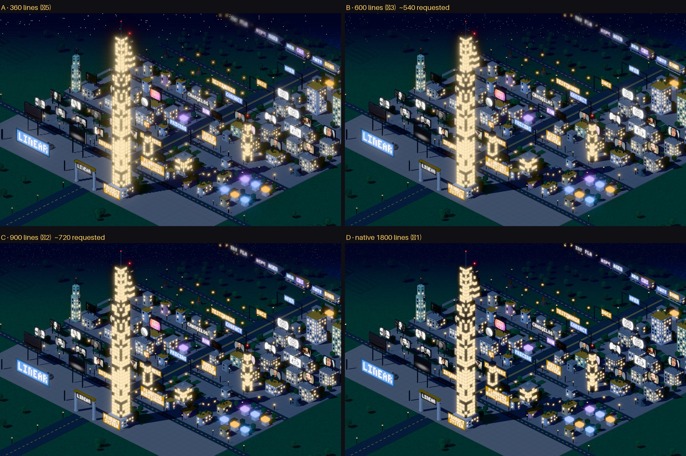
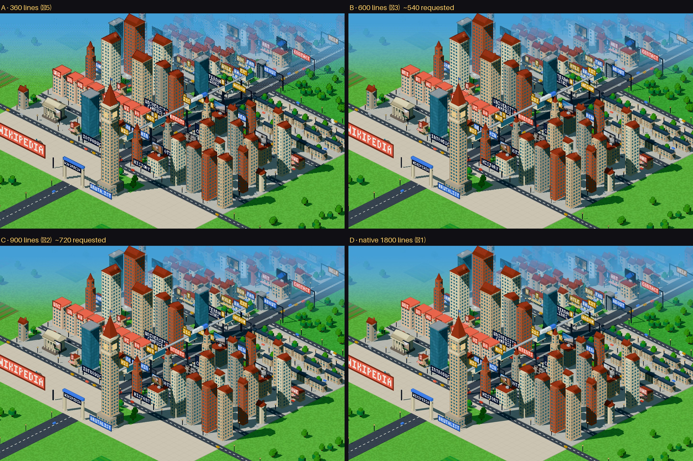

# Pixel city: estudo de resolução

Isolado: só muda o número de linhas internas (`useArtPixelDpr`), via `?res=`. Geometria, câmera,
enquadramento, paleta, luz, shaders, UI e geração são os mesmos. O resto do pipeline também:
nearest, antialias desligado e ampliação por fator inteiro.

```bash
BASE=http://localhost:3000 node scripts/resolution.mjs   # refaz todas as capturas
# ao vivo: /pixel?url=https://linear.app&res=360|450|600|900|native
```

## Quais resoluções existem de verdade

A 1440×900 numa tela 2× são 1800 linhas de dispositivo. Com ampliação inteira, que mantém todos os
pixels do mesmo tamanho, só existem 1800 (×1), 900 (×2), 600 (×3), 450 (×4) e 360 (×5). ~540 e
~720 não existem sem pixels de tamanhos desiguais. Por isso:

| | pedido | capturado | framebuffer |
|---|---|---|---|
| A | atual ~360 | 360 (×5) | 576×360 |
| B | ~540 | **600** (×3), o passo mais próximo | 960×600 |
| C | ~720 | **900** (×2), o passo seguinte | 1440×900 |
| D | nativo | 1800 (×1) | 2880×1800 |

Também há uma captura em 450 (×4), em `*-450.jpg`. Numa tela 1× de 900 px, o “360” de hoje
na prática vira **300** linhas.

## Capturas




Recortes 1:1 em pixels de dispositivo (abra em tamanho real):

- Linear: `linear-crop-billboards.png` (outdoors, letreiro, torre), `linear-crop-district.png`
  (janelas, telas), `linear-crop-sky.png` (estrelas, faixas distantes, névoa)
- Wikipedia: `wikipedia-crop-tower.png` (torre, portal, fachadas), `wikipedia-crop-roofs.png`,
  `wikipedia-crop-haze.png` (pontilhado da névoa)

## Tamanhos na City View (zoom 0,9; 61 px de dispositivo por tile)

| | A 360 | B 600 | C 900 | D nativo |
|---|---|---|---|---|
| pixels de arte por tile | 12 | 20 | 31 | 61 |
| px de dispositivo por pixel de arte | 5 | 3 | 2 | 1 |
| espessura do contorno (px de dispositivo) | 5 | 3 | 2 | 1 |
| célula Bayer 4×4 do céu/névoa (px de dispositivo) | 20 | 12 | 8 | 4 |
| janela (0,25 tile), em pixels de arte | 3 | 5 | 8 | 15 |
| célula do pontilhado da grama (0,2 tile) | 2,4 | 4 | 6 | 12 |
| faixa de rua (0,06–0,09 tile) | 0,7–1,1 | 1,2–1,8 | 1,8–2,8 | 3,7–5,5 |
| pixel da fonte dos letreiros (0,11 tile) | 1,3 | 2,2 | 3,4 | 6,7 |

## O que está acoplado ao framebuffer

**Acoplado à resolução de render.** Encolhe quando ela sobe:

- `PixelPost.ts`: o pontilhado Bayer das faixas do céu e da névoa (`px = floor(uv * resolution)`).
- `PixelPost.ts`: as estrelas (`h12(px)`, um pixel cada).
- `PixelPost.ts`: o contorno, que amostra os vizinhos a `texelSize`, ou seja, tem 1 pixel de framebuffer.
- Bloom (`mipmapBlur`, `levels={4}`): o raio do brilho é medido em pixels do framebuffer.
- Encaixe da câmera na grade (`Rig`, `texel = 1/(zoom·dpr)`). Esse se adapta sozinho e está correto.

**Acoplado ao mundo.** Tamanho fixo em tiles, não importa a resolução:

- Os padrões do `FRAG_SURFACE`: janelas, faixas, grama, piso, telhado, água, listras. Foram
  calibrados para cerca de 1 pixel de arte a 360 linhas. Com mais resolução continuam nítidos (são
  degraus), mas deixam de ser “pixels” e viram retângulos inclinados pela projeção.
- O atlas de letreiros (`SIGN_TEXEL = 0.11`, nearest): continua blocado em qualquer resolução. Em D,
  porém, o pixel do letreiro tem 6,7 px, enquanto o da cena tem 1. São duas escalas de pixel no
  mesmo quadro.
- O atlas de imagens dos outdoors (`atlas.ts`): **linear com mipmaps**, não nearest. Hoje ele só
  parece pixel art porque o framebuffer é pequeno. Em C e D as fotos ficam lisas.

Ou seja: hoje a linguagem pixel vem quase toda do framebuffer pequeno. Aumentar só a resolução
muda essa linguagem de forma desigual. O pontilhado e o contorno somem, as fotos alisam, e os
letreiros continuam grandes.

## Como separar definição geométrica de escala do pixel

Duas grandezas independentes:

- **R** (resolução de render): define quão finos saem silhuetas, arestas e janelas.
- **P** (escala do pixel de arte): o tamanho do “pixel” estilizado em pontilhado, contornos,
  estrelas, faixas, letreiros e imagens.

Com `k = R/P`:

1. **Pós (`PixelPost.ts`).** Uniform `uPx = k`. Bayer, estrelas e névoa passam a usar
   `floor(gl_FragCoord.xy / uPx)`. O contorno ganha um peso próprio: amostra a `uPx` texels, ou
   engrossa com um máximo k×k. A espessura do contorno vira decisão de desenho, não efeito
   colateral.
2. **Bloom.** Ajustar `levels`/`radius` pelo k, para o brilho manter o tamanho na tela.
3. **Padrões de superfície.** Manter no espaço do mundo, para não “nadar” quando a câmera anda.
   Recalibrar os tamanhos para 1 pixel de P no zoom da City View. No Explore eles crescem como
   pixels de textura, igual aos letreiros.
4. **Letreiros.** Escolher `SIGN_TEXEL` para que 1 pixel da fonte seja 1 pixel de P na City View.
5. **Imagens dos outdoors.** Nearest, e reduzir cada imagem no atlas para a resolução de P
   (por exemplo ~64×40 por slot). As fotos ficam pixeladas em qualquer R.
6. **Gradientes contínuos** (céu, névoa, faixas de luz) pontilhados na grade de P em tela; texturas
   no espaço do mundo. É a divisão usual para não aparecer efeito de tela de mosquiteiro ao mover a câmera.

Nada disso foi implementado. Esta rodada só mudou o parâmetro `?res=`.
