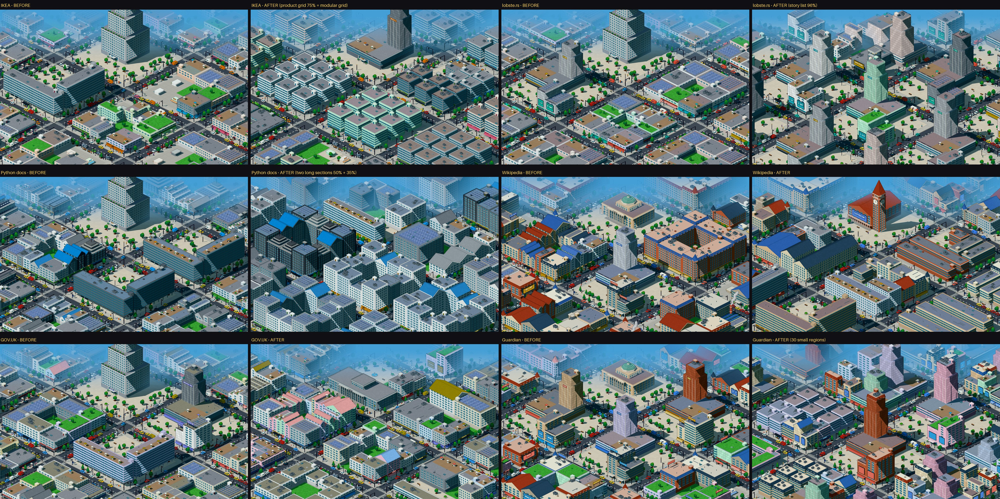
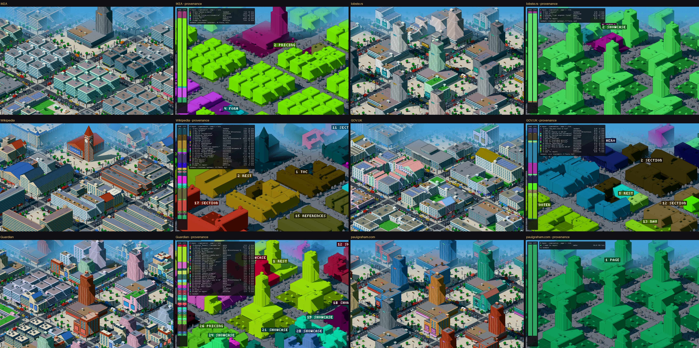
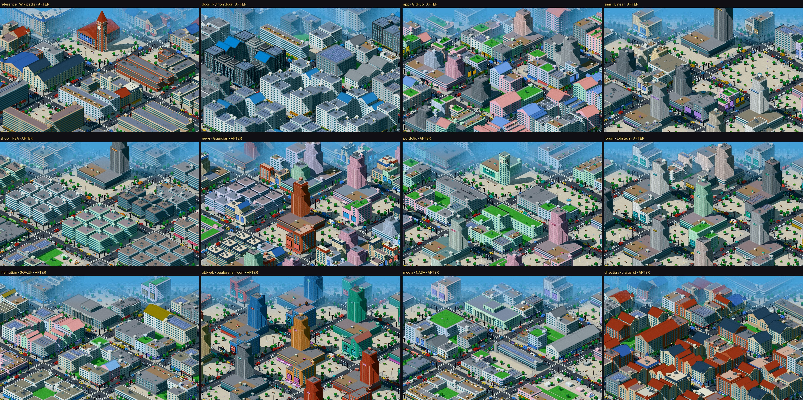
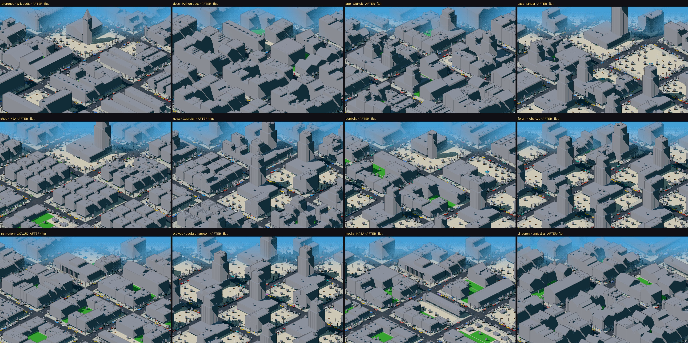
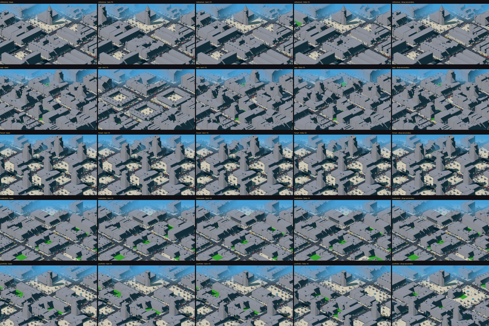

# Pixel city: semantic allocation pass — avaliação

> **Hipótese:** se cada região da página receber um território **contíguo e proporcional ao seu
> peso**, em vez de ciclar sobre a lista de regiões menores, e se o landmark sair do papel do hero
> e não do estilo, então a cidade passa a representar a estrutura da página, sem perder a
> diferença entre páginas nem ficar instável.
>
> **Resultado: confirmada para alocação, contiguidade, landmark e diferenciação; confirmada só em
> parte para estabilidade.**
>
> - O território acompanha o peso: aderência 0,50 → 0,99. A grade de produtos da IKEA vai de
>   7,2% para 74,6% do território; o rodapé do lobste.rs, de 85,5% para 0,8%.
> - Cada região ocupa uma peça só.
> - O landmark deixou de depender do estilo: em 11 de 12 páginas o estilo sozinho trocava a
>   família do landmark; agora isso não acontece em nenhuma.
> - A diferença entre páginas ficou maior em relação ao ruído da seed (morfologia 5,8× → 12,6×).
> - O efeito "uma região muda → tudo reembaralha" caiu de 51% para 15% dos lotes.
> - **Trade-off:** a cidade agora responde, pouco e com frequência, a qualquer mudança de peso. E
>   uma perturbação que muda uma região grande muda a cidade na mesma medida. Em média, as
>   perturbações do corpus mexem *um pouco mais* na cidade do que antes.

```bash
npm run dev
# http://localhost:3000/pixel/kit?page=<id>&time=day[&flat=1][&debug=provenance][&perturb=…][&seed=8]
#   &v=2  o gerador anterior (massing pass + ciclo), congelado em kit-v2 — BEFORE
npx tsx scripts/semantic-allocation/analyze.ts   # BEFORE × AFTER → docs/semantic-allocation/
npx tsx scripts/semantic-allocation/corpus.ts    # hashes do corpus e do baseline
```



*Mesmas páginas, câmera, seed e horário. À esquerda o BEFORE (kit-v2), à direita o AFTER.*

---

## 1. Baseline

Para comparar **exatamente** os mesmos casos:

- **O gerador anterior foi congelado inteiro** em `src/lib/pixelcity/kit-v2/`: kit, adaptador
  página → brief e perturbações. `scripts/real-pages/analyze.ts` passou a importar dali e regenera
  `docs/real-pages/tables.md`, `report.json` e os 14 traces **byte a byte iguais** aos da rodada
  de validação. Os quatro perfis sintéticos no kit-v2 têm os mesmos hashes do massing pass.
- **O corpus foi registrado** em [`semantic-allocation/corpus-before.txt`](semantic-allocation/corpus-before.txt):
  SHA-1 de cada snapshot congelado, de cada cidade BEFORE (seed 7, dia), dos perfis e das tabelas
  de baseline. São as mesmas 14 páginas, 4 perturbações, seeds 7 / 8 / 9 / 10, câmera e viewport.
- Nenhum screenshot ou documento anterior foi alterado. O BEFORE continua acessível com `?v=2`.

O que o baseline mostrava: os quarteirões dos *majors* falavam da página, mas 85–95% dos prédios
vinham de um ciclo sobre os *minors* que ignorava o peso. O peso dos majors tinha efeito zero, e
8 das 12 cidades abriam com a mesma torre escalonada.

## 2. O que mudou

São três peças novas e um ajuste no landmark. Todas as regras são gerais: não há nenhuma condição
por domínio, página ou membro do corpus, nenhuma constante calibrada olhando para um site e
nenhum tipo novo de prédio ou de telhado.

### 2.1 Página → territórios ([`kit/plan.ts`](../src/lib/pixelcity/kit/plan.ts))

| Regra | O que faz |
|---|---|
| **T1 partição** | As regiões semânticas formam uma árvore. Contêineres genéricos (`main`, `section`, `sidebar`) que têm filhos são **abertos**: cada filho vira um território, e o contêiner fica com um território de **resto** para o próprio conteúdo. Tipos estruturados (feed, grid de preços, hero…) nunca são abertos. O que está fora de toda região vira o resto **da página**. Os pesos (peso estrutural do DOM) somam 1 por construção |
| **T2 ordem** | Por camadas e, dentro delas, em ordem de leitura: hero → conteúdo principal (dentro de `<main>` ou de um distrito semântico) → chrome (nav, formulários, marca, laterais) → rodapé → resto da página. A ordem decide **onde** a região fica, nunca **quanto** ela recebe |
| **T3 organização** | Tipos estruturais têm uma organização fixa: hero → landmark · brand → marcador · feed → parcelado · toc / references / directory → arquivo · nav → navegação · footer → apoio · pricing → grade · infobox → estruturado · form / cta → interativo. Regiões genéricas, restos e os tipos que a própria análise semântica decide por uma razão de conteúdo (gallery / showcase / logos: < 140 caracteres por imagem; faq / testimonials são o que sobra quando essa razão falha) passam por **portas suaves**: uma logística em torno dos limites da rodada de validação. Perto do limite, a região vira uma **mistura** (por exemplo 56% parcelado + 44% contínuo), e cada parte com menos de 15% é descartada |
| **identidade** | Seletor + título (+ "~n" para repetições), **sem o tipo**. Uma região que a análise reclassifica continua sendo a mesma região, com a mesma cor de debug |

### 2.2 Territórios → terreno ([`kit/territory.ts`](../src/lib/pixelcity/kit/territory.ts))

O distrito continua com 4×4 quarteirões, agora divididos em **256 lotes** de 3,5×3,5. Um único
**caminho** passa por todos os lotes, sempre de vizinho para vizinho:

- entre quarteirões, faz uma espiral a partir do quarteirão atrás do cruzamento central;
- dentro do quarteirão e de cada quadrante, faz um 2×2 que entra de frente para o lote anterior.

Os territórios ocupam trechos consecutivos desse caminho, na ordem do plano. O tamanho de cada
trecho vem de **arredondamento cumulativo**: a fronteira k fica em `round(256 · Σ pesos antes de k)`.

| Propriedade | Por quê |
|---|---|
| **A1 terreno ∝ peso** | cada território difere de 256·w em menos de um lote |
| **A2 contiguidade** | um trecho de um caminho de vizinhos é uma peça só (verificado: 256 lotes, 0 passos não adjacentes) |
| **A3 localidade** | mudar um peso em δ desloca fronteiras em no máximo 256·δ lotes. Não há reordenação nem ciclo, mas **há deslizamento** (§5) |

Não há limiar em cascata. Os únicos números da alocação são o tamanho do caminho (256) e a
largura das portas suaves (τ = 0,15 em escala log).

### 2.3 Terreno → prédios ([`kit/compose.ts`](../src/lib/pixelcity/kit/compose.ts))

Em cada quarteirão, os lotes de um mesmo trecho formam a maior **peça** possível: quarteirão
inteiro (14×14), meio quarteirão numa borda (14×7), quadrante de esquina (7×7) ou lote. Cada
organização sabe ocupar cada tamanho de peça usando só as famílias que já existem. O que muda entre
organizações é a **relação entre os volumes**:

| Organização | Origem | Como ocupa o terreno |
|---|---|---|
| contínuo | texto, faq, depoimentos | uma massa só ao longo da rua: quadra perimetral, L, esquina |
| parcelado | feed, listas de links | muitas unidades estreitas geminadas com lojas; mais itens → unidades mais estreitas |
| arquivo | índice, referências, diretório | barras baixas paralelas (2–3 andares, janelas em fita) |
| grade | grade de produtos / preços | módulos **idênticos** em malha regular |
| mídia | galerias, vitrines | pódio + torre com tela, sobre praça; a altura cresce com o peso |
| interativo | formulários, CTA | praça aberta com quiosques |
| navegação | nav | arcadas baixas ao longo da rua |
| apoio | rodapé | prédios baixos e sem placa |
| estruturado | tabelas, infobox | lâminas altas com janelas em fita |

As alturas crescem com o peso do território, de forma monotônica e logarítmica, e com a
verticalidade da gramática. O estilo do site só expressa: telhado, fachada, cor, ornamento. A
mistura de estilos agora é **contínua**: a fração do estilo secundário sobe até 50% quando os dois
empatam, e o sorteio é feito numa ordem fixa. Assim, uma troca de primário por secundário no
empate não muda nada.

### 2.4 Landmark

| Regra | |
|---|---|
| **L1 papel → família** | O conteúdo do hero decide o tipo de monumento: declaração (texto) → **salão cívico**; portal de links → **torre do relógio**; vitrine (mídia) → **torre de pódio** (torre estreita, se ganhar um único lote); chamada para ação → **praça com pavilhão** |
| **L2 peso → porte** | A planta é a maior peça do território do hero, e a altura cresce com o peso do hero. O resto do território do hero vira o adro |
| **L3 estilo → expressão** | Telhado (cúpula, agulha, coroa, terraço, plano, mansarda), fachada e cor. O estilo nunca escolhe a família |
| **ausência** | Sem hero com `<h1>` (só a marca), ou com um hero sem terreno, **não há landmark**. A marca vira um quiosque do tamanho do peso dela |

Para isso, três famílias que já existiam deixaram de ter o telhado fixo no código e passaram a
recebê-lo do estilo: a cúpula do cívico, a agulha da torre do relógio e o topo da torre de pódio.
Os valores padrão continuam iguais.

### 2.5 Proveniência (`?debug=provenance`)

É uma visualização separada do renderer normal; só reprocessa as partes geradas.

- Cada território aparece numa **cor estável**, derivada da identidade da região, sem textura nem
  luz, com cada lote tingido (inclusive praças e quintais).
- Cada território com 4 ou mais lotes ganha um **rótulo** flutuante com número e tipo.
- Ruas, carros e mobiliário ficam em cinza; as pessoas somem.
- Uma legenda mostra duas colunas com as mesmas cores: **PAGE** (ordem de leitura, altura ∝ peso)
  e **CITY** (altura ∝ lotes recebidos). Ao lado, uma tabela região → organização → % da página →
  lotes, e a decisão do landmark.



*Seis páginas que expõem comportamentos diferentes. Esquerda: City View normal. Direita:
proveniência; as colunas PAGE e CITY são a representação da página e do terreno.*

---

## 3. A. Fidelidade da alocação

Para comparar os dois geradores, a página é descrita sempre pela mesma partição (a do AFTER). O
terreno do BEFORE é atribuído às mesmas partes: um quarteirão composto inteiro para o major,
cada lote para o brief dele, e um contêiner que o AFTER abre é dividido pelo peso dos filhos.

- **aderência** = Σ min(fração do terreno, fração do peso). Vale 1 quando o terreno é exatamente
  proporcional.
- **ρ** = correlação de Spearman entre peso e terreno (elementos ≥ 0,5%).
- **excesso** = maior razão terreno/peso.

| página | aderência B | **aderência A** | ρ B | ρ A | excesso B | excesso A |
|---|---|---|---|---|---|---|
| reference | 0,68 | **0,99** | 0,22 | 0,98 | 15,5× | 1,16× |
| docs | 0,24 | **0,99** | −0,48 | 1,00 | 24,5× | 1,07× |
| app | 0,38 | **0,98** | 0,62 | 0,99 | 12,3× | 1,37× |
| saas | 0,46 | **0,99** | −0,26 | 1,00 | 12,9× | 1,16× |
| shop | 0,26 | **1,00** | 0,20 | 1,00 | 21,8× | 1,23× |
| news | 0,80 | **0,99** | 0,49 | 0,95 | 1,8× | 1,10× |
| portfolio | 0,36 | **0,98** | 0,80 | 0,97 | 26,7× | 1,33× |
| forum | 0,10 | **1,00** | −0,50 | 1,00 | 93,6× | 1,00× |
| institution | 0,52 | **0,99** | 0,45 | 1,00 | 9,4× | 1,02× |
| oldweb | 0,93 | **1,00** | – | – | 0,9× | 1,00× |
| media | 0,59 | **0,99** | 0,22 | 0,98 | 9,9× | 1,21× |
| directory | 0,45 | **0,99** | −0,55 | 1,00 | 34,9× | 1,31× |
| **média (14)** | **0,50** | **0,99** | 0,16 | 0,99 | | |

> **Leitura honesta:** o 0,99 do AFTER é **construção**, não descoberta: ele aloca pela própria
> partição. A evidência está em outro lugar:
>
> - o mesmo critério mostra quanto o BEFORE errava, com ρ negativo em 5 páginas (mais peso, menos
>   terreno);
> - a monotonicidade (§6);
> - os prédios seguem o terreno (abaixo).
>
> O oldweb tem aderência alta nos dois só porque a página inteira é "resto" nos dois.

**Os casos extremos:**

| página | região | peso | terreno B | **terreno A** | prédios B → A |
|---|---|---|---|---|---|
| **shop** (IKEA) | grade de produtos | 74,7% | 7,2% | **74,6%** | 2 → 111 |
| shop | rodapé | 10,6% | 30,4% | 10,5% | 50 → 13 |
| **forum** (lobste.rs) | lista de histórias | 96,4% | 7,2% | **96,5%** | 2 → 35 |
| forum | **rodapé** | 0,9% | **85,5%** | **0,8%** | **152 → 2** |
| docs | “Itertool Functions” | 50,3% | 7,1% | 50,4% | 2 → 11 |
| app | feed de commits | 39,8% | 6,5% | 39,8% | 2 → 51 |
| portfolio | rodapé | 2,4% | 65,0% | 2,3% | 120 → 5 |
| directory | rodapé | 0,6% | 20,8% | 0,8% | 40 → 2 |
| institution | rodapé (GOV.UK) | 23,8% | 17,9% | 23,8% | 33 → 30 |

O caso absurdo foi corrigido **pela regra geral**, sem exceção para IKEA ou lobste.rs. Nenhum dos
dois aparece no código. O efeito colateral é igualmente geral: o rodapé do GOV.UK (23,8%) e o da
NASA (21,4%) agora ocupam um quarto da cidade, porque o peso deles na página é esse.

## 4. B. Contiguidade

Componentes conexos de cada região na grade de lotes (4-vizinhos; lotes frente a frente
atravessando a rua contam como vizinhos). **score** = fração média, ponderada pelo peso, do terreno
de cada região que está no seu maior pedaço. **fragmentadas** = regiões com ≥ 5% da página em mais
de um pedaço.

| página | score B | **score A** | fragmentadas B | A |
|---|---|---|---|---|
| reference | 0,75 | **1,00** | 1 | 0 |
| news | 0,55 | **1,00** | 0 | 0 |
| institution | 0,63 | **1,00** | 1 | 0 |
| media | 0,68 | **1,00** | 1 | 0 |
| directory | 0,77 | **1,00** | 1 | 0 |
| saas-2 | 0,51 | **1,00** | 2 | 0 |
| (demais 8) | 0,88–1,00 | **1,00** | 0–1 | 0 |

Toda região do AFTER é **uma peça só**, como o caminho garante. No BEFORE, as regiões menores se
espalhavam: o ciclo distribuía os lotes de um minor por todos os quarteirões.

## 5. C. Estabilidade

### O efeito específico: remover UMA região pequena

Para cada página, removi uma região de 0,5–5% de cada vez, sem mexer em mais nada. Foram 48
remoções, todas de regiões que existem nos dois geradores. **mudança de dono** = fração dos lotes
das *outras* regiões que mudam de dono.

| | BEFORE | **AFTER** |
|---|---|---|
| mudança de dono, média / máx. | 0,51 / 0,84 | **0,15 / 0,35** |
| remoções que mudam > 25% do resto | **46 de 48** | **6 de 48** |
| distância de bloco, média / máx. | 0,03 / 0,10 | 0,04 / 0,08 |

**"Uma região muda → toda a alocação se reembaralha" foi eliminado na forma em que existia.** No
BEFORE, tirar um minor de 0,5% mudava o dono de metade da cidade. No AFTER, o que sobra é
**deslizamento**: os territórios depois da região removida andam 256·δ lotes ao longo do caminho.
As 6 remoções acima de 25% são todas do Guardian, onde ~30 territórios de 6–8 lotes deslizam
juntos (−4,1% → 35% dos lotes mudam de dono, mas cada território anda ~1 lote).

### As perturbações da rodada anterior (as mesmas 56 execuções)

| resumo | BEFORE | AFTER |
|---|---|---|
| mudança de dono, média / máx. | 0,04 / 0,69 | 0,05 / 0,69 |
| execuções com mudança > 25% | 4 | 4 |
| bloco ≤ 0,01 (praticamente idêntica) | **46** | 36 |
| bloco ≤ 0,04 | **53** | 45 |
| bloco máximo | **0,11** | 0,16 |
| deslocamento médio do centróide | 0,17 tiles | 0,63 tiles |

Uma regra corrigida nesta rodada: a altura das torres de mídia crescia com o peso total da
região, e cada peça herdava esse valor. A lista do lobste.rs (96%) virou uma floresta de torres de
35 andares. Como o peso já vira terreno, a altura passou a saturar (no máximo ~16 andares, sempre
abaixo do landmark). Todos os números deste documento são posteriores a essa correção.

**Aqui o AFTER não é melhor, é diferente.** O BEFORE parecia estável porque **ignorava** o peso:
±10% de texto ou −10% de links não mudavam nada enquanto a lista de minors mantivesse o tamanho. O
AFTER responde a toda mudança de peso, com deslizamentos de menos de um lote (0,6 tile em média).
É a propriedade "pequena alteração → pequena alteração", mas com uma frequência maior de mudanças
pequenas.

Os casos instáveis restantes:

| página / perturbação | dono B → A | bloco B → A | causa |
|---|---|---|---|
| app / text−10 | 0,31 → 0,27 | 0,11 → 0,16 | a análise semântica reestrutura 29 → 24 regiões (extração) |
| portfolio / drop-secondary | 0,06 → **0,69** | 0,04 → 0,11 | a seção removida (“Writing”) tem **14,6%** do peso: é uma mudança estrutural relevante, e o AFTER a mostra; o BEFORE trocava um quarteirão |
| portfolio / links−10 | 0,69 → 0,50 | 0,07 → 0,07 | o rodapé e 3 seções deixam de ser detectados (extração) |
| news / links−10 | 0,56 → 0,34 | 0,02 → 0,05 | uma região some e os pesos de todos os links mudam: deslizamento de ~1 lote |
| **forum / text+10 e links−10** | 0,06 → **0,00** | 0,03 → **0,00** | a análise passa de `showcase` para `faq` a 137 → 151 caracteres por imagem. Na primeira versão da alocação isso **trocava a cidade inteira** (bloco 0,63), porque a região tem 96% do peso. Duas mudanças resolveram: classificar esses tipos pelas portas suaves (T3) e tirar o tipo da identidade da região |

> O caso do lobste.rs mostra o trade-off central: **alocação fiel amplifica a instabilidade da
> extração na proporção do tamanho da região.** Corrigi o que estava na gramática (o mapeamento
> categórico de tipos decididos por razão). A reestruturação de regiões do app e do portfolio está
> na extração, que segue fora do escopo.

## 6. Monotonicidade

Muda **só** o peso de uma região; as outras são reescaladas para a soma continuar 1, e todo o
resto fica constante.

| página · região (peso real) | 5% | 10% | 20% | 40% | 70% | BEFORE |
|---|---|---|---|---|---|---|
| shop · grade de produtos (74,7%) | 5,1% | 10,2% | 19,9% | 39,8% | 70,3% | 7,2% em todos (**ignora o peso**) |
| institution · feed “Benefits” (22,2%) | 5,1% | 10,2% | 19,9% | 40,2% | 69,9% | 4,4% em todos |
| reference · “History” (10,2%) | 5,1% | 10,2% | 19,9% | 39,8% | 69,9% | 6,9% em todos |

| página · região pequena (peso real) | 0,2% | 0,5% | 1% | 2% | 5% | BEFORE |
|---|---|---|---|---|---|---|
| forum · rodapé (0,9%) | 0 lotes | 0,4% | 0,8% | 2,0% | 5,1% | 85,5% em todos |
| saas · “Changelog” (2,2%) | 0,4% | 0,8% | 1,2% | 2,0% | 5,1% | 12,9% em todos |
| news · nav (7,9%) | 0 lotes | 0,4% | 0,8% | 2,0% | 5,1% | 13,3% em todos |

- **O terreno é monotônico nos 6 casos**, e sempre numa peça só.
- No BEFORE, o terreno é **constante**: não responde ao peso.
- **Um contraexemplo:** o *número de prédios* não é sempre monotônico. A nav do Guardian passa de
  4 prédios (a 2%) para 2 (a 5%), porque com 13 lotes ela forma uma peça maior e vira duas arcadas
  longas em vez de lotes soltos. O território cresce e os prédios ficam maiores e menos numerosos.
  Considero isso correto, mas não é "mais prédios para mais peso". Isso também vale para
  composições contínuas: a 70%, “History” tem 179 lotes e 21 prédios, porque são quadras
  perimetrais.

## 7. D. Diferenciação

| min / média / máx. | só a seed B | só a seed A | irmãs B | irmãs A | páginas diferentes B | **páginas diferentes A** |
|---|---|---|---|---|---|---|
| bloco | 0,02 / 0,03 / 0,06 | 0,01 / 0,03 / 0,05 | 0,07 / 0,14 / 0,21 | 0,13 / 0,28 / 0,42 | 0,06 / 0,19 / 0,34 | 0,03 / **0,33** / 0,53 |
| decisão | 0,00 / 0,02 / 0,04 | 0,01 / 0,04 / 0,14 | 0,13 / 0,26 / 0,38 | 0,13 / 0,38 / 0,63 | 0,13 / 0,40 / 0,66 | 0,23 / **0,55** / 0,83 |

Diferença entre páginas ÷ ruído da seed:

- **morfologia:** 5,8× → **12,6×**;
- **vocabulário:** 16,6× → 12,3×. Caiu porque o ruído da seed subiu (0,02 → 0,04), não porque
  as páginas ficaram mais parecidas: a distância média entre páginas subiu de 0,40 para 0,55.
  - No AFTER, a seed **não muda nenhuma organização nem família** (ruído 0,00 nas 14 páginas).
    Muda só telhado e estilo, sorteados prédio a prédio.
  - Esses sorteios pesam mais no histograma porque as composições grandes têm menos prédios.

**A estabilidade não veio às custas de homogeneização.** As cidades ficaram *mais* diferentes
entre si.

- **Irmãs:** Wikipedia × Wikipedia continua sendo o par de vocabulário mais próximo do corpus
  (decisão 0,13), com morfologia 0,13. Linear × Vercel ficaram mais distantes (0,42).
- **Pares mais parecidos agora:** **forum × oldweb (bloco 0,03, no nível do ruído da seed)**, as
  duas falhas de extração (avatares e GIFs espaçadores lidos como imagens): as duas viram cidades
  inteiras de mídia. Depois vêm app × docs (0,16) e directory × docs (0,16). docs × institution, o par perigoso da rodada
  anterior, foi de 0,06 para 0,26.

## 8. E. Landmark

| página | BEFORE | AFTER |
|---|---|---|
| reference | cívico (cúpula) | **torre do relógio**, 13 andares (portal: o hero da Wikipedia tem 63 links) |
| reference-2 | cívico | torre do relógio, 15 andares |
| saas (Linear) | escalonada ≥ 20 andares | **torre de pódio**, 25 andares (vitrine: 42 imagens) |
| shop (IKEA) | escalonada | torre de pódio, 19 andares |
| saas-2 (Vercel) | estreita | torre de pódio, 21 andares |
| portfolio | escalonada | torre do relógio, 13 andares |
| forum | escalonada | torre do relógio **pequena**, 8 andares, num quadrante (hero de 2%) |
| institution (GOV.UK) | escalonada | **salão cívico** baixo em meio quarteirão (declaração) |
| media (NASA) | escalonada | salão cívico baixo em meio quarteirão |
| docs, app, directory, oldweb | escalonada / cívico / campanário | **nenhum**: a página não tem hero com `<h1>`, só a marca |
| news (Guardian) | cívico | **nenhum**: o hero (0,3%) está dentro da nav e não ganha terreno próprio |

| | BEFORE | AFTER |
|---|---|---|
| páginas com landmark | 12/12 | 7/12 |
| maior grupo com o **mesmo** landmark (família + posição + porte) | **8/12** | **2/12** |
| combinações distintas | 3 | 6 |
| páginas cuja família de landmark muda **só pelo estilo** (4 estilos forçados) | **11/12** | **0/12** |

A posição é a mesma em todas as páginas com landmark: o hero é o primeiro trecho do caminho, no
quarteirão atrás do cruzamento. **Isso é uma escolha:** o hero é a entrada da cidade. O que
diferencia os landmarks é a família e o porte, que agora vêm da página.

## 9. F. Cobertura semântica

| página | B: major / minor / fallback / sobra | A: região / resto de contêiner / resto da página |
|---|---|---|
| reference | 37,5 / 52,9 / 0 / 9,6% | 80,5 / 15,2 / 4,3% |
| docs | 25,0 / 63,2 / 0 / 11,8% | 94,9 / 3,9 / 1,2% |
| shop | 12,5 / 73,9 / 0 / 13,6% | 94,1 / 0,4 / 5,5% |
| forum | 12,5 / 73,9 / 0 / 13,6% | 99,2 / 0,4 / 0,4% |
| news | 31,3 / 58,1 / 0 / 10,7% | 75,4 / 22,3 / 2,3% |
| directory | 31,3 / 58,1 / 0 / 10,7% | 56,3 / 0 / **43,8%** |
| oldweb | 6,3 / 0 / **79,0** / 14,8% | 0 / 0 / **100%** |

- **BEFORE:** 2–6 dos 16 quarteirões eram compostos a partir da página. O resto eram lotes de
  minors, que vinham de regiões reais mas tinham tamanho arbitrário (aderência média 0,50).
- **AFTER:** 100% do terreno é alocado em proporção (aderência 0,98–1,00), e 56–99% dele vem de
  uma região nomeada.
- O que **não** fala de uma região específica é conteúdo real fora de toda região (resto da
  página) ou o conteúdo próprio de um contêiner. É rastreável, mas genérico, e é classificado
  pelas métricas.
- **Os dois limites são da extração:**
  - no craigslist, a análise só reconhece 5 países (56% da página); os outros 44% viram "resto da
    página";
  - no HTML antigo, nenhuma região é reconhecida, e a cidade inteira é o resto da página.
- A métrica de quarteirões que "falam" da página (BEFORE = compostos; AFTER = de um só dono
  nomeado) **não serve para comparar**. No Guardian o AFTER tem 1/16, porque ~30 regiões dividem
  os quarteirões, mas cada lote tem dono e tamanho certos.

## 10. Casos que melhoraram

- **IKEA:** a grade de produtos ocupa três quartos da cidade como **módulos idênticos em malha**.
  É a organização mais legível do corpus.
- **lobste.rs:** o rodapé deixou de ser a cidade; o sintoma agora é outro (piorou, abaixo).
- **Python docs:** as duas seções longas (50% e 35%) viram 12 quadras perimetrais **contínuas**, e o
  índice, um arquivo de barras.
- **GitHub:** o feed de commits (39,8%) vira 102 lotes de unidades parceladas, no lugar de um
  quarteirão.
- **Wikipedia:** cada seção tem a sua quadra; referências e bibliografia viram arquivos de barras
  baixas; o hero, uma torre do relógio. A irmã (Lighthouse) continua da mesma família.
- **Landmark:** saiu da mesma torre em 8/12 para 6 combinações, e nenhuma depende do estilo.

## 11. Casos que pioraram ou expõem limites

- **Extração amplificada.**
  - No **lobste.rs**, os avatares fazem a lista de histórias ser lida como mídia: antes isso era um
    quarteirão de torres, agora são **96% da cidade em torres de pódio**.
  - No **paulgraham.com**, os GIFs espaçadores fazem o mesmo, e as duas cidades ficaram
    praticamente idênticas (bloco 0,03, o nível do ruído da seed).
  - A alocação é fiel a uma leitura errada.
- **Rodapés grandes.** GOV.UK (23,8%), NASA (21,4%) e Vercel (26,2%) têm rodapés pesados, e a cidade
  mostra isso: um quarto do terreno em prédios baixos de apoio. É fiel, mas visualmente pesa.
  Talvez o rodapé devesse pesar pelo conteúdo e não pelo DOM; não mudei isso.
- **Fragmentação por wrappers.** No portfolio e no GitHub, cadeias de `section` aninhadas viram
  vários territórios pequenos de "resto" (0,4–1,8% cada), contíguos e da mesma organização, mas
  separados na proveniência.
- **Deslizamento.** Qualquer mudança de peso desloca as fronteiras seguintes. Em páginas com muitos
  territórios pequenos (Guardian), isso troca o dono de até 35% dos lotes, embora cada território
  ande ~1 lote.
- **Estabilidade média.** Nas perturbações do corpus, o AFTER tem mais respostas pequenas que o
  BEFORE (bloco ≤ 0,01: 35 contra 46) e um máximo um pouco maior (0,14 contra 0,11).
- **Menos landmarks.** 5 páginas ficaram sem landmark. Era a saída pedida quando a estrutura não o
  justifica, mas a cidade perde o ponto focal. Docs e GitHub *têm* um título; a análise semântica
  é que não marcou um hero.

## 12. Screenshots

| Arquivo | O que é |
|---|---|
| [`sheet-before-after.jpg`](screenshots/semantic-allocation/sheet-before-after.jpg) | 6 páginas, BEFORE × AFTER, City View |
| [`sheet-city.jpg`](screenshots/semantic-allocation/sheet-city.jpg) | as 12 cidades AFTER, dia |
| [`sheet-silhouette.jpg`](screenshots/semantic-allocation/sheet-silhouette.jpg) | as 12 em flat |
| [`sheet-provenance.jpg`](screenshots/semantic-allocation/sheet-provenance.jpg) | City View + proveniência de 6 páginas |
| [`sheet-stability.jpg`](screenshots/semantic-allocation/sheet-stability.jpg) | 5 páginas × 4 perturbações (flat) |
| [`sheet-seed.jpg`](screenshots/semantic-allocation/sheet-seed.jpg) | seed 7 × 8 |







## 13. Limitações restantes

1. A **extração** decide tudo o que vem antes, e agora o efeito é proporcional. Os erros
   conhecidos (avatares, espaçadores, HTML antigo, regiões que aparecem e somem com ±10% de texto)
   pesam mais do que antes.
2. O **deslizamento** é inerente a uma alocação proporcional numa sequência. Para evitá-lo seria
   preciso uma alocação 2D com âncoras, o que é outra rodada.
3. O **peso** é o peso estrutural do DOM, que superestima rodapés e navegações cheias de links.
4. O distrito continua **fixo em 4×4**; a página não muda o tamanho da cidade.
5. A **proveniência** rotula só territórios com 4 ou mais lotes; os menores aparecem só na
   legenda.
6. Os **perfis sintéticos** do massing pass agora também passam pela alocação. Isso muda a aparência
   deles; a versão original continua em `?v=2`.

## 14. Como auditar

- **Por que cada região recebeu esse território:** `docs/semantic-allocation/trace/<id>.md`. Cada
  linha traz a camada, o peso, os lotes, a fração do terreno, o terreno BEFORE, os prédios
  BEFORE → AFTER, os pedaços BEFORE → AFTER, a organização (com a mistura), as regras T1–T3 que se
  aplicaram e as peças geradas (`media:full@1,2 …`).
- **Todas as tabelas:** `docs/semantic-allocation/tables.md`; os números brutos estão em
  `report.json`.
- **Na tela:** `?page=<id>&debug=provenance`, com as colunas PAGE e CITY, a legenda e a decisão do
  landmark.
- **Verificação:**
  - `npm run test:allocation` roda 13 checks e todos passam. O caminho é válido. Os lotes somam
    256 e cada território fica a menos de um lote de 256·w. Todo território é contíguo. A
    alocação é monotônica para todo território de uma página real, de 0,2% a 95%. Não há partes
    inválidas em 560 cidades. O resultado é determinístico. Os perfis sintéticos renderizam. O
    baseline kit-v2 bate com os hashes do corpus. E não há nome de site ou hostname em
    `src/lib/pixelcity/kit`.
  - Typecheck, lint e build passam.

## 15. Conclusão

Os 8 critérios pedidos, um a um:

| # | Critério | Evidência | |
|---|---|---|---|
| 1 | regiões grandes recebem materialmente mais território | aderência 0,50 → 0,99; ρ 0,16 → 0,99; monotonicidade nos 6 testes | ✔ |
| 2 | IKEA e lobste.rs corrigidos de forma geral | grade 7,2% → 74,6%; rodapé 85,5% → 0,8%; nenhuma regra específica | ✔ |
| 3 | regiões importantes contíguas | score de contiguidade 1,00 em todas; 0 regiões ≥ 5% fragmentadas (antes 9) | ✔ |
| 4 | pequenas perturbações não reembaralham a cidade inteira | remoção de uma região: 46/48 → 6/48 acima de 25%. **Mas** há mais respostas pequenas e o deslizamento continua | ◐ |
| 5 | páginas diferentes ≫ seed | morfologia 12,6× (era 5,8×); vocabulário 12,3× (era 16,6×). Exceção: forum × oldweb no nível do ruído (extração) | ✔ |
| 6 | landmark deixa de vir do estilo | 11/12 → 0/12 mudam com o estilo; maior grupo igual 8/12 → 2/12 | ✔ |
| 7 | mais da cidade rastreável à página | 100% do terreno alocado por peso; 56–99% de regiões nomeadas | ✔ |
| 8 | nenhuma regra específica | nenhuma condição por domínio, página ou corpus; os nomes do benchmark só aparecem no dataset e no script de análise | ✔ |

**A hipótese se confirma** como base para continuar. O dado contrário é a estabilidade média, e ele
deve pesar na próxima decisão. O BEFORE era "estável" porque não ouvia a página; o AFTER ouve e
responde com deslizamentos pequenos. E ele expõe a extração como o principal gargalo: antes um erro
de classificação estragava um quarteirão, agora estraga o território inteiro da região.

**Não implementado:** passe de superfície, telhados, integração com a cidade real, correções de
extração. **Nada foi commitado.**
