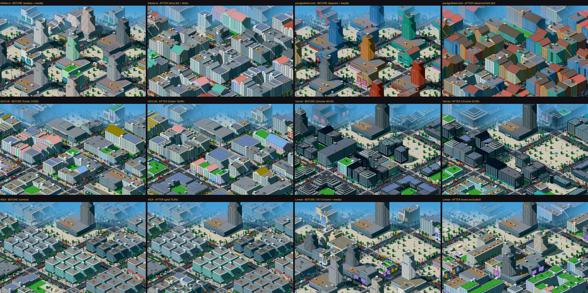
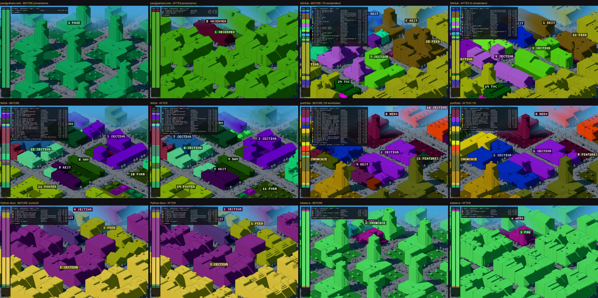

# Pixel city: semantic hygiene pass

> Passe curto de limpeza da extração. A alocação ([PIXEL_SEMANTIC_ALLOCATION.md](PIXEL_SEMANTIC_ALLOCATION.md))
> não mudou: `territory.ts`, o caminho de 256 lotes e a regra proporcional são os mesmos.
>
> - **Baseline:** o allocation pass foi congelado em `src/lib/pixelcity/kit-v3/` (`?v=3`).
>   [`semantic-hygiene/corpus-before.txt`](semantic-hygiene/corpus-before.txt) guarda os hashes de
>   snapshots, cidades e tabelas. `scripts/semantic-allocation/analyze.ts` regenera as tabelas da
>   rodada anterior byte a byte.
> - **Escopo da extração:** o normalize e o analyzer só ganharam campos e opções novos (desligados
>   por padrão). A cidade real (`/pixel`), o kit-v2 e o kit-v3 continuam idênticos, e o
>   `npm run test:hygiene` verifica isso.

## 1. Problemas observados

| # | Problema | Dado |
|---|---|---|
| P1 | Imagens incidentais contadas como mídia | **paulgraham.com:** 709 imagens, sendo 471 GIFs espaçadores (dimensão ≤ 2 px), 235 marcadores repetidos (12×14) e 3 gráficos de título. **lobste.rs:** 25 avatares de 16×16 com `alt=""`. **Linear:** 142 ícones SVG `role="img"` de 12–16 px. **GitHub:** 10 ícones |
| P1b | Imagens incidentais também pesam | cada imagem soma ~4 ao peso estrutural. No paulgraham, **66%** do peso da página é imagem incidental, e só o cluster de marcadores tem 30% |
| P2 | Chrome pesa pelo volume | rodapés de 21–26% do peso (GOV.UK, NASA, Vercel); chrome do Vercel 46,5%. **Correção parcial da hipótese:** esses rodapés são grandes também em *texto* (são mapas do site), não só em DOM |
| P2b | Rodapé muito grande deixa de ser rodapé | o analyzer só reconhece um rodapé com até 35% do peso. Acima disso, elege uma coluna, e o resto vira conteúdo comum, fora da regra de chrome. Não acontece no corpus (máximo 26%); apareceu no teste de aceitação |
| P3 | Restos artificiais | cadeias de `section` aninhadas criam restos vazios ou só com o título. GitHub: 16 restos e 6 territórios sem lote; portfolio: 13 restos |
| P4 | Página pobre vira massa genérica | paulgraham: 0 regiões, 99,9% "resto da página", 100% mídia |

## 2. Regras introduzidas

A extração não conhece a cidade: [`snapshot/media.ts`](../src/lib/snapshot/media.ts) e
[`semantics/hygiene.ts`](../src/lib/semantics/hygiene.ts) só falam da página (há um teste que
verifica isso).

| Regra | Camada | O que faz |
|---|---|---|
| **M1 imagem de conteúdo × incidental** | extração | Para cada imagem, vale a primeira regra que se aplicar: **spacer** (dimensão declarada ≤ 2 px) → **icon** (maior lado ≤ 32 px **e** sem texto alternativo, ou repetida ≥ 3× na página, ou SVG inline) → **repeated** (sem tamanho declarado, sem texto alternativo, ≥ 5×) → **named-ui** (sem tamanho, classe ou arquivo com vocabulário de interface: avatar, icon, sprite…) → **content**. `alt=""` é a convenção HTML de imagem decorativa. Uma imagem pequena *com* descrição própria, que aparece uma vez (uma bandeira com nome, por exemplo), continua sendo conteúdo |
| M1 no analyzer | extração | `analyzeSemantics(doc, { contentMedia: true })` decide gallery / showcase / logos só com mídia de conteúdo |
| **H1 peso de conteúdo** | page model | peso − 4 × imagens incidentais; uma subárvore sem texto, link, controle nem mídia de conteúdo pesa zero |
| **H2 chrome** | page model | Navegação, rodapé, marca e formulários, CTAs e laterais fora do conteúdo principal são chrome. A fração total S do chrome vira **S/(1+S)**, repartida entre as regiões de chrome na proporção de cada uma. Fica ≈ S enquanto pequena, é monotônica e nunca passa de 1/2. Não há constante calibrada |
| H2 no analyzer | extração | `explicitFooter`: um `<footer>`/`contentinfo` que vai até o fim da página é o rodapé em qualquer tamanho (corrige P2b) |
| **T1b restos** | partição | O resto de um contêiner é **fundido** nos filhos (o peso dele vai para os filhos, em proporção) quando: não tem conteúdo próprio; ou o conteúdo próprio é só o título; ou o contêiner tem um único filho e o próprio texto é menos de 10% dele. Fora desses casos, o resto continua território. Cada fusão é registrada com o motivo |
| **H3 fallback** | page model | Se as regiões nomeadas cobrem menos de 50% do conteúdo, o conteúdo não coberto é segmentado pelo que se observa: desce pelos wrappers (filho ≥ 80% do pai) e, a partir da primeira divisão real, os filhos viram blocos, com vizinhos pequenos (< 1/32) agrupados. Rótulos só estruturais ("lista de 215 td", "40 links", "tabela"); nenhum tipo é inventado |

O trace de cada território guarda **`rawWeight`** (o peso estrutural puro) e **`urbanWeight`**
(o peso usado na alocação), com a explicação de cada passo. Exemplo do rodapé do GOV.UK:
`raw 23.8% → content 23.9% → chrome ×0.78 (footer: site-wide chrome; chrome 28% → 22%) = urban 18.7%`.
Detalhes por página em [`semantic-hygiene/trace/`](semantic-hygiene/trace).

## 3. BEFORE × AFTER dos casos afetados

BEFORE = allocation pass (kit-v3); AFTER = hygiene. "Terreno" é a fração dos 256 lotes.

| página | territórios | restos | sem lote | imagens → conteúdo | chrome: raw → terreno B → A | rodapé: raw → terreno B → A | maior território B → A | terreno de regiões nomeadas | terreno de mídia B → A | forma B→A |
|---|---|---|---|---|---|---|---|---|---|---|
| **lobste.rs** | 5 → 4 | 1 → 0 | 0 → 0 | 25 → **0** | 0,9 → 0,8 → 0,8% | 0,9 → 0,8 → 0,8% | 96,5 → 96,5% | 99 → 100% | **96,5 → 0%** | 0,51 |
| **paulgraham.com** | 2 → 3 (2 blocos observados) | 0 → 0 | 1 → 0 | 709 → **3** | – | – | 100 → 96,5% | 0 → 0% | **100 → 0%** | 0,54 |
| **GOV.UK** | 16 → 11 | 6 → 1 | 1 → 0 | 5 → 5 | 27,7 → 27,7 → **21,9%** | 23,8 → 23,8 → **18,8%** | 23,8 → 26,2% | 94 → 97% | 11,7 → 13,3% | 0,08 |
| **NASA** | 23 → 16 | 9 → 2 | 3 → 0 | 27 → 27 | 27,9 → 28,1 → **21,5%** | 21,4 → 21,5 → **16,4%** | 21,5 → 21,1% | 88 → 89% | 40,6 → 44,1% | 0,09 |
| **Vercel** | 11 → 10 | 2 → 1 | 0 → 0 | 41 → 40 | 46,5 → 46,5 → **32,0%** | 26,2 → 26,2 → **18,0%** | 26,2 → 18,0% | 91 → 90% | 11,3 → 14,5% | 0,22 |
| **portfolio** | 25 → 13 | 13 → 1 | 1 → 0 | 9 → 9 | 2,4 → 2,3 → 2,3% | idem | 18,4 → 21,1% | 81 → 90% | 33 → 36% | 0,04 |
| **GitHub** | 30 → 19 | 16 → 5 | 6 → 0 | 13 → 3 | 6,0 → 5,9 → 5,9% | 2,4 → 2,3 → 2,3% | 39,8 → 42,2% | 81 → 85% | 15,6 → 3,7% | 0,12 |
| **Python docs** (controle) | 12 → 10 | 3 → 1 | 3 → 1 | 3 → 3 | 1,2% | 0,2 → 0,4% | **50,4 → 50,4%** | 95 → 95% | 0 → 0% | **0,03** |
| **IKEA** (controle) | 7 → 7 | 1 → 1 | 1 → 1 | **73 → 73** | 12,0 → 12,1 → 10,9% | 10,6 → 10,5 → 9,8% | **74,6 → 75,8%** | 94 → 94% | 0 → 0% | **0,01** |

- **paulgraham.com:** a página é uma tabela com 215 células de link. O fallback produz dois blocos
  observados: a lista de 215 links (96,5%, parcelada) e um grupo de 40 links (3%). Mais a marca. A
  cidade de mídia vira uma cidade de lista de links, simples como a página.
- **lobste.rs:** a lista de histórias (96%) passa a ser parcelada, como um feed. O analyzer agora
  a rotula `faq` (ver §5); a composição sai das métricas, não do rótulo.
- **Rodapés:** perdem 5–8 pontos de terreno e **continuam presentes**: são grandes também em
  texto, e a regra não os zera.
- **Controles:** IKEA (as 73 imagens de produto continuam conteúdo; a grade passa a 75,8%) e
  Python docs (seções de 50% e 35%) praticamente não mudam.

*Proveniência antes/depois: paulgraham (resto da página → blocos observados), GitHub e portfolio
(restos fundidos), NASA (rodapé), Python docs (controle) e lobste.rs.*

**Remainders no corpus inteiro:**

| | antes → depois |
|---|---|
| restos | 62 → **26** |
| territórios sem lote | 19 → **5** |
| territórios | 222 → 189 |
| regiões semânticas | 146 → 148 |
| fusões | 42, todas com motivo no trace |
| imagens | 1281, das quais 359 de conteúdo |

## 4. Regression check (corpus inteiro)

| métrica | BEFORE | AFTER |
|---|---|---|
| fidelidade da alocação (aos pesos que recebe) | 0,99 | 0,99 |
| contiguidade (média / mínimo) | 1,00 / 1,00 | 1,00 / 1,00 |
| diferença entre páginas ÷ ruído da seed, **vocabulário** | 12,3× | **12,3×** |
| diferença entre páginas ÷ ruído da seed, **forma** | 12,6× | **8,4×** |
| … forma, sem lobste.rs e paulgraham: distância média entre páginas | 0,29 | 0,27 |
| perturbações: bloco ≤ 0,04 / máximo | 45 / 0,16 | 46 / 0,15 |
| perturbações: execuções com > 25% de troca de dono | 4 | 5 |
| landmark: maior grupo igual / combinações distintas | 2/12 · 6 | 2/12 · 6 |

**A queda de diferenciação de forma (12,6× → 8,4×) foi investigada antes de aceitar.**

- Quase toda ela vem das duas correções-alvo: lobste.rs e paulgraham eram as páginas mais
  distantes de todas (0,38 em média) porque eram, por erro, cidades de torres.
- Sem elas, a distância média entre as outras páginas vai de 0,29 para 0,27 (−7%).
- O resto vem do Linear, que perdeu as torres (abaixo).
- Os novos pares próximos são lobste.rs × paulgraham (forma 0,06, vocabulário 0,42): as duas são
  de fato listas de links.

**O caso bom que mudou materialmente: Linear (forma 0,37).**

- 161 das 180 "imagens" eram ícones de UI de 12–16 px nos mockups. Sem elas, as vitrines deixam
  de ser showcase e viram seções que se abrem em filhos.
- Resultado: terreno de mídia 72% → 17%, territórios 11 → 17, restos 1 → 5. As seções saem
  interativas ou contínuas, e o landmark continua torre de pódio (25 → 22 andares).
- É a regra pedida (ícones e UI não são mídia de conteúdo) aplicada a um site cuja riqueza visual
  é CSS, não imagem.
- **Efeito colateral:** a página ficou mais fragmentada e mais sensível. Sob links−10, a troca de
  dono foi de 0,11 para 0,31. É a mesma instabilidade de extração das rodadas anteriores (a
  região "Changelog" some), agora agindo sobre uma partição mais fina.

## 5. Bugs e limitações que continuam fora de escopo

- **Rótulos do analyzer.** A lista do lobste.rs agora é `faq`: a regra de faq casa com o título
  da primeira história. A composição sai das métricas, mas o rótulo está errado. Corrigir isso é
  mexer na cascata de tipos do analyzer.
- **Instabilidade de detecção de regiões** (±10% de texto ou de links cria ou apaga regiões) e o
  **deslizamento** da alocação: os mesmos da rodada anterior. São extração e allocation, fora
  daqui.
- **`fingerprint.imagery`** continua contando todas as imagens. Influencia só o score de estilo
  (+0,15 × imagery no modern) e não muda o estilo de nenhuma página do corpus, então não foi
  tocado.
- **A cidade real (`/pixel`)** continua na extração antiga: as opções novas estão desligadas lá
  até a integração.
- **Constantes da higiene:** 32 px, 3/5 repetições, cobertura 50%, bloco 1/32, wrapper 80%,
  título + 24 caracteres, 10%. Todas são estruturais, foram fixadas antes de medir e não foram
  ajustadas depois.
- **Fora do escopo pedido:** SPAs, captura renderizada, landmark, superfície.

## 6. Conclusão

| # | Critério | |
|---|---|---|
| 1 | paulgraham deixa de ser mídia por assets incidentais | ✔ 706 de 709 imagens são incidentais; mídia 100% → 0% |
| 2 | lobste.rs deixa de ser distorcido por avatares | ✔ 25 de 25 avatares; mídia 96,5% → 0% (rótulo `faq` errado, §5) |
| 3 | chrome/rodapé deixam de dominar só pelo volume | ✔ −5 a −8 pontos nos três casos; limitado a < 1/2 em qualquer tamanho (testado até 87% de peso bruto) |
| 4 | fragmentação artificial cai | ✔ restos 62 → 26, sem lote 19 → 5. No Linear a fragmentação subiu (efeito de M1) |
| 5 | fallback conservador para páginas pobres | ✔ paulgraham: 2 blocos observados, determinísticos |
| 6 | casos bons não regridem | ✔ IKEA 0,01, Python docs 0,03, Wikipedia 0,02–0,05, Guardian 0,03, craigslist 0,02. **Exceção explicada:** Linear |
| 7 | diferenciação, contiguidade e fidelidade preservadas | ✔ vocabulário 12,3×, contiguidade 1,00, fidelidade 0,99; forma −7% sem os dois alvos |
| 8 | nenhuma regra por site | ✔ testado (`test:allocation` e `test:hygiene`) |

**Considero a camada `PAGE → SEMANTICS → TERRITORY` pronta para ser congelada**, com as
limitações da §5 registradas. Elas são de rótulos e de estabilidade de detecção no analyzer, não
de alocação nem de peso.

**Verificação:**

- `npm run test:hygiene`: 15 checks, todos passam. Cobrem mídia incidental × fotos reais,
  veredictos de imagem, rodapé crescente (limitado e monotônico), resposta a conteúdo real no
  rodapé, wrappers aninhados, resto real preservado, fallback sem mídia e determinístico, a
  extração não citar a cidade e os baselines kit-v2/kit-v3 intactos.
- `npm run test:allocation`, typecheck, lint e build passam.

| Arquivo | |
|---|---|
| `src/lib/snapshot/media.ts` | **novo**: M1 |
| `src/lib/semantics/hygiene.ts` | **novo**: H1, H2, H3 |
| `src/lib/model/normalize.ts`, `types.ts` | `incidentalImages`, `doc.media` (só campos novos) |
| `src/lib/semantics/analyze.ts` | opções `contentMedia`, `explicitFooter` (padrão desligado) |
| `src/lib/pixelcity/kit/plan.ts` | pesos de conteúdo, chrome, T1b, fallback, `rawWeight` |
| `src/lib/pixelcity/kit-v3/` | allocation pass congelado (`?v=3`) |
| `scripts/semantic-hygiene/` | `corpus.ts`, `analyze.ts`, `check.ts` |
| `docs/semantic-hygiene/` | tabelas, traces, hashes |
