# Pixel city: architectural surface grammar

> Passe de superfície sobre uma fundação congelada. PAGE → SEMANTICS → TERRITORIES → BLOCK
> COMPOSITION → BUILDING MASSING não mudaram: mesmos territórios, mesmo caminho de 256 lotes,
> mesmas composições, mesmas famílias, mesmos footprints, andares e formas de cobertura.
>
> - **Baseline:** o kit da rodada de hygiene foi congelado em `src/lib/pixelcity/kit-v4/` (`?v=4`).
>   [`surface/corpus-before.txt`](surface/corpus-before.txt) guarda os hashes das cidades kit-v4
>   (normal, flat, noite) e das tabelas anteriores; `npm run test:surface` verifica que o kit-v4
>   ainda os reproduz. As capturas BEFORE estão em [`screenshots/surface/before/`](screenshots/surface/before).
> - **Laboratório:** `/pixel/surface-lab` (prédios isolados, mesma câmera e paleta).
> - **Inspetor:** `/pixel/kit?page=<id>&debug=surface` — clicar num prédio mostra a anatomia, o
>   porquê de cada zona e o que ficou de fora (e por quê).
> - **Tabelas:** [`surface/tables.md`](surface/tables.md) (`npx tsx scripts/surface/analyze.ts`).

Folhas de comparação (`screenshots/surface/sheets/`):

| folha | o quê |
|---|---|
| [A-street-1](screenshots/surface/sheets/A-street-1.jpg), [A-street-2](screenshots/surface/sheets/A-street-2.jpg) | BEFORE × AFTER, Street View, 9 páginas reais |
| [B-close-1](screenshots/surface/sheets/B-close-1.jpg), [B-close-2](screenshots/surface/sheets/B-close-2.jpg) | BEFORE × AFTER, Close View |
| [C-programs-classic](screenshots/surface/sheets/C-programs-classic.jpg) · [modern](screenshots/surface/sheets/C-programs-modern.jpg) · [retro](screenshots/surface/sheets/C-programs-retro.jpg) · [tech](screenshots/surface/sheets/C-programs-tech.jpg) | mesmo massing, sete usos (Lab) |
| [C-styles](screenshots/surface/sheets/C-styles.jpg), [C-sizes](screenshots/surface/sheets/C-sizes.jpg) | mesmo uso em cinco estilos; tamanhos |
| [D-ground](screenshots/surface/sheets/D-ground.jpg) | térreos e esquinas |
| [E-roofs](screenshots/surface/sheets/E-roofs.jpg) | coberturas por uso (4×4, 8×6, duas águas) |
| [F-city](screenshots/surface/sheets/F-city.jpg), [F-flat](screenshots/surface/sheets/F-flat.jpg) | City View e massing (`flat=1`) |
| [G-night](screenshots/surface/sheets/G-night.jpg), [G-night-programs](screenshots/surface/sheets/G-night-programs.jpg) | noite |

Páginas: Wikipedia (`reference`), Python Docs (`docs`), IKEA (`shop`), Linear (`saas`), GOV.UK
(`institution`), NASA (`media`), portfolio, Paul Graham (`oldweb`, *old web*) e GitHub (`app`).

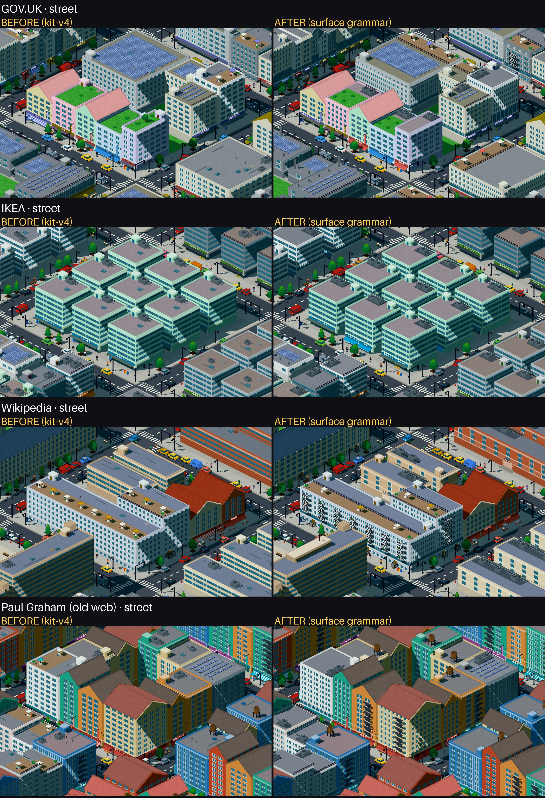

## 0. Surface Grammar Lab e inspetor

`/pixel/surface-lab?set=programs|corners|roofs|styles|sizes&style=classic|retro|modern|soft|tech`
(`&v=4` = antes, `&legend=1` = anatomia de cada célula, `&time=night`, `&flat=1`, `&focus=x,z&zoom=n`).
Mesma câmera, paleta e seeds; só o eixo estudado muda. É uma *fixture* de regressão: as folhas C, D
e E saem dele (`node scripts/surface/lab.mjs <set>` captura célula a célula), e o `test:surface`
roda os invariantes sobre os mesmos prédios (234 prédios: 5 conjuntos × 3 estilos).

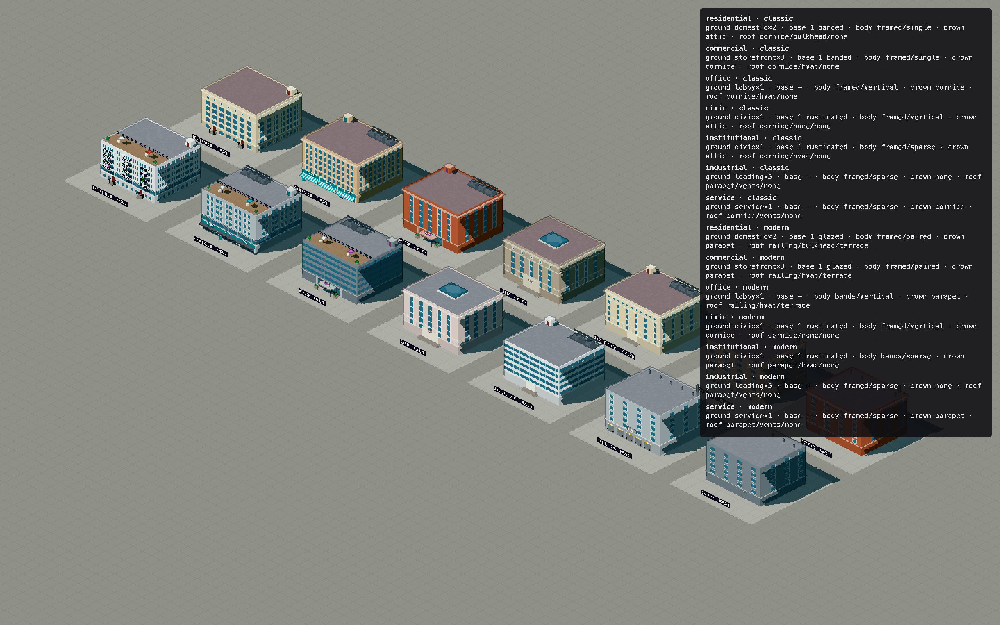

Inspetor (`/pixel/kit?page=reference&view=close&focus=9.4,0&debug=surface`, clique num prédio):

```
#55 structured / full · slab 13.6×4.2 · 8 floors · classic
program office
groundFloor lobby ×1, entrance central, transparency 0.75
base 1 floor(s) glazed
body bands vertical, bay 0.5, tall, lit in runs per floor
crown emphasized (top floor), heavy cornice
roof flat; edge cornice; service penthouse; occupied none
detailFamilies  · mechanical penthouse: office, 6+ floors
absent          · no fire escape: needs a narrow walk-up (residential / commercial, 2.8–4 tiles) + retro + 4+ floors + punched façade (here office, classic, 13.6 wide, 8 floors, bands)
                · no HVAC cluster: office roof plant is a penthouse
                · no awning: lobby ground (awnings belong to shopfronts)
                · roof not occupied: hvac topside, classic style
why             · use office (from the composition) · ground: one lobby with a central entrance — office use · …
```

O mesmo conteúdo está no trace (`KitTrace.buildings[i].anatomy`, resumido por `surfaceTrace()`:
program, groundFloor, base, body, crown, roof, cornerCondition, detailFamilies, pageSignalsUsed,
styleExpression, variation, absent).

## 1. Qual era exatamente o problema visual antes?

Auditoria do kit-v4 (capturas em `screenshots/surface/before/`, folhas A e B):

| Elemento | Como era decidido | Efeito |
|---|---|---|
| Janelas | um único `FRAMED` (grade de janelas) por volume, do térreo ao topo | não havia base, corpo nem coroamento: o prédio era uma grade com uma cornija em cima |
| Térreo | uma vitrine por fachada inteira (lojas), porta do lado sorteado; *lobby* = a mesma porta giratória para escritório, prefeitura e escola | o térreo dizia "loja" ou "não-loja", e mais nada |
| Mercadorias na vitrine | 60% sorteado | ruído |
| Toldos | sorteio dentro da tabela do estilo, em qualquer térreo de loja | ok como expressão, mas sem relação com unidades |
| *Stoops* (escadinhas) | posições sorteadas | casas sem ritmo |
| Varandas | só a família *apartments* | o uso residencial não aparecia nas outras famílias |
| Escada de incêndio | 20% sorteado (retro, 3+ andares) | detalhe por sorte, não por tipo |
| Cornija | só pelo estilo | um galpão e um palácio terminavam igual |
| Cobertura | caixa de escada em 70% (canto sorteado) + *topside* sorteado pelo estilo (HVAC em posições e quantidades sorteadas, caixa d'água em posição sorteada, terraço com 3–5 guarda-sóis e pessoas, jardim com arbustos sorteados, painéis) + *roof clutter* proporcional à área (respiros, claraboias, alçapões, conduítes sorteados) | da câmera isométrica alta, a cobertura é o que mais aparece — e era a parte mais aleatória |
| Esquinas | família *corner* com torreão/curva pelo estilo | o resto dos prédios de esquina não sabia que era esquina |
| Noite | cada janela acende por hash próprio | grade luminosa uniforme |

Em resumo: a fachada era uma textura contínua, o térreo tinha dois estados e a cobertura era
decidida pelo RNG. O que diferenciava prédios era a silhueta e a cor.

## 2. Qual é o modelo de anatomia criado?

Um tipo pequeno, [`kit/surface.ts`](../src/lib/pixelcity/kit/surface.ts) (`Anatomy`, ~300 linhas
com as regras), calculado uma vez por volume em `block()`, `slab`, `podiumTower` e `stepped`:

```
use      residential | commercial | office | civic | institutional | industrial | service | kiosk
GROUND   kind (storefront, arcade, lobby, civic, domestic, service, loading, blank), units,
         entrance (per-unit, central, axial, domestic, service), transparency, awning, signage,
         cornerEntrance
BASE     floors 0–2, treatment (rusticated, banded, glazed)
BODY     surf (framed, bands, curtain), pattern (single, paired, vertical, sparse), bay, tall,
         brick, accentEnds, litGroups
CROWN    none | cornice | parapet | attic | emphasized (+ cornija heavy/light/none)
ROOF     edge (cornice, parapet, railing, eaves), service (hvac, tank, vents, penthouse,
         chimneys, bulkhead, none), occupied (terrace, garden, none), energy (solar, none),
         architectural (a forma da cobertura — do massing)
CORNER   condition (esquina ou meio de quadra), treatment (wrap, entrance, vertical, turret, round)
+ details (famílias elegíveis), signals (sinais de página usados), variation (o que o RNG
  escolheu, e entre quais equivalentes), absent (o que ficou de fora e a regra), style, why
```

O **uso** vem da composição (`compose.ts`, uma tabela `Comp → Use`): continuous → residential,
parcelled/grid/navigation → commercial, media/structured → office, archive → institutional,
support → service, marker/interactive → kiosk. O marco (landmark) usa a família (salão cívico,
torre do relógio → civic). O uso não depende do estilo (teste).

## 3. Como funciona ground/base/body/crown/roof?

Tudo acontece **dentro da mesma caixa externa** do massing: `block()` empilha base, corpo e
coroamento como faixas do mesmo volume, separadas por frisos (*string courses*). Nenhuma altura,
footprint ou forma muda (teste: mesmas famílias, footprints, andares e coberturas que o kit-v4;
altura do volume principal idêntica em 99,7% dos prédios, e os 4 restantes diferem por uma caixa
de escada num lote pequeno).

- **GROUND** — o uso escolhe o tipo; o estilo, só a expressão.
  - commercial: unidades de loja (`round(vão / largura)`, cada uma com porta, vitrine, letreiro e toldo), portas alternadas entre vizinhas;
  - office: um lobby com entrada central;
  - civic: portal axial (degraus, moldura que sobe até o andar de cima, frontão nos estilos clássicos, placa);
  - institutional: entrada central marcada num embasamento quase fechado;
  - residential: uma porta com *stoop* e luminária a cada ~3,4 tiles, alinhadas aos vãos do corpo (ou loja de esquina, se o programa é misto);
  - industrial: portas de carga com faixas de perigo;
  - service: uma porta de serviço numa fachada cega.
- **BASE** — cívico/institucional com 3+ andares: 1 andar rusticado (faixas horizontais no shader); escritório com 6+: 1–2 andares envidraçados; residencial/comercial com 4+: 1 andar com faixa (*banded*) ou envidraçado (moderno/tech).
- **BODY** — ver §4.
- **CROWN** — o prédio precisa terminar? (uso + altura). Industrial, quiosque e prédios com menos de 2 andares: não. Coberturas inclinadas: cornija. Residencial/cívico/institucional com 5+ andares e estilo clássico (ou página com muita hierarquia de títulos): **ático** (último andar com aberturas pequenas e quadradas). Escritório com 6+: **topo enfatizado** (último andar mais escuro, com grelha). Senão, cornija (clássico, retro, cívico) ou platibanda (moderno, soft, tech).
- **ROOF** — ver §6.

## 4. Como façade rhythm funciona?

A unidade é o **vão** (*bay*: 0,5 / 0,75 / 1,0 / 1,25 tile), vindo do programa (`rhythm`). Dentro
do vão, o uso escolhe o **padrão de abertura** e o shader `FRAMED` o desenha (bits novos em
`materials.ts`; os bits antigos continuam idênticos, então os kits congelados não mudam):

| padrão | desenho | quem usa |
|---|---|---|
| single | uma janela por vão (com mainel em vãos largos) | residencial, comercial |
| paired | duas janelas estreitas por vão | residencial e comercial modernos/tech |
| vertical | janela alta e estreita, quase do piso ao teto | escritório (pilares), cívico (vãos largos) |
| sparse | vãos alternados cegos | institucional, industrial, serviço |
| attic | aberturas pequenas e quadradas | coroamento ático |
| rusticated | faixas horizontais no embasamento | base cívica/institucional |
| end bays | os vãos das pontas cegos e mais claros | fachadas ≥ 3,6 tiles em páginas pouco regulares |

**Repetição → variação controlada:** a variação acontece em escalas arquitetônicas, nunca na
janela isolada. Casas e lojas podem tomar o vão vizinho (0,25 tile a mais ou a menos) — prédios
vizinhos raramente têm o mesmo vão; escritório, cívico e institucional mantêm o seu (é a assinatura
do programa). A fachada comercial pode ter uma unidade de loja a mais (mais estreitas) quando cabe.
À noite, a luz acende **por unidade** (um apartamento = 2 vãos × 1 andar) em vez de janela a janela,
e escritórios acendem em faixas longas por andar.

## 5. Como corners funcionam?

Um lote com duas frentes (família *corner*) é `corner: true` na anatomia, e o tratamento depende do
uso: lojas **dobram a esquina** (unidades nas duas fachadas e uma entrada chanfrada na quina);
escritórios grandes (vão > 5) ganham a **entrada de esquina**; residencial com 3+ andares ganha um
**vão vertical de esquina** (faixa clara com janelas verticais); torreão e curva continuam vindo da
família (massing, intocado). As duas fachadas deixam a quina livre quando há entrada de esquina.

## 6. Como roof zoning funciona?

O uso decide **quais zonas existem**; o *topside* do programa (escolhido no brief entre os
equivalentes do estilo) decide **como se expressam**:

- **EDGE** — platibanda, cornija, guarda-corpo (cobertura ocupada) ou beiral (inclinada).
- **SERVICE** — sempre um **único agrupamento na faixa de trás**, sobre uma base: HVAC (unidades em
  linha + duto; quantidade pela área, uma a menos é equivalente), caixa(s) d'água + caixa de escada
  (residencial/comercial retro ou topside *tank*), respiros + chaminé de exaustão (industrial,
  serviço), casa de máquinas com antena (escritório 6+), caixa de escada (residencial: **uma por
  núcleo**, ~1 a cada 5 tiles de frente), chaminés nas empenas (residencial com telhado inclinado).
  O lado (esquerdo/direito) é a única escolha livre.
- **OCCUPIED** — terraço: faixa da frente (rua) com deck, guarda-corpo, até 3 guarda-sóis e
  floreiras; jardim (telhado verde): toda a laje que a zona de serviço deixa livre, arbustos em
  fileiras espaçadas. Só onde o uso é ocupável (residencial, escritório,
  comercial até 5 andares).
- **ENERGY** — topside *solar*: fileiras de painéis na faixa livre entre o serviço e a ocupação.
- **ARCHITECTURAL** — a forma (massing); cívico deixa a cobertura **limpa de propósito**, só com uma
  claraboia/lanternim central.

O antigo *roof clutter* sorteado foi removido.

## 7. Como programa influencia superfície?

O mesmo volume 6×5×5 andares, mesma paleta, só o uso mudando (folha C): o térreo sozinho separa 7
de 7 usos (teste), a cobertura sozinha separa 4–5 (teste), e o corpo separa por padrão de abertura
(vertical × single × sparse). No BEFORE, os sete prédios da folha C são o mesmo
prédio com outra porta: grade de janelas idêntica e a mesma cobertura sorteada. No AFTER, cada um tem
um térreo próprio (casas com *stoops*, três lojas, lobby, portal, porta central, docas, porta de
serviço), um corpo próprio (janelas simples, pilares verticais, vãos largos, vãos alternados cegos)
e uma cobertura própria (caixa de escada, HVAC agrupado, casa de máquinas, lanternim, respiros).

## 8. Como style influencia expressão sem dominar estrutura?

O estilo escolhe **entre alternativas que o uso já tornou elegíveis**: qual toldo (clássico
liso/listrado, retro listrado, moderno marquise, tech nenhum), qual cornija (pesada/leve) ou
platibanda, tijolo, janela alta, padrão *paired* nos modernos, e o *topside* (tank, solar, garden,
terrace) dentro das zonas que o uso permite. O teste fixa o **mesmo lote** e varia os cinco estilos
para cada uso: uso, tipo de térreo, entradas, unidades, andares de base, vão e altura externa não
mudam; a expressão muda (folha C-styles). O ático é o único ponto em que o estilo (clássico) mexe
no coroamento — é expressão de hierarquia, não muda a altura.

## 9. Quais page signals chegam à superfície?

Quatro sinais da página inteira (`kit.surface`, setado em `district.ts`), cada um com **um** efeito,
registrado em `signals` quando muda uma decisão:

| sinal | efeito na superfície | quando age |
|---|---|---|
| `linkDensity` | largura da unidade de loja: `3,2 − 1,4·linkDensity` tiles (páginas densas em links → frentes mais fatiadas) | sempre que há térreo comercial; registrado quando \|ld − 0,5\| > 0,2 |
| `interactivity` | transparência do térreo comercial `0,7 + 0,25·i` | registrado quando > 0,7 |
| `headings` | força da hierarquia: base de 2 andares (7+ andares) e ático fora do estilo clássico | > 0,65 / > 0,6 |
| `regularity` | vãos das pontas articulados (cegos/claros) em páginas **pouco** regulares | < 0,45 |

Por página: tabela 4 de [`surface/tables.md`](surface/tables.md).

## 10. Quais sinais foram deliberadamente NÃO reutilizados?

| sinal | já gasto em | por que não volta na superfície |
|---|---|---|
| estrutura de regiões, pesos de conteúdo, chars/links/imagens/controles por região | territórios e composição (`plan.ts`) | é o que decide *onde* e *que tipo de quadra*; repetir na fachada dobraria o mesmo voto |
| `type` (serif/sans/mono), `roundness`, `airiness`, `ornament`, `legacy`, `darkness`, `imagery` | estilo (`grammar.ts`) | a superfície recebe o estilo pronto; não relê os sinais que o formaram |
| `depth`, `size`, `textDensity` | verticalidade e densidade (massing) | altura e densidade são massing |
| cores (`hues`, `colorfulness`) | paleta | — |
| `forms` | indústria (gramática legada) | não usado pelo kit |

Ressalva honesta: `linkDensity` da página é correlacionado com a densidade de links **por região**
que a composição já usa (parcelled/archive/navigation). O efeito na superfície é de grão fino
(largura da loja), mas é um segundo voto do mesmo fenômeno. `headings` alimentava `towers` na
gramática legada, que o kit não lê; aqui é o primeiro uso no kit.

## 11. Quais detalhes antes eram RNG e agora são semânticos?

| detalhe | kit-v4 | agora |
|---|---|---|
| porta da loja | lado sorteado | portas alternadas entre unidades; só o lado da primeira é livre |
| mercadorias na vitrine | 60% sorteado | determinístico por unidade |
| número de lojas | 1 por fachada | `vão / largura` (+ `linkDensity`), uma a mais como equivalente |
| *stoops* | posições sorteadas | 1 por ~3,4 tiles, centradas nos vãos |
| entrada de escritório / cívico / institucional | a mesma porta giratória | lobby central / portal axial / porta central marcada |
| varandas | só família apartments | residencial moderno/soft 4+ andares, empilhadas nos vãos do meio |
| escada de incêndio | 20% sorteado | elegibilidade: *walk-up* **estreito** (residencial, ou lojas com apartamentos em cima; frente de 2,8–4 tiles = um só núcleo de escada) + retro + 4+ andares + fachada de janelas; RNG só escolhe o vão |
| cornija | só estilo | coroamento pelo uso e altura; estilo escolhe pesada/leve |
| caixa de escada | 70% sorteado, canto sorteado | pelo uso (residencial: 1 por núcleo); só o lado é livre |
| HVAC | 1–3 unidades em posições e tamanhos sorteados | um agrupamento na faixa de trás; quantidade pela área |
| caixa d'água | posição sorteada | agrupamento de serviço (retro / topside tank) |
| terraço | 3–5 guarda-sóis + pessoas sorteadas | faixa da frente, até 3, só onde o uso é ocupável |
| jardim | arbustos e árvore sorteados | faixa da frente, arbustos espaçados |
| *roof clutter* (respiros, claraboias, alçapões, conduítes) | proporcional à área, sorteado | removido |
| luzes à noite | janela a janela | por apartamento (2 vãos) / faixas de escritório |

**RNG por prédio** (Surface Lab, mesmos programas): de 18–36 sorteios para 1,6–6,8. Nas cidades,
de 114 270 para ~96 500 sorteios (as ruas, iguais nos dois kits, são a maior parte do que sobrou).
O que o RNG ainda escolhe fica em `variation` no trace, sempre "x de {equivalentes}". As escolhas
equivalentes são semeadas pelo programa **e pelo lote**: uma composição que repete o mesmo programa
(a grade de produtos da IKEA, por exemplo) ainda produz vizinhos diferentes.

## 12. Programas diferentes são distinguíveis com massing controlado?

**Sim, no Lab.** Com o mesmo volume 6×5×5, mesma paleta e mesmo estilo (folhas
[C-programs-classic](screenshots/surface/sheets/C-programs-classic.jpg),
[C-programs-modern](screenshots/surface/sheets/C-programs-modern.jpg),
[C-programs-retro](screenshots/surface/sheets/C-programs-retro.jpg),
[C-programs-tech](screenshots/surface/sheets/C-programs-tech.jpg)), os sete usos são
distinguíveis de olho — e os testes garantem 7 anatomias e 7 geometrias distintas por estilo. Os
pares mais próximos: **residencial × institucional** no clássico (paredes claras, ático; o que
separa é o térreo — *stoops* × porta central marcada — e o padrão esparso), e **industrial ×
serviço** (os dois têm fachada esparsa e respiros; separa o térreo: docas × uma porta).

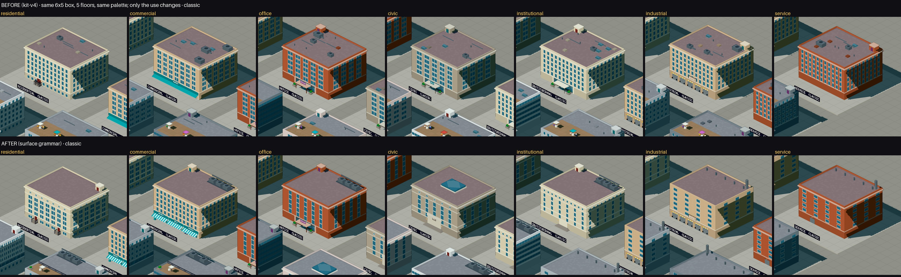
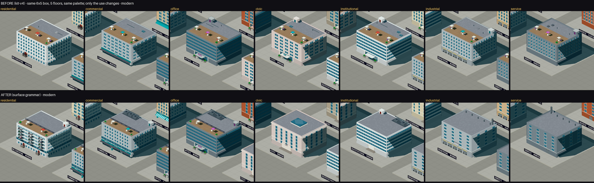

Estilo como expressão (mesmo uso, cinco estilos):

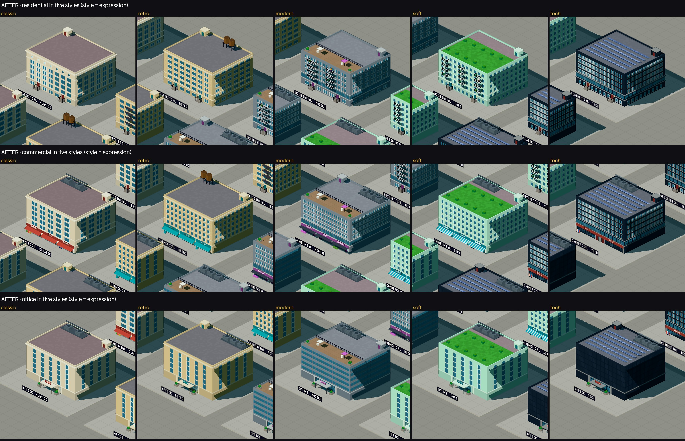

Tamanhos (3×4 com 3 andares; 8×6 com 9 andares):

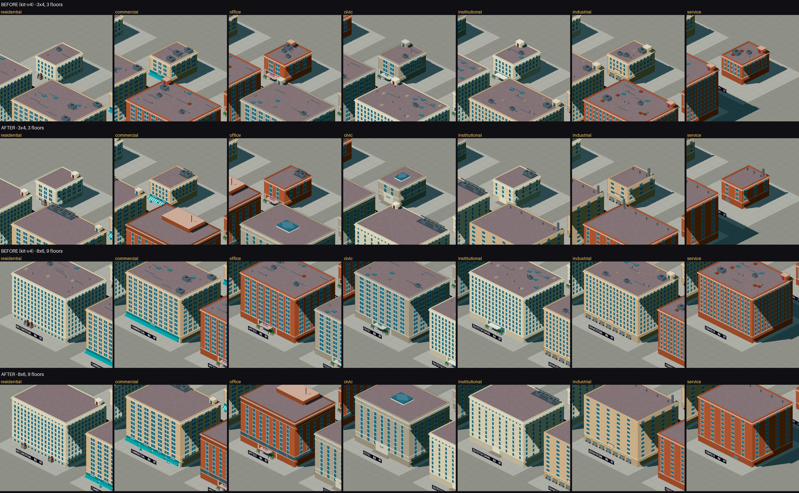

Térreos e esquinas:

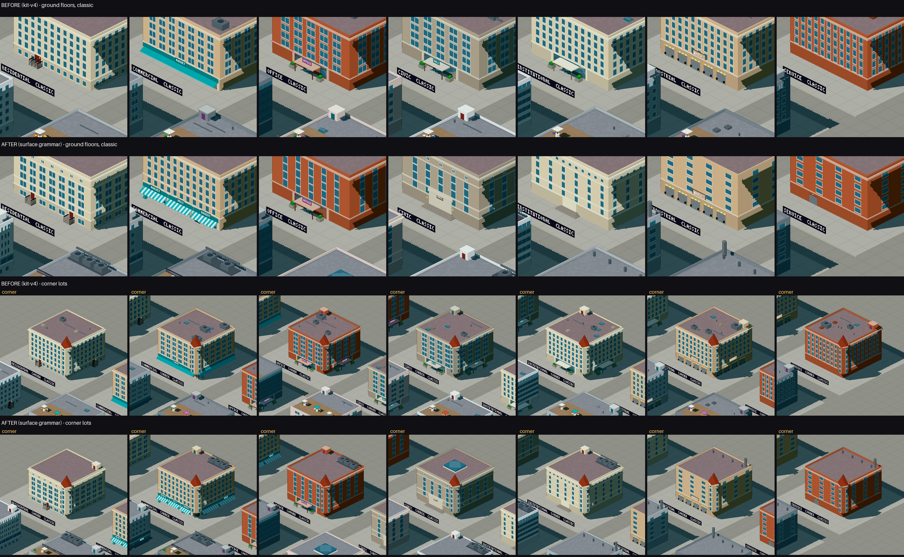

Coberturas (4×4 plana, 8×6 plana, 6×5 em duas águas):

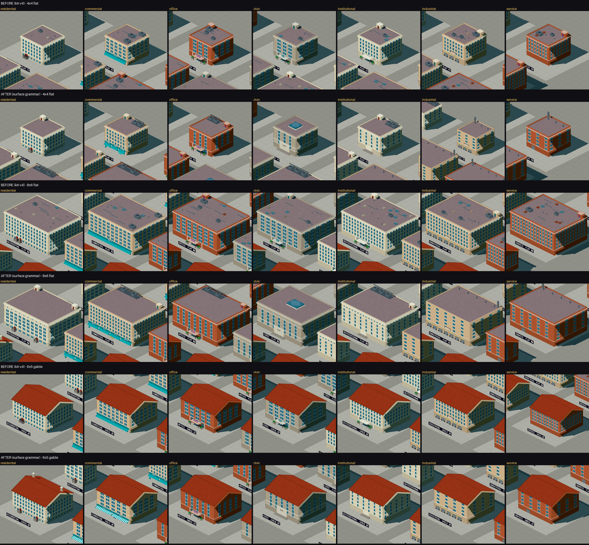

**Nas cidades reais a distinção é menor**, porque a composição produz pouca variedade de uso: 57%
dos volumes são comerciais, 20% residenciais, 15% escritório; cívico e industrial praticamente não
aparecem. A gramática não inventa programas que a composição não deu.

## 13. Close View melhorou materialmente?

**Melhorou, mas de forma desigual** (folhas B e D).

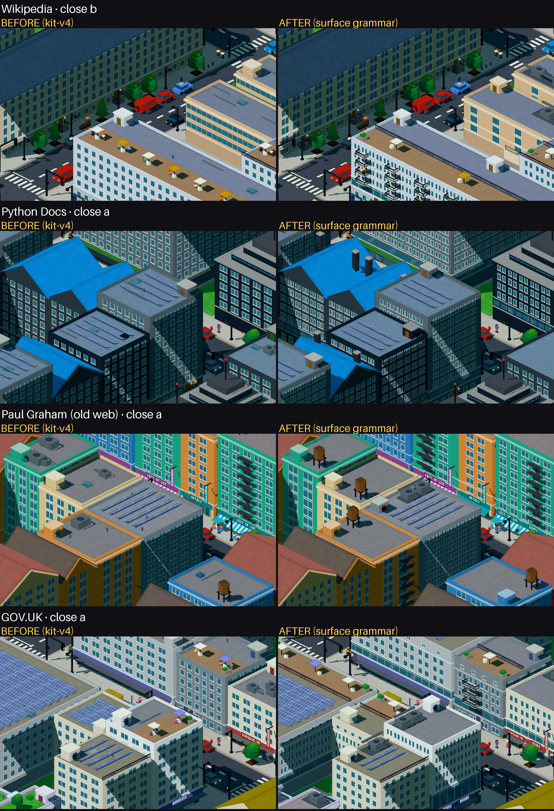
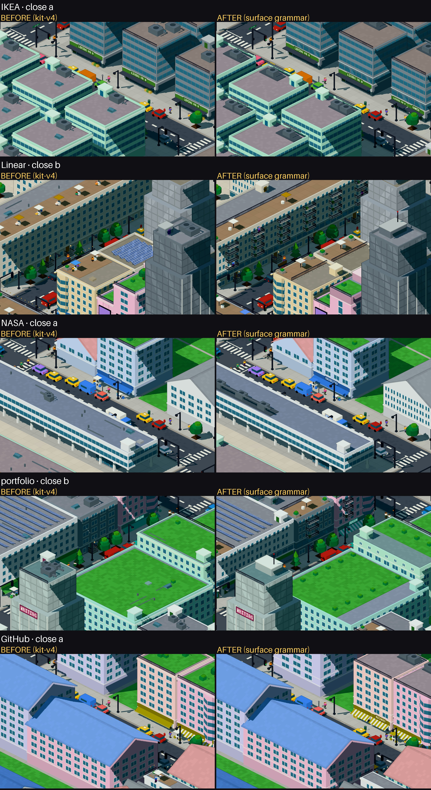

O que agora se lê na Close View e antes não se lia:

- **onde o prédio encontra a rua**: unidades de loja com letreiros próprios e portas alternadas,
  portal cívico com degraus, docas com faixas, porta de serviço numa parede cega, *stoops* no ritmo
  dos vãos;
- **onde começa e termina o corpo**: friso acima do térreo, embasamento rusticado/envidraçado,
  ático ou topo enfatizado, cornija só quando o uso pede;
- **como a cobertura funciona**: um agrupamento de serviço na faixa de trás em vez de peças
  espalhadas; caixas d'água nos retro; casa de máquinas com antena nos escritórios altos; chaminés
  nos telhados residenciais; telhado verde inteiro no soft; claraboia no cívico.

O que **não** melhorou o bastante: o corpo continua sendo uma textura de janelas pintadas; base e
coroamento são sutis (um friso e uma mudança de padrão); e os terraços perderam vida (menos
guarda-sóis e pessoas que o kit-v4).

## 14. City View permaneceu legível?

**Sim.** Na City View a forma urbana é a mesma (folha F); o modo `flat` é praticamente idêntico
(mesmas famílias, footprints e alturas — teste; as únicas diferenças visíveis em `flat` são os
frisos de 0,03 e as prumadas de varandas, que são geometria).

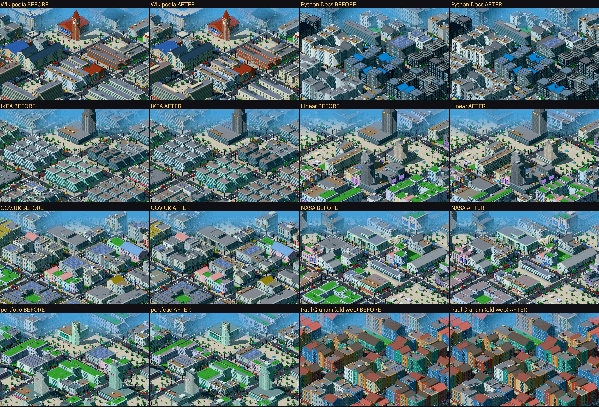
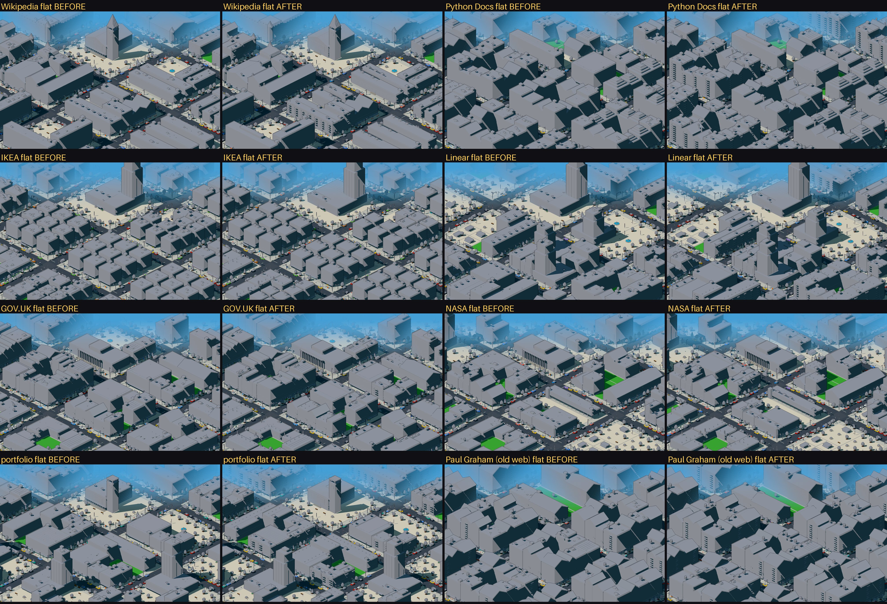

O que mudou na escala da cidade: as coberturas ficaram mais calmas (sem o salpicado de peças
sorteadas) e organizadas em faixas; isso é ganho de leitura, mas também perda de "textura" — lajes
grandes parecem mais vazias que antes.

Noite (teste secundário):

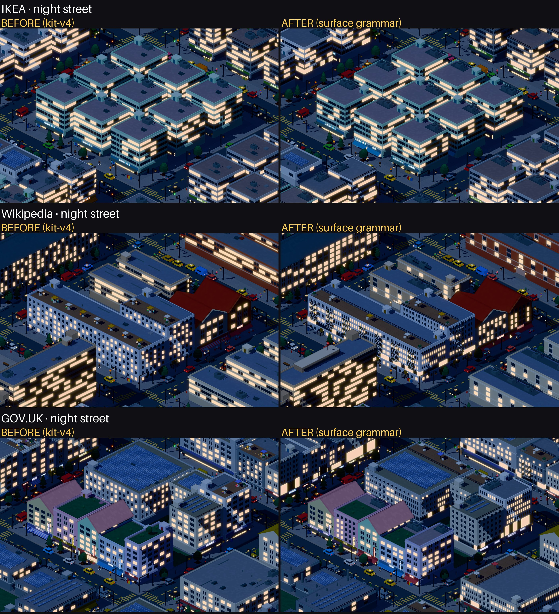
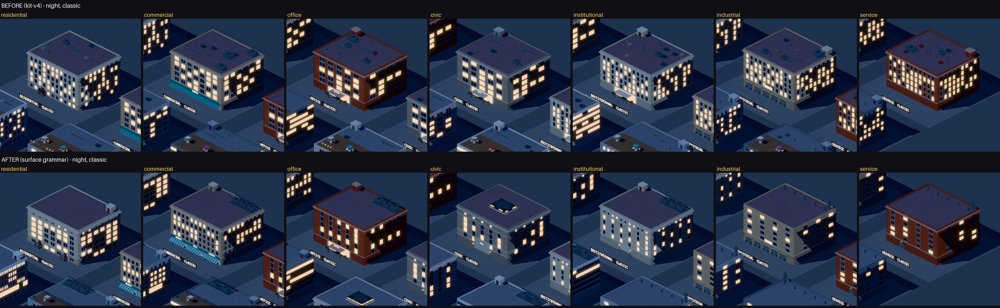

## 15. Houve regressão de performance?

**Não.** Números completos na tabela 1 e 5 de [`surface/tables.md`](surface/tables.md).

| | kit-v4 | agora |
|---|---|---|
| peças (14 cidades) | 216 291 | 222 941 (**+3,1%**; de −5% em NASA/Vercel a +13% em Python Docs e +11% em Paul Graham — escadas de incêndio) |
| geração (soma, 14 cidades; mediana de 5) | 94–102 ms | 108–113 ms (**+11–15%** conforme a execução; ≤ 3 ms por cidade) |
| sorteios RNG (14 cidades) | 114 270 | 95 629 (−16%; por prédio no Lab: 18–36 → 3–7) |
| FPS (4 páginas × city/street/close/noite) | 60 | 60 (teto do vsync no Chrome headless; nenhuma queda medida) |

O que tirou peças: o *roof clutter* sorteado. O que pôs: um friso por junta de zona (1–3 por volume),
unidades de loja, prumadas de varandas, escadas de incêndio nos *walk-ups* estreitos retro e o
telhado verde com fileiras de arbustos. Os padrões de janela novos (vertical, pareado, esparso,
ático, rusticado) e a luz por apartamento são bits do shader — peças zero. Nenhuma geometria abaixo
da resolução útil foi adicionada, exceto os respiros industriais, que já existiam e continuam
pequenos.

## 16. Quais limitações visuais ainda restam?

Onde a gramática ainda parece procedural (avaliação própria, das folhas):

1. **O corpo ainda é uma grade.** Um único padrão do shader cobre a zona inteira: não há vão
   central, eixo de entrada subindo pela fachada, agrupamento de vãos além do par. Na Street View
   os prédios ainda leem como "grade de janelas + frisos".
2. **Aberturas sem profundidade** (pintadas). É a maior limitação de material (ver §17).
3. **Lojas de um mesmo prédio são clones**: mesma largura, mesmo toldo, mesma cor; só o letreiro
   muda. Uma rua real tem frentes de larguras diferentes.
4. **O agrupamento de serviço virou um novo carimbo**: toda cobertura comercial mostra a mesma
   barra escura de HVAC na faixa de trás. Consistente, mas mecânico na City View (grade da IKEA).
5. **Variação entre equivalentes é binária** (lado esquerdo/direito, ±1 loja, ±1 largura de vão):
   suficiente para que vizinhos não sejam clones, pequena demais para ser percebida de longe. As
   métricas de repetição ficaram iguais ao kit-v4 na maioria das páginas, melhores só na grade de
   produtos (IKEA: vizinhos idênticos 43/122 → 1/122), e um pouco piores em Wikipedia (0 → 3 de 67).
6. **Varandas são um módulo repetido** (mesma laje, mesmo guarda-corpo em todas as prumadas).
7. **Base e coroamento são sutis**: um friso de 0,05 e uma troca de padrão. Na Street View quase
   somem; na City View não existem.
8. **Coberturas grandes ficaram vazias** — a gramática tirou ruído mas não pôs estrutura no lugar
   (o que existe numa laje grande real — juntas, drenos, platibandas internas — está abaixo da
   resolução útil). Respiros industriais pequenos demais para ler de longe.
9. **Noite**: as janelas acendem por apartamento (pares), escritórios em faixas por andar, e
   cívico/industrial ficam escuros; mas residencial e comercial ainda formam uma grade luminosa.
   (Na primeira versão as faixas por andar vazaram para o comércio e as bases envidraçadas
   brilhavam demais — a IKEA à noite ficou *mais* uniforme que antes; corrigido: faixas só em
   escritório/institucional, base envidraçada com metade da luz.)
10. **Menos vida nos terraços**: o kit-v4 punha 3–5 guarda-sóis com pessoas; agora até 3.

Limites estruturais conhecidos (documentados, não corrigidos nesta rodada):

- **Esquina só existe para a família *corner*.** A composição não diz a um *walkup* que ele está na
  ponta da quadra; prédios em lotes de esquina de outras famílias continuam "de meio de quadra".
  Resolver exige que a composição passe a condição do lote — fora do escopo (composição congelada).
- **Famílias fora de `block()`**: marco cívico, torre do relógio, galpão, quiosque, *narrowTower*,
  *courtyard* (alas usam `block()`, o pátio não) não têm anatomia própria (≈4% dos prédios).
- **Cívico e institucional quase não aparecem nas cidades reais** (0,1% e 2% dos volumes): a
  composição mapeia pouco território para eles; a gramática cívica só é vista no Lab e nos marcos.
- **57% dos volumes são comerciais** (parcelled/grid/navigation): nas cidades reais o térreo de loja
  domina, e a diferença de programa na escala da rua é sobretudo loja × escritório × casa.
- **`linkDensity`** é um segundo voto (correlacionado) do que a composição já leu por região.

## 17. O vocabulário atual é suficiente ou existe alguma primitive realmente ausente?

Nenhuma primitive nova foi criada: tudo é `box`/`span` com os códigos de superfície existentes,
`cyl`, `pyramid` (claraboia cívica), `prism` (frontão), `glow`, `sign`, `sprite`. A gramática nova
de janelas é **bits novos do shader `FRAMED`** (padrões, ático, rusticado, vãos de ponta, luz por
unidade) — custo zero em peças.

A primitive que falta de verdade é **relevo de fachada**: hoje as aberturas são pintadas no plano
(cor + moldura), sem profundidade. Na Street View a fachada ainda lê como textura, e é isso que
mais segura a sensação de "grade de janelas". Fazer em geometria (um recuo por janela) multiplicaria
as peças por dezenas; o caminho certo é no shader — sombreamento de recuo/peitoril e pilastras
como faixas verticais do próprio `FRAMED` (um bit a mais), mantendo uma peça por zona. Secundário:
um modo de variar o padrão **ao longo** de uma mesma parede (vão central enfatizado, eixo de
entrada), que hoje exige dividir a parede em várias peças.

